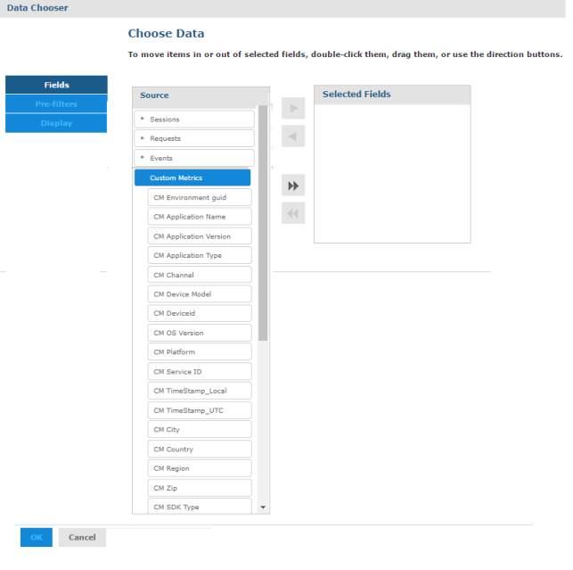

                            

Custom Metrics Datasets
-----------------------

If an app is enabled for custom metrics, a custom domain with the app name is created. It contains the custom metrics data in addition to **Standard****Metrics** data as shown in earlier datasets.

> **Note:**  
*   The standard metrics domain fields are available as part of custom metrics domain, but it is added depending on when the custom metrics list was last updated. The latest set of **Standard****Metrics** data is picked such that it could be either **Standard Metrics**, **Standard Metrics V7.2**,   or **Standard Metrics V8.0**. This depends on which was the latest dataset available during the creation of the custom reports dataset.  
*   To view only Custom Metrics service-related data for an application, add a pre-filter or filter while creating reports for Service ID equals **capturevoltmxcustommetrics**.  

Fields for Custom Metrics are as follows:

1.  CM Environment guid - GUID of the environment.
2.  CM Application Name - Name of the application.
3.  CM Application Version - Version of the application.
4.  CM Application Type - Type of the application. For example, Native and SPA.
5.  CM Channel - Channel of application. For example, Mobile and Tablet.
6.  CM Device Model - The model type of client device.
7.  CM DeviceID - Unique ID of the device for the application.
8.  CM OS Version - Version of the client device's OS.
9.  CM Platform - Application platform. For example, iOS and Android.
10.  CM Service ID - Request Service ID
11.  CM TimeStamp\_Local – Timestamp of the event in the local time zone. The local time zone is set in user’s profile in Volt MX Foundry console.
12.  CM TimeStamp\_UTC – Timestamp of the event in UTC.
13.  CM City - Obtained from IP for geolocation mapping. This field is not populated if this detail cannot be resolved from the IP address.
14.  CM Country - Obtained from IP for geolocation mapping. This field is not populated if this detail cannot be resolved from the IP address.
15.  CM Region - Obtained from IP for geolocation mapping. This field is not populated if this detail cannot be resolved from the IP address.
16.  CM Zip - Obtained from IP for geolocation mapping. This field is not populated if this detail cannot be resolved from the IP address.
17.  CM SDK Type - If an app is built using Volt MX Foundry SDK this will indicate the type of SDK such as iOS and PhoneGap.
18.  CM SDK Version - Version of the Volt MX Foundry SDK used in the client binary.
19.  CM Volt MX Foundry (Foundry) app name– application name provided on creation of an app in Volt MX Foundry console.
20.  CM Volt MX Foundry (Foundry) app guid – application guid generated on the creation of an app in Volt MX Foundry console.
21.  CM Volt MX User ID - User ID of the end user using the app. Value has to be set using the setUserID API in the application.
22.  CM Remote IP - Request Remote IP
23.  CM User Agent - User agent of the client device from a network call.
24.  CM Request\_key - Request key of the request.
25.  CM Session\_key - Unique session identifier for application session data from session init call.

> **_Note:_** In addition to the above fields, you can view all the Custom Metrics created for an application.

> **Note:**  
*   For a published application, when you create a new custom metrics or update the existing one, the custom metrics domain is updated with a new data set.  
*   In the new format, the custom metric fields are a subset of a new dataset called Custom Metrics.  
    If you modify an existing report or a view, it throws an error saying, **Specific fields not found**. To avoid this, delete the existing custom metric fields added as part of the view that you want to edit and add them again from the updated Custom Metrics dataset. This can affect the   calculations done by using those fields.   
    Alternatively, you must create a new report by adding the fields from the latest Custom Metrics dataset without disturbing the existing views/reports. The new Custom Metrics dataset accelerates the report creation process. The new Custom Metrics dataset includes all the application related   fields. Thus, you must add the application related fields from the Custom Metrics dataset instead of adding from Requests/Sessions/Events datasets.  
    
