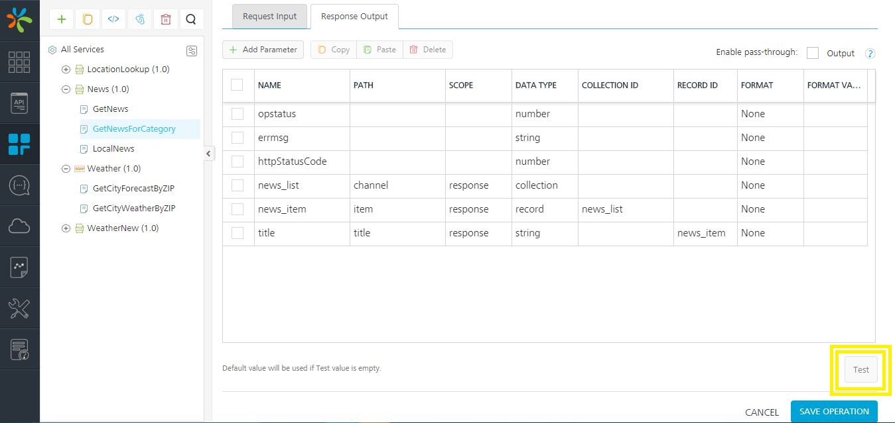
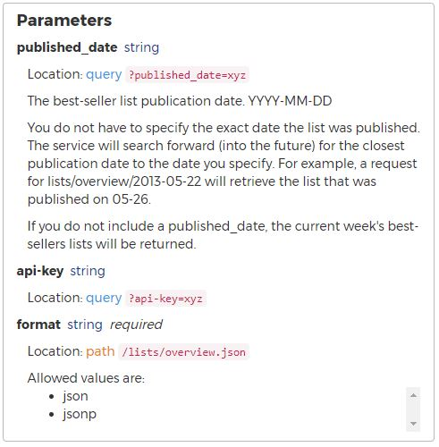

Service Testing using VoltMX Foundry Console
=========================================

When configuring your VoltMX Foundry services, the first thing you must do, is to ensure the connectivity to the backend services is established properly by testing them from VoltMX Foundry console. For this module, you can use the application provided for the **Sample BookStore** application (VoltMX BookStore Sample) to try out service testing.

Testing a Service from VoltMX Foundry Console
------------------------------------------

First, import the provided application via the **Apps** section. Once you import the application, navigate to the **NYTimes Integration** service. You see that we have a list of pre-configured operations here :

*   `GET_lists-date-list-json` : Retrieves the list of bestsellers on a given date.
*   `GET_lists-format` : Search for book lists by a given name.
*   `GET_lists-overview-format` : Returns the latest bestsellers list.

The Testing mechanism in VoltMX Foundry console differs slightly based on the type of the service you configure. For Integration services, you can see **Fetch Response** and **Test** buttons to retrieve service data, as shown below :

**RAML**, **OpenAPIs**, and **Data Adapters** behave slightly differently to make the experience better for you. For these services, you can see a **Test** tab on the **Operation Details** page. Lets look at one of the services in our **BookStore** application as `GET_lists-overviewformat` to understand a test scenario.

The service shows you the latest bestsellers list, based on the publishing date. Here's what the API doc says :

Let us see how VoltMX Foundry responds to a valid and invalid data in this API call. Once your services are configured properly and tested in VoltMX Foundry Console, you can deploy your service, and invoke it. Once a service is published, you can test the live API using VoltMX Log Server, or the Admin Console.

In the next section of this tutorial, we will dive deeper into debugging your live APIs.
