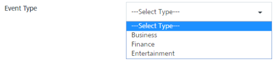
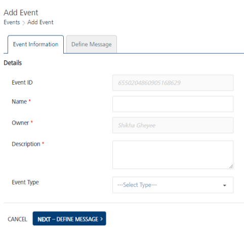
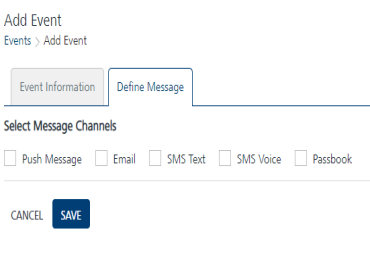

                              

Engagement Services Event Management QuickStart Guide: Event Information

Creating an Event
=================

Adding an event involves the following steps:

1.  On the **Events** home page, click the **Add Event** button.
    
    The **Add Event** page appears. The **Add Event** page includes two tabs: **Event Information** and **Define Message**. By default, the **Event Information** tab is set to **Active**.
    
    *   [Event Information](#event-information)
    *   [Define Message](#define-message)
    
    Event Information  
    
    --------------------
    
2.  In the **Details** section, enter details for the following fields:
    *   **Event ID**: The field displays the system-generated event identification number. You cannot modify an event ID.
    *   **Name**: Enter a name of the event such as **ATM Transaction**. The event name can be a maximum of 50 characters.
    *   **Owner**: The field displays the name of an event creator. You cannot change the owner details.
    *   **Description**: Enter the event description such as **Rs. xxxx was withdrawn using your Sample Bank Card ending 0000 on mm-dd-yy on, Avl bal: xxxxxxxx.**. You can enter only alphanumeric characters. If the description exceeds the existing message box area, a scroll bar appears.
    *   **Event Type**: Select the event type from the **Event Type** drop-down list.
        
        
        
        > **_Note:_** The **Name** and **Description** fields are mandatory. If you do not enter the details, the system displays an error message that information is required.
        
        
        
3.  Click **Next-Define Message** to continue.
    
    The **Define Message** tab becomes active.
    
    Define Message
    --------------
    
4.  Based on your requirement, select a channel to compose an event message. You need to select at least one channel: push, email, SMS, or pass to send event notifications.
    
    
    
    For more details about how to configure the email messages, refer to [Adding Email Messages](../../../Foundry/vms_console_user_guide/Content/Events/Defining_Notification_Types_for_an_event_-_Email.md)
    
    For more details about how to configure the SMS messages, refer to [Adding SMS Messages](../../../Foundry/vms_console_user_guide/Content/Events/Defining_Notification_Types_for_an_event_-_SMS.md)
    
    For more details about how to configure the passbook messages, refer to [Adding Passbook Messages](../../../Foundry/vms_console_user_guide/Content/Events/Defining_a_campaign_Type_eventPassbook.md)
    
    > **_Note:_** When an email, push, or SMS channel is selected, you can define name-value pairs in the message. The name-value pairs are replaced with the actual data when the event message is sent, such as `customerID-bankaccountno`.  
    For pass messages, you can choose an existing pass template or create a new pass to send as the event message.
    
    In this example, push message is chosen as the notification channel.
