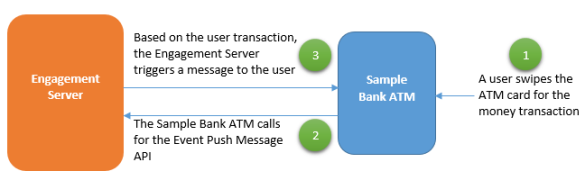

                            

Engagement Services Event Management QuickStart Guide: Overview

Overview
========

Engagement Services, enable you to send event messages through any of the four channels (push notification, email, SMS, and pass) to the users. When an event is added and published successfully, you need to call the event through the Event APIs to deliver event messages.

To understand events, let us assume that a bank wants to inform about the ATM transaction done by users. When a user swipes the ATM card for money, the ATM contacts the Engagement server through the Event Push Message API. Based on the generated event ID the Bank (the Event Push Message API is called) triggers the event push notification to the user about the ATM transaction.

The QuickStart guide explains about how to create an event and configure the event notification channels.
