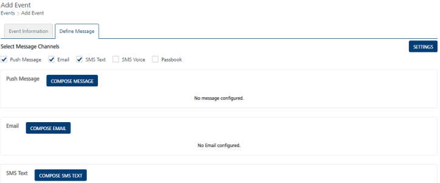
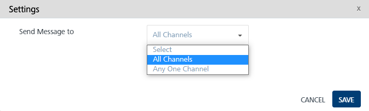
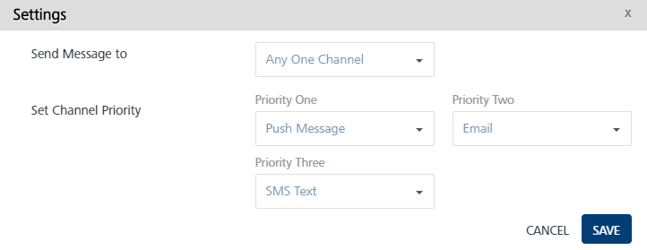
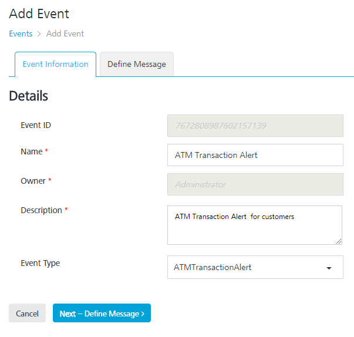
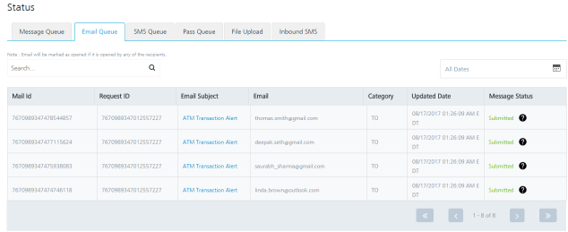

                            

Engagement Services Event Management QuickStart Guide: Setting Event Message Priority

Setting Event Message Priority
==============================

You can set channel priority to send messages to users through the **Settings** button available on the **Events** > **Define Message** page. The **Settings** button becomes active when you select at least two channels. There are four options available to send messages to users: push message, email, SMS, and Passbook.

Allowing a user to set the message priority ensures that the message is always delivered when the event is triggered. The event message is delivered instantly through the notification channel available and also prevents the duplication of the messages sent.

A user creates an event and sets the first priority as email notification, second priority as push message and the third priority as SMS. When the event is triggered and the email subscription is valid, only email message is delivered. The notifications through push message and SMS channels are ignored. When the first and second channel cannot deliver the message, the third channel is used. The message is always delivered through one channel only when more than one channel are defined.

To set the event message priority, follow these steps:

1.  Based on your requirement, select the channels from the **Define Message** page.
    
    The **Settings** button becomes active.
    
    
    
2.  Click the **Settings** button.
    
    The **Settings** window appears on the page. By default, the **Send Message to** drop-down list is set to **All Channels**.
    
    
    
3.  Select the option as **All Channels** or **Any One Channel**.
4.  **All Channels**: The message is sent to all channels without any channel priority. Click **Save** to continue. The system displays the **Define Message** page.
5.  **Any One Channel**: The **Set Channel Priority** drop-down list appears for the respective channels.
6.  Based on your requirement, set the channel priority for respective channels as priority one, priority two, and priority three.
    
    
    
7.  Click the **Cancel** button to exit from the window without saving any information. The system displays the **Add Event** \> **Define Message** page.
8.  Click **Save** to continue. The system displays the **Add Event** \> **Define Message** page.

Use Case Scenario
-----------------

To understand how to set event message priority, let us assume that a bank wants to inform about the ATM transaction done by users. When a user swipes the ATM card for money, the ATM contacts the Engagement server through the Event Push Message API. Based on the generated event ID the Bank (the Event Push Message API is called) triggers the event message to the user about the ATM transaction. You can set event message priority through following channels:

*   Push Message
*   Email Message
*   SMS Message

The Bank Admin creates an event named as **ATM Transaction Alert** in Volt MX Engagement Services console.

The Admin clicks the **Next- Define Message** button to set message priority for the event. On the **Define Message** page, the Admin selects the three channels: Push, Email, and SMS. When Admin selects the three channels, the **Settings** button becomes active.

The Admin sets the email message as priority one, push message as priority two, and SMS as priority three. When the event is triggered, the email message is sent successfully. Therefore other channels, push message and SMS message are ignored. The following image displays that the email message is sent successfully.

