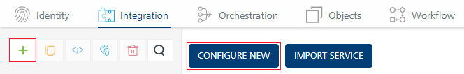
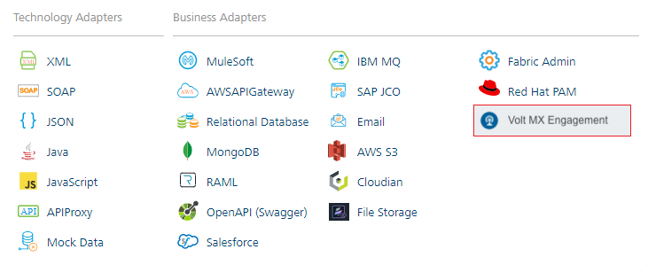
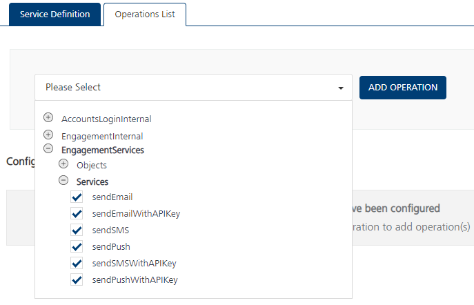

 

Engagement Adapter
==================

Overview
--------

With the Engagement Adapter, you can invoke Engagement Services by using credentials for authorization, or by using an API key. You can use the APIs to send notifications to subscribed applications and perform administrative tasks such as sending a push notification, sending an email, or sending an SMS.

Prerequisites
-------------

Before you use the engagement adapter, make sure that you meet the following requirements.

*   Have access to a VoltMX Account. If you do not have an account, you can sign-up for a trial [here](https://manage.demo-hclvoltmx.com/registration).
*   Have access to an Engagement server on VoltMX Foundry
*   Have access to an app that is published on the engagement services console.  
    For more information, refer to [Adding an Application](../../../vms_console_user_guide/Content/Apps/Adding_an_Application.md).
*   To send emails, set up email configuration on the Engagement Services Console.  
    For more information, refer to [Email Configuration](../../../vms_console_user_guide/Content/Administration/Email_Configuration.md).
*   To send SMSes, set up SMS configuration on the Engagement Services Console.  
    For more information, refer to [SMS Configuration](../../../vms_console_user_guide/Content/Administration/SMS_Configuration.md).

Using the Engagement Adapter
----------------------------

To use the Engagement adapter, follow these steps.

1.  Create and publish an app on the Engagement Services console.
2.  Download the Engagement Adapter zip file.
3.  Import the Engagement Adapter to VoltMX Foundry.  
    For more information, refer to [Importing a Custom Data Adapter](../../../voltmx_foundry_user_guide/Content/CustomDataConfig.md).
    
    After importing the adapter, you will see a new adapter with the name **VoltMX Engagement**.
    
4.  Create an app on the VoltMX Foundry Console.  
    For more information, refer to [How to Add Applications](../../../voltmx_foundry_user_guide/Content/Adding_Applications.md).  
    
    Alternatively, you can use API Management, for more information, refer to [API Management](../../../voltmx_foundry_user_guide/Content/API_Management.md).
    
5.  Create an **Integration Service** with the **Service Type** as **VoltMX Engagement**.  
    For more information, refer to [Creating a Service](#creating-a-service).
6.  Configure the [Connection Parameters](#connection-parameters) to connect to the Engagement Server.
7.  Add Operations and use the [Engagement Adapter APIs](Adapter_APIs.md) to send push notifications, emails, or SMSes to client devices or recipients.

You can also download the [Foundry Engagement Services](https://marketplace.voltmx.com/items/voltmx-foundry-engagement-services) from HCL Forge.

Creating a Service
------------------

1.  From the Foundry app page, or the **API Management** page, go to the **Integration** tab.
2.  On the **Integration** tab, click **Configure New**.  
    Alternatively, click the plus (**+**) icon, and then select **Add New Service**.  
    
3.  From the **Service Type** list, select **VoltMX Engagement**.

    

After you create the Integration Service, you must configure the [Connection Parameters](#connection-parameters).

Connection Parameters
---------------------

Before you use the Engagement Adapter APIs, you need to use the following connection parameters to connect to the Engagement Server.

   
| Connection Parameter | Required | Type | Description |
| --- | --- | --- | --- |
| Accounts Login URL | Optional if using API Key, Required if using authentication | URL | Specifies the URL of the VoltMX Foundry account login. You can find this under **Identity** tab of **Settings** page on the Foundry Console. |
| Engagement URL | Required | URL | Specifies the URL of the VoltMX Foundry Engagement server. |
| Engagement User Id | Optional if using API Key, Required if using authentication | String | Specifies the user name or user ID that is used to sign-in to the Engagement Server. |
| Password | Optional if using API Key, Required if using authentication | String (password) | Specifies the password that is used to sign-in to the Engagement Server. |
| Engagement App API Key | Optional if using authentication, Required if using API key | String | Specifies the API key of the app on the engagement console. You can find the **App API Key** under the **Settings** tab of the app page in the Engagement Services Console. |

If you want to use the Engagement Adapter APIs with the user authentication mechanism, make sure that you configure the following parameters:

*   Accounts Login URL
*   Engagement User Id
*   Engagement Password

If you want to use the Engagement Adapter APIs with the App API Key, make sure that you configure the following parameters:

*   Engagement App API Key

After you connect to the Engagement Server, you can [Add Operations](#adding-operations) and use the [Engagement Adapter APIs](Adapter_APIs.md).

Adding Operations
-----------------

1.  After creating an Integration Service, switch to the **Operations List** tab.
2.  From the drop-down list, expand **Engagement Services** → **Services**.
3.  Select the operations (APIs) that you want to add to the services, and then click **ADD OPERATION**.

After you add the operations, you can configure the input parameters and use the [Engagement Adapter APIs](Adapter_APIs.md).
