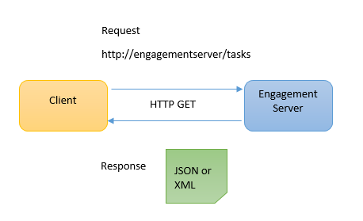
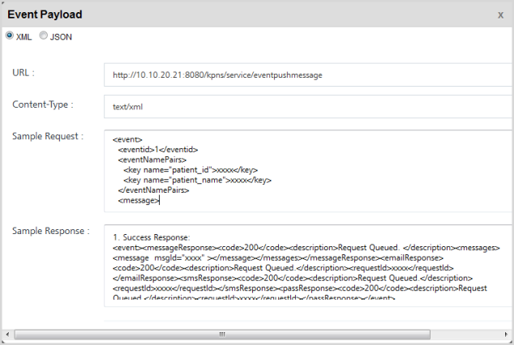

You are here: Introduction

# Introduction

The Volt MX Foundry Engagement Services API Programming guide refers to REST APIs. REST (Representational State Transfer) is an architectural style, and an approach to communicate through Web APIs. REST APIs communicate over HTTP (hyper text transfer protocol) with an application. The common HTTP methods to send request and receive responses are GET, POST, PUT and DELETE. REST APIs interface with engagement server through URI (uniform resource identifier). For example, you can create, modify and delete events through Engagement Services Console. Similarly, you can perform all these functions through REST APIs.

- Create Event: `http://<host>:<port>/api/v1/events`
- Modify Event: `http://<host>:<port>/api/v1/events/<id>`
- Delete Event: `http://<host>:<port>/api/v1/events/<id>/delete`

## Representational State Transfer Architecture

Representational State Transfer (REST) is a style of architecture based on a set of principles that define how networked resources are addressed. REST is a style of software architecture instead of a set of standards. A generic REST architecture is characterized by following:

### Client -Server

The client-server style is used for network-based applications. A server component listens for requests for a number of APIs. A client component sends a request to the server through a connector to invoke an API. The server either rejects or executes the request and sends a response back to the client. The following diagram describes the current client-server architecture:



### Stateless

The client-server communication is stateless in nature. Here, each request from client to server contains all the information necessary to satisfy the request. So, the session state entirely resides on the client.

### Representations

REST components perform actions on a resource by using a representation to capture the current or intended state of that resource and transferring that representation between components.

A representation consists of metadata that describes the data (to verify message integrity). Metadata is in the form of name-value pairs, where the name corresponds to a standard that defines the value's structure and semantics. Response messages may include both representation metadata and resource metadata.

Based on the client requirement arbitrary key/value pairs (metadata) are passed. For example, the two Name_Value pairs **patient_name** and **patient_id** configured in the **Event Message** Box as shown below are included in the <eventNamePairs> tag.



Depending on the message control data, a given representation may indicate the current state of the requested resource, or the value of a resource, such as a representation of the input data within a client's query form.

### Connectors

REST uses various connector types to encapsulate and transfer resource representations. The connectors present an abstract interface for component communication. The common connectors are displayed in the table given below:

| REST Connectors | Examples          |
| --------------- | ----------------- |
| RESTClient      | libwww-perl       |
| server          | engagement server |

The primary connector types are client and server. The essential difference between the two is that a client initiates communication by making a request, whereas a server listens for connections and responds to requests to supply access to its APIs. A component may include both client and server connectors.

### Components

REST components are displayed in the table given below:

| REST Components | Examples                                          |
| --------------- | ------------------------------------------------- |
| user agent      | Google Chrome, Internet Explorer, Mozilla Firefox |

A user agent uses a client connector to initiate a request and becomes the ultimate recipient of the response. The most common example is a web browser, which provides access to information APIs and renders API responses according to the application needs

## How REST APIs works

Let us take a simple web API as an example: Querying the Engagement APIs application for the details of a user. You need to pass the user ID in a URI to retrieve the information.

```
http://<host>:<port>/api/v1/accessmgmt/users/<id>
```

The sample request is sent through the HTTP GET method to the engagement server. The result is an JSON file with complete user details as given below:

```
{
"id": 1,
"email": "admin@hcl.com",
"displayName": "Administrator",
"mobileNo": "",
"activeFlag": true,
"lastModifiedBy": "admin",
"lastModifiedDate": "07/15/2015 02:47:07 AM EDT",
"createdDate": "07/15/2015 02:44:02 AM EDT",
"createdBy": "admin",
"allowAllApps": false,
"selectedAppIds": [
"AppForAll"
],
"userName": "admin",
"selectedPermissionIds": [],
"selectedGroupIds": [
1,
2
]
}
```

The above example includes a simple example for a REST request -- with a single parameter. But REST can easily handle more complex requests, including multiple parameters. For example,

```
http://www.xxx.com/phonebook/UserDetails?firstName=Tom&lastName=Smith
```
