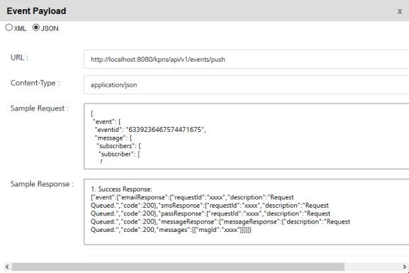

# Event Push Message

The **Event Push Message** API sends push messages to the subscribed app users.

## Use Case

This use case outlines how to send event push message to the subscribed apps:

1.  Click the required event in the Events home page list view.

    The View Event page appears.

2.  Click Next-Define Message.

    The Define Message page appears.

3.  Click View API Payload.

    The Event Payload window appears.

    

4.  Select the event payload format as XML or JSON.
5.  Copy the sample request.
6.  Enter the subscriber ksid.
7.  Submit the payload.

## URL

The HTTP URL for **Event Push Message** API is:

```
http://<host>:<port>/api/v1/events/push
```

The Event Push Message API supports all kinds of authentication.

## Method

POST

## Header

The payload's request header includes Content-Type as application/json;charset=UTF-8.

## Input Parameters

The following fields are input parameters for the sample event push message payload (normal) and sample event push message payload with channel priorities:

| Input Parameter                                | Level – Two       | Level – Three   | Level- Four     | Required | Type    | Description                                                                                                                                                                                                                                                                                               |
| ---------------------------------------------- | ----------------- | --------------- | --------------- | -------- | ------- | --------------------------------------------------------------------------------------------------------------------------------------------------------------------------------------------------------------------------------------------------------------------------------------------------------- |
| **Input Parameters (Normal)**                  |                   |                 |                 |          |         |                                                                                                                                                                                                                                                                                                           |
| event                                          |                   |                 |                 |          |         | An array of event objects                                                                                                                                                                                                                                                                                 |
|                                                | Event ID          |                 |                 | Yes      | long    | The unique id assigned to an event                                                                                                                                                                                                                                                                        |
|                                                | message           |                 |                 |          |         | An array of message objects                                                                                                                                                                                                                                                                               |
|                                                |                   | subscribers     |                 |          |         | An array of subscribers objects                                                                                                                                                                                                                                                                           |
|                                                |                   | subscriber      |                 | Yes      | string  | An array of subscriber objects                                                                                                                                                                                                                                                                            |
|                                                |                   |                 | \- ksid         | Yes      | long    | Volt MX Subscription Identification number of the application                                                                                                                                                                                                                                             |
|                                                |                   |                 | \- ufid         | Optional |         | The User Friendly Identifier or UFID is used when you subscribe to Volt MX Foundry Engagement Services. Based on your requirement, you can provide an UFID. It is alphanumeric, for example xxx@voltmx.com or 2890XZCY. It can be used to map devices to the user using the value as a reconciliation key |
|                                                |                   |                 | \- deviceId     | Optional |         | Device ID of the Subscriber which was used when you subscribe to Volt MX Foundry Engagement Services                                                                                                                                                                                                      |
|                                                | content           |                 |                 |          |         | An array of content objects                                                                                                                                                                                                                                                                               |
|                                                |                   | mimeType        |                 | Yes      | string  | Label for data such as text/plain                                                                                                                                                                                                                                                                         |
|                                                |                   | priorityService |                 | Optional | boolean | If it is priority service or not                                                                                                                                                                                                                                                                          |
|                                                | eventType         |                 |                 | Optional | string  | Selected event type                                                                                                                                                                                                                                                                                       |
| **Input Parameters (with Channel Priorities)** |                   |                 |                 |          |         |                                                                                                                                                                                                                                                                                                           |
| event                                          |                   |                 |                 |          |         | An array of event objects                                                                                                                                                                                                                                                                                 |
|                                                | eventid           |                 |                 | Yes      | long    | The unique id assigned to an event                                                                                                                                                                                                                                                                        |
|                                                | audienceMembers   |                 |                 |          |         | An array of audienceMembers objects                                                                                                                                                                                                                                                                       |
|                                                |                   | property-value  |                 |          |         | An array of audience member property-value pairs                                                                                                                                                                                                                                                          |
|                                                | channelPriorities |                 |                 | Optional |         | An array of channel priority objects. The channels are listed in priority order, with the highest priority channel listed first                                                                                                                                                                           |
|                                                | sms/message       |                 |                 |          |         | An array of sms objects                                                                                                                                                                                                                                                                                   |
|                                                |                   | content         |                 |          |         | An array of content objects                                                                                                                                                                                                                                                                               |
|                                                |                   |                 | mimeType        | Yes      | string  | Label for data such as text/plain                                                                                                                                                                                                                                                                         |
|                                                |                   |                 | priorityService | Optional | boolean | If it is priority service or not                                                                                                                                                                                                                                                                          |
|                                                | email             |                 |                 |          |         | An array of email objects                                                                                                                                                                                                                                                                                 |
|                                                |                   | from            |                 |          |         | An array of from objects                                                                                                                                                                                                                                                                                  |
|                                                |                   |                 | emailId         |          |         | Email ID of the user who sends the event email message                                                                                                                                                                                                                                                    |
|                                                |                   | content         |                 |          |         | An array of content objects                                                                                                                                                                                                                                                                               |
|                                                |                   |                 | priorityService | Optional | boolean | If it is priority service or not                                                                                                                                                                                                                                                                          |

## Sample Request (Normal)

```
{
"event": {
"eventid": "6339236467574471675",
"message": {
"subscribers": {
"subscriber": [
{
"ksid": "6338529139847084503",
"ufid": "xxxx",
"deviceId": "xxxx"
}
]
},
"content": {
"mimeType": "text/plain",
"priorityService": "false"
}
}
}
}
```

## Sample Request (with Channel Priorities)

```
{
"event": {
"eventid": "event_id",
"audienceMembers": [{
"property": "xxxx",
"value": "xxxxxx"
},
{
"property": "xxxx",
"value": "xxxxxx"
}
],
"channelPriorities": [{
"messageChannel": "PUSH"
},
{
"messageChannel": "Email"
},
{
"messageChannel": "SMS"
}
],
"sms": {
"content": {
"mimeType": "text/plain",
"priorityService": "false"
}
},
"message": {
"content": {
"mimeType": "text/plain",
"priorityService": "false"
}
},
"email": {
"from": {
"emailId": "xxxx "
},
"content": {
"priorityService": "false"
}
}
}
}
```

## Output Parameters

The following fields are output parameters for the sample event push message response (normal) and sample event push message response with channel priorities:

| Output Parameter (first level)                  | Level-Two                                               | Level-Three                                             | Level-Four | Level-Five | Description                                                                                    |
| ----------------------------------------------- | ------------------------------------------------------- | ------------------------------------------------------- | ---------- | ---------- | ---------------------------------------------------------------------------------------------- |
| event                                           |                                                         |                                                         |            |            | An array of event objects                                                                      |
|                                                 | messageResponse and/or smsResponse and/or emailResponse |                                                         |            |            | An array of messageResponse objects, and/or smsResponse objects, and/or emailResponse objects. |
|                                                 |                                                         | response                                                |            |            | An array of response objects                                                                   |
|                                                 |                                                         |                                                         | id         |            | The unique id assigned to an event                                                             |
|                                                 |                                                         |                                                         | message    |            | Response status message                                                                        |
|                                                 |                                                         | status                                                  |            |            | Response status code                                                                           |
| **Output Parameters (with Channel Priorities)** |                                                         |                                                         |            |            |                                                                                                |
| event                                           |                                                         |                                                         |            |            | An array of event objects                                                                      |
|                                                 | channelResponse                                         |                                                         |            |            | An array of channelResponse objects                                                            |
|                                                 |                                                         | messageResponse and/or smsResponse and/or emailResponse |            |            | An array of messageResponse objects, and/or smsResponse objects, and/or emailResponse objects  |
|                                                 |                                                         |                                                         | response   |            | An array of response objects                                                                   |
|                                                 |                                                         |                                                         |            | id         | The unique id assigned to an event                                                             |
|                                                 |                                                         |                                                         |            | message    | Response status message                                                                        |
|                                                 |                                                         |                                                         | status     |            | Response status code                                                                           |

## Sample Response (Normal)

```
{
"event": {
"messageResponse": {
"response": {
"id": "6339762469036817916",
"message": "Request Queued. "
},
"status": 200
}
}
}
```

## Sample Response (with Channel Priorities)

```


{
"event": {
"channelResponse": {
"emailResponse": {
"response": {
"id": 8995541177564983145,
"message": "Request Queued."
},
"status": 200
},
"messageResponse": {
"response": {
"id": "899554117756434343434",
"message": "Request Queued.”
},
"status": 200
},
"smsResponse": {
"response": {
"id": "8995541151019817780",
"message": "Request Queued."
},
"status": 200
}
}
}
}
```

## Response Status

| Code       | Description                       |
| ---------- | --------------------------------- |
| Status 200 | Request queued                    |
| Status 400 | Invalid request format            |
| Status 401 | Unauthorized request              |
| Status 500 | Server failure to process request |
