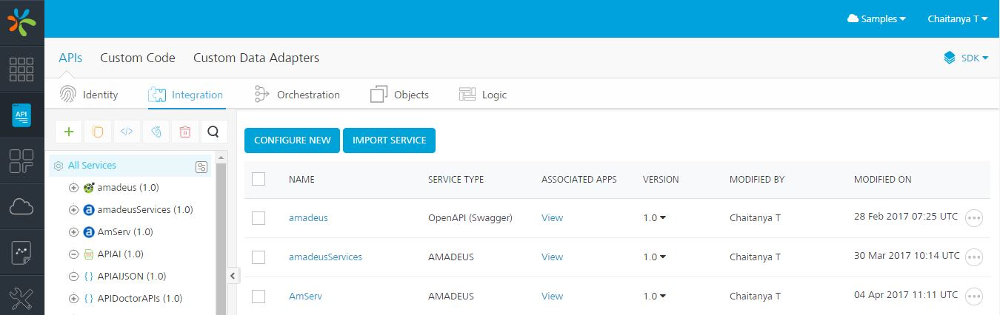



Understanding VoltMX Foundry Console
=================================

Hello Everyone! Welcome to your first look at VoltMX Foundry! In this tutorial, we will take you thru the various components of VoltMX Foundry console, and terms you need to know before you get started.

Navigating the Console
----------------------

Your first login to VoltMX Foundry console will navigate you to the **Dashboard** view, containing a snapshot of your deployment:

The VoltMX Foundry console comprises six major sections, accessible from the left panel of your console.

*   **The Dashboard** - You can connect to your Apps, Runtime Environments, VoltMX Marketplace, SDK downloads, and learning links here.
*   **Apps** – Create your backend apps and services here. All service deployments will need to be done thru this section.
*   **API Management**\- With API Management, you can configure and manage app services (for identity, integration, orchestration, objects, and logic for Node.js services) without linking or configuring them within an app. After configuring the services in API Management, you can edit, clone, view a sample code, and delete services.
*   **Clouds** – View state of your connected clouds here. This sections also lets you navigate to the Administrator view for each connected service.
*   **Reports** – View data from your active applications here. You can use one of our out-of the box reports, or create your own.
*   **Settings** – Manage access to cloud deployments linked to the active account.
*   **Support** – Connect to us! Access VoltMX documentation and forums.

We will go into further details on these sections in the later part of this lesson.

Accounts, Clouds, and Environments
----------------------------------

Lets take a better look at **Accounts, Clouds and Environments** in VoltMX Foundry.

At the top-right section of your Cloud login, you will be able to see your Account and Login information. Your VoltMX login can be associated with multiple Accounts.

Your VoltMX login will be associated with a default account. You will be the **Owner** for this account, and will have the right to share your account with other members. Any users you share your account with can access the clouds associated with your account. You can choose the access you provide to the associated user, by making them – an **Owner**, an **Administrator**, or a **Member**.

Each account can be linked with a set of **Environments**. An environment is a collection of servers available to you for use. You can view the environments associated with each account under the **Environments** section of your login.

This is what your **Environments** section will look like:

The Apps Section
----------------

The **Apps** section of your VoltMX Foundry console is where all the heavy lifting gets done. This section lets you create services to connect to your backend services, and deploy your services and applications.  
You can create a new application or service here, or choose to import an existing VoltMX Foundry application here. VoltMX Foundry lets you configure services to fulfil to the suitable backend requirement. The **Services** section contains a bunch of options to configure different types of services. Based on the type of feature you want to implement, create a service of the required type. The type of services supported are:

To provide you the freedom to control your backend operations, we allow a set of services catering to connecting to a set of predefined Endpoints URLs, or to create your own backend operations in Java, or JavaScript. You can even create NodeJs applications and host them on the VoltMX Foundry server as backends!

### Applications and API Management

You can access your **Applications** from the **Applications** tab (left control pane).

An application is a logical grouping of a set of services. Creating an application to group your services lets you create an inter-relation between the included services. For example, an application can contain an Identity provider, and a protected backend application. By linking these two services in an application, they can be used in correlation with each other.

Your Applications page will look like this:

If you do not wish to create an application for grouping your services, VoltMX Foundry allows you to create a standalone service and access it as well. You can create these services from the **API Management** section of VoltMX Foundry portal. This section lets you configure **Identity**, **Integration**, **Orchestration, Objects**, and **Logic** services.

Here’s what the API Management section looks like:

Settings
--------

The **Settings** area lets you manage user access to your clouds. If you are a owner or an Admin of the cloud, you will be able to invite users to a cloud from this section. You can also modify user access from this section.

Refer the sample view below:

