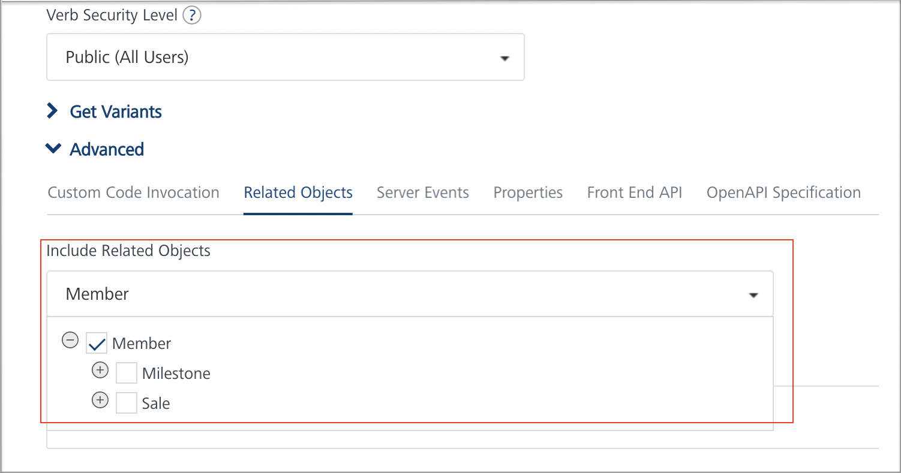
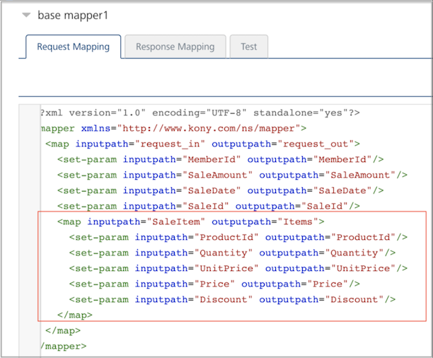
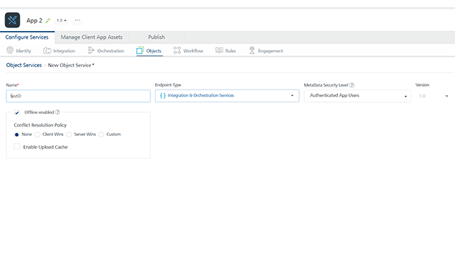

Configuring Volt MX Foundry Server
=================================

Offline Objects supports the following modules: 

*   **Service Driven Objects (SDO)**: Object services can interact with the backend through service-driven objects derived from Integration services, which wraps the backend end-points such as REST API.
*   **Line-of-Business (LOB) Adapters**: You can use Object Services to create data models from line-of-business (LOB) objects. You can access LOB objects by using Volt MX Foundry business adapters such as SAP, Salesforce, and RDBMS. These business adapters enable you to visually discover and select the entities exposed by the LOB system.

The following section explains how to configure Offline Objects by using [Service Driven Objects](#service-driven-objects) and [Line-of-Business Adapters](#line-of-business-adapters).

Service Driven Objects
----------------------

1.  Sign in to the [VoltMX Foundry Console](https://manage.hclvoltmx.com/console/).
2.  Create a new application by clicking **ADD NEW** in the applications' page. A new app is created, and the **Configure Services** page opens, by default.
3.  Under the Integration tab, either create a new Integration service or use an existing one. For more information about creating an integration service, click [here](../../../Foundry/voltmx_foundry_user_guide/Content/ConfigureIntegrationService.md).
4.  Under the Objects tab, click **CONFIGURE NEW**. A New Object Service page appears.
5.  Type a name for your object service and select **Integration & Orchestration Services** from the Endpoint Type list.

6.  Select the Offline enabled check box. Upon selecting this check box, options to set **[Conflict Resolution Policy]**](../../../Foundry/offline_objects_user_guide/Content/Conflict_Resolution.md) and **[Enable Upload Cache]**(../../../Foundry/offline_objects_user_guide/Content/Upload_Cache.md) are enabled.
    
    
    
7.  Configure the [Conflict Resolution Policy](../../../Foundry/offline_objects_user_guide/Content/Conflict_Resolution.md) and [Enable Upload Cache](../../../Foundry/offline_objects_user_guide/Content/Upload_Cache.md) features as required and save the service.
8.  To link your integration service to your object service, click **Generate** under the Data Models’ section. The **Generate App Data Model from Existing Services** tab appears.
    
    
    
9.  Click **Add** and type your Object Name and select your Service Name and Operation Name from the list. Click Generate.
    
    
    
10.  The generated data model is created with the relevant fields and relationships.
       
       > **_Note:_** Enable primary key for the fields.

11.  Configure the Fields, Relationships, and ChangeTracking as required.

     >  ***Note:*** *ChangeTracking* column: At present, this column supports only string type. Another type, like date, can be used, but it would require a postprocessor to convert to string format.
    
12.  Save the changes and publish the app.
13.  Now, link your Foundry application to the client application.  

<h3 id="map1">Defining Mapping for Objects in Parent-Child Relationship</h3>

When two objects are in parent-child relationship, the mapping for verbs (GET/CREATE/UPDATE) can be defined in two ways depending on how the integration services are defined for these objects:

<ol>
<li>Parent and Child objects have their own integration services for the verb mapping (GET/CREATE/UPDATE):</li>
<ul type="disc">
<li>

Verbs for parent and child objects are defined as though they are two independent objects.

<blockquote><em><b>Note:</b></em> verbs should be mapped individually for both parent and child objects.</blockquote>
</li>
<li>For the selected parent object and verb, in Advanced &gt; Related Objects &gt; Include Related Objects section, checkboxes should not be turned on for including child objects.</li>
<li>

For example, <b>Member</b> (parent object) has one-to-many relationship with <b>Milestone</b> and <b>Sale</b> (child objects) and they have their own integration services that get/create/update them.

Individual verb (CREATE/UPDATE) mappings are defined for <b>Milestone</b> and <b>Sale</b> objects.

Checkboxes should not be turned on for <b>Milestone</b> and <b>Sale</b> objects when defining verb mapping for <b>Member</b> object
 

</li>
</ul>
<li>Parent and Child objects share the same integration service for the verb mapping (GET/CREATE/UPDATE):</li>
<ul>
<li>

Verbs for both parent and child objects should be mapped in parent object only.

<blockquote>
<em><b>Note:</b></em> verbs should not be mapped individually in both parent and child objects.
</blockquote>
</li>
<li>

For example, <b>Sale</b> (parent object) has one-to-many relationship with <b>SaleItem</b> (child object) and they share the same integration services.

Individual verb (CREATE/UPDATE) mappings are not defined for <b>SaleItem</b>. Mapping these verbs for <b>Sale</b> will create/update <b>SaleItem</b> as well.

 

</li>
<li>

For the selected parent object and verb, in Advanced &gt; Related Objects &gt; Include Related Objects section, checkboxes should be turned on for both parent, child objects and for all the applicable methods for which the mapping is defined in this verb.

</li>
<li>When the check box for child object is turned on, the child object fields become available in visual mapper for mapping the fields to input/output parameters in request/response mapper.</li>
</ul>
</ol>
<h3 id="map2">Request and Response Mapping with Parent-Child Objects</h3>
<b>Request Mapping with Parent-Child Objects</b>
<ul>
<li>
In request mapping, child object fields are mapped to integration service input parameters.

</li>
<li><blockquote><em><b>Note: </b></em>Visual mapper does not allow to map the child object fields to collection inputs in integration service. This can be achieved by editing the request mapper XML. <b>Need to define at least one Request property mapping for Parent Object to pass the Data Filter from the requests.</b>
</blockquote>

</li>
</ul>
 
<b>Response Mapping with Parent-Child Objects</b>
<ul>
<li>In response mapping, child object's integration service response parameters are mapped to child object fields.</li>
<li>

For example, <b>Items</b> is a collection in the response of <b>“sale_create”</b> integration service. The fields of <b>Items</b> collection are mapped to fields of the child object <b>SaleItem</b> object.
 

</li> 
<li><blockquote><em><b>Note: </b></em>Parent object's integration service response output parameters should not be mapped to child object fields. <b>If Response Mapping is done manually in XML then Child Object properties should be nested in Parent Object Response mapping for hierarchical output data.</b>
</blockquote></li>

For example, below mapping should not be done.
 

</ul>

Line-of-Business Adapters
-------------------------

1.  Sign in to the [VoltMX Foundry Console](https://manage.hclvoltmx.com/console/).
2.  Create a new application by clicking **ADD NEW** in the applications' page. A new app is created, and the **Configure Services** page opens, by default.
3.  Under the Objects tab, click **CONFIGURE NEW**. A New Object Service page appears.
4.  Type a name for your object service and select the required business adapter from the Endpoint Type list.
5.  Select the Offline enabled check box. Upon selecting this check box, options to set [Conflict Resolution Policy](../../../Foundry/offline_objects_user_guide/Content/Conflict_Resolution.md) and [Enable Upload Cache](../../../Foundry/offline_objects_user_guide/Content/Upload_Cache.md) are enabled. Configure these fields as required.
    
    
    
6.  Configure the fields of the selected business adapter. For example, **SAP**.
    
    
    
7.  Click **Save and Configure** to configure the data models and add mappings.
8.  You can either create a new data model and add mappings or import the objects from the metadata of your backend provider.
    
    *   To create a new data model and add a mapping, click **Configure New** under the Data Model section. For more information about how to create a data model and add a mapping, click [here](../../../Foundry/voltmx_foundry_user_guide/Content/ObjectsServices/Stage_2.md#creating-objects-39-definition-and-map-to-back-end-objects-manually).
    *   To import objects from your backend, click **Generate** under the Data Model section. For more information about importing objects from the metadata of your backend provider, click [here](../../../Foundry/voltmx_foundry_user_guide/Content/ObjectsServices/Objectservices_Stage3.md).

    > **_Note:_** Enable primary key for the fields.

9. Configure the Fields, Relationships, and ChangeTracking as required.  
        
    >  ***Note:*** *ChangeTracking* column: At present, this column supports only string type. Another type, like date, can be used, but it would require a postprocessor to convert to string format.
        
9.  Save the changes and publish the app.
10.  Now, link your Foundry application to the client application.
