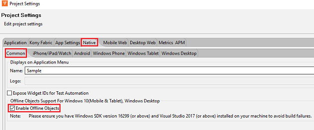
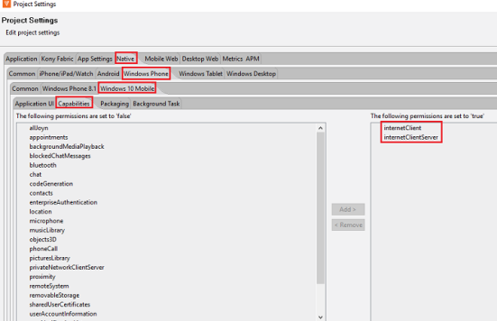
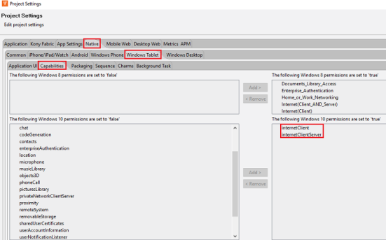

                            

Offline Objects Support in Windows 10
=====================================

Overview
--------
<!--- 
As a part of V8SP3, an offline objects feature is released as a beta version for Windows Store and Windows 10 based Kiosk applications. Using this feature, you can enable offline objects for the apps built with Iris.
-->
Volt MX contains an object feature for Windows Store and Windows 10 based Kiosk applications. Using this feature, you can enable offline objects for the apps built with Iris.

Offline Objects allows an application to interact with the data in online or offline mode and sync the data to the backend at a later point in time. Refer [Offline Objects Getting Started Guide](../../../Foundry/offline_objects_gettingstarted/Content/Offline_Objects_Getting_Started.md) and [API reference Guide](../../../Foundry/offline_objectsapi_reference_guide/Content/Offline_Objects_API_Reference.md) for better understanding of this feature and its capabilities.

This guide helps in getting started with Offline Objects on Windows channels and describes the supported functionality, limitations, roadmap, and code samples.

Advantages of Offline Objects
-----------------------------

**Following are the advantages of Offline Objects support in Windows 10:**

*   Makes an app truly offline enabled.
*   Offline Objects is implemented as a native library that gives better performance and ability to perform background sync.
*   Offline Objects is based on object services, it allows switching or enhancing the backend capabilities without changing the client app or the applications data model.
*   It is a feature-rich, that provides control over data syncing to the developer of the app.

Supported Features
----------------------------------
<!--- **Following are the supported Offline Objects features for the beta release:** -->
**Following are the supported Offline Objects features for the release:**

*   Ability to setup, drop or reset the sync environment.
*   Perform ORM operations (create, update, delete, and get) on local database of the device.
*   Sync device data with the backend (Supports - Storage Objects, RDBMS, SAP, and Salesforce).
*   Ability to perform incremental or delta sync.
*   Support for upload or download data in batches.

RoadMap
-------

**Following is the roadmap for Offline Objects in Windows 10:**

*   Support for data filters.
*   Support for syncing hierarchical data.
*   Ability to disable change tracking.
*   Ability to defer changes from uploading.
*   Support for binary data operations.

Prerequisites
-------------

**Following are the prerequisites for Offline Objects in Windows 10:**

  
| Standard Environments | Configuration |
| --- | --- |
| Windows | Windows 10 |
| Windows 10 SDK | Windows 10 Fall Creators Update (10.0 Build 16299) and above |
| .Net Framework Version | 4.6.1 and above |
| RAM (Min) | 8 GB or more for development |
| Hard Disk (Min) | 40 GB or more |

You can configure applications data model using Offline Enabled Object Services through Volt MX Foundry. For detailed information, refer [Configure Offline Objects Services Server](../../../Foundry/voltmx_foundry_user_guide/Content/Offline_Enable_Objectservices.md)

Enabling Offline Objects in Volt MX Iris
-------------------------------------------

Offline Objects for Windows 10 is not enabled in Volt MX Iris by default .

**Follow these steps to enable Offline Objects in Volt MX Iris:**

*   Open the latest version of Volt MX Iris.
*   Open or create a new project.
*   Navigate to **Project Settings>> **Native****\>> ****Common** and click **Enable Offline Objects** check box.**
    
    
    
*   Under **Native Project Settings**,
    
    *   Navigate to **Windows Phone** >> **Windows10 Mobile** >> **Capabilities** >> include **internetClient** and **internetClientServer** (ignore, if already included).
        
        
        
    *   Navigate to **Windows tablet** >> **Capabilities** >> include **internetClient** and **internetClientServer** (ignore, if already included).
        
        

<!--- *   As Offline Objects support on Volt MX Iris is a beta version, a .zip file windowsofflineobjects\_ffi is provided.
-->        
*   As Offline Objects support on Volt MX Iris, a .zip file windowsofflineobjects\_ffi is provided.
*   Unzip the file and navigate to customlibs folder.
    
    **Path**: windowsofflineobjects\_ffi>> resources>> customlibs.
    
*   Copy the contents of the folder and paste them to your project folder>> resources>> custom libs) folder by navigating to your project folder of your Iris work space (if prompted to replace the files, permit it).
