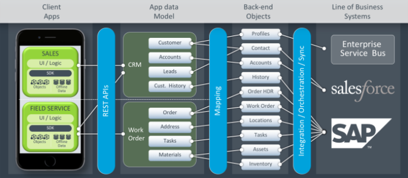

---
layout: "documentation"
category: "offline_objects_user_guide"
---                        

Architecture
============

In Offline Objects, there are four main components. They are Client App, App Data Model, Back-end, and Line of Business Systems or Service Driven Objects.

In a field services app, the client app contains front-end and custom logic that executes the assigned tasks. The field service app interacts with the App Data Model (an Object Model) that contains work order with data in terms of the order, address, tasks, and materials. These are the objects with which the client app will interact. On the other hand, there is a back-end with its own object structure. You can map these objects by using either one-to-one or one-to-many or many-to-many relationships. You can set filters as to what data to send with the help of an object model. Now, the back-end objects can interact with the Source of Truth such as Salesforce, SAP, and Legacy Data through either built-in adapters or through Integration or Orchestration services.
