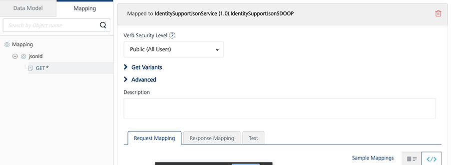
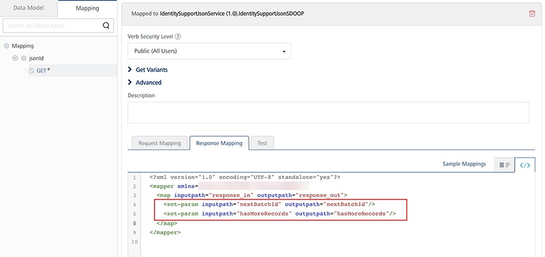

Volt MX  Offline Objects User Guide: [Advanced Features](Advanced_Features.md) > Line-of-Business Systems

Batching Support in Sync Operation
==================================

Batching is an efficient way to upload or download a large number of records from or to the client device. Instead of having to upload documents one-by-one, you can group a bunch of them together to upload at once. Also, if you need to upload a large number of records, you can upload them in batches to avoid time-out. The same applies to download as well. Batching helps to limit the amount of data to be resynchronized due to weak mobile network connections.

Offline Objects supports record-count based batching at the Object and the Object-Service levels. You can specify the batch size and batch ID through the syncOptions parameter in the Sync API.

*   **$batchsize** represents the size of the batch to be uploaded/downloaded. The default batch size for upload is 50 records and download is 500 records. If the downloadBatchSize parameter is set to 0, all records will be downloaded.
    
    Make sure that your backend supports record-count based batching and the downloadBatchSize parameter in the sync API. You should be aware of the capabilities and drawbacks of your backend. For example, the batch size in SAP represents the number of bytes to be downloaded. Hence, use appropriate values for the downloadBatchSize option.
    
*   **$batchId** represents the batch pointer that has to be uploaded/downloaded.

Volt MX  Foundry relies on the back end for batching support. The back-end system must have the capability to return data in the form of batches. The back-end system should contain the following response level parameters:

*   **nextbatchID** represents a pointer to the next batch that has to be uploaded/downloaded.
*   **hasMoreRecords** specifies if there are any more batches to be retrieved.

Batching for Line-of-Business Systems
-------------------------------------

The prerequisite for batching in LOB systems is that the back-end adapter must honor the OData params, $batchId, and $filter.

> **_Note:_** The RDMS adapter and Storage Objects do not support batching, by default. For the RDMS adapter, batching can be achieved through SDOs.

Batching for Service Driven Objects
-----------------------------------

In SDO, objects are built on top of Integration services. There are two types of SDOs. They are

*   SDO that support OData
*   SDO that does not support OData

### SDOs that Support OData

These SDOs support $filter and $batchId. In this case, no extra configurations are required.

### SDOs that do not Support OData

The batching for these SDOs depend on the number of Integration services available in the back end. To achieve batching for these SDOs, follow these steps.

1.  Under the Objects tab in Volt MX Foundry Console, go to the **Mapping** tab of your object.
2.  Click GET. The following screen appears.
    
    
    
3.  Expand the **Get Variants** field. Map the **getbatch** verb to the service that downloads in batches.
    
    
    
4.  Modify the request mapper and response mapper of the GET operation as follows.

    Request Mapper

    ```
    <?xml version="1.0" encoding="UTF-8" standalone="yes"?>
    <mapper xmlns="http://www.voltmx.com/ns/mapper"> 
        <map inputpath="request_in" outputpath="request_out"> 
            <set-param inputpath="../criteria/filter/__LastModifiedDate__" outputpath="__from_timestamp__"/> 
            <set-param inputpath="/$batchid" outputpath="__batchid parameter__"/>
            <set-param inputpath="/$batchsize" outputpath="__batchsize param__"/> 
            <set-param inputpath="../criteria/filter/__Id__" outputpath="__Id__"/> 
        </map>
    </mapper> 
    ```

    The code contains the following fields:

    *   **LastModifiedDate** is the column name selected for object update tracking.
    *   **Outputpath** represents the getupdated service input param that takes the timestamp as input to the filter applied to it.
    *   **batchid** represents request param relevant to the batchid that has to be downloaded for the service mapped in the getBatch operation.
    *   **batchsize** represents the request param relevant to the batchsize that has to be downloaded for the service mapped in the getBatch operation.
    *   **/criteria/filter/\_Id\_** is required when you configure the conflicts.
        
        > **_Note:_** The filter can be accessed from a criteria node such as `../criteria/filter/<key>`. This node provides the value of the key present in the filter. For example, if $filter = Id eq 10, the `../criteria/filter/Id` gives a value of 10.
        
    *   **\_Id\_** represents the primary key of the object.

    Response Mapper

    ```
    <?xml version="1.0" encoding="UTF-8" standalone="yes"?>
    <mapper xmlns="http://www.voltmx.com/ns/mapper"> 
        <map inputpath="response_in" outputpath="response_out"> 
            <set-param inputpath="hasMoreRecords" outputpath="__hasMoreRecords__"/> 
                <exec-function name="voltmx.string:isNotBlank" outputpath="notNullBatchID" output="$vars"> 
                    <set-arg inputpath="__batchid__" /> 
                </exec-function> 
                <choose> 
                    <when test="$vars/notNullBatchID"> 
                        <set-param outputpath="nextBatchId" inputpath="__batchid__" /> 
                    </when> 
                </choose> 
            <map inputpath="Account" outputpath="Account"> 
            <set-param inputpath="AccountNumber" outputpath="AccountNumber"/> 
            <default generated mapper continued>
            </map> 
        </map>
    </mapper> 
    ```

    In the code, a null check for the batchid parameter must be performed. If the batchid is null, ensure that the **nextBatchId** parameter is not present.

    > **_Note:_** The batchid and nextBatchId parameters are case-sensitive.

If the object service contains multiple object in it in that case the post-processor code should be as -

JS code snippet:
```
function setNextBatchID() {
    var size = request.getParameter('$batchsize');
    if(size != null){
       var count = 0;
       var resultCount  = result.getAllDatasets().size();
       for(var i=0; i < resultCount; i++)
        {           
            count = Number(count) + Number(result.getAllDatasets().get(i).getAllRecords().size());                 
        }
        var total = 0;
        if(request.getParameter('$batchid') != null)
        {             
            total = request.getParameter('$batchid');                  
        }
        var batchId = Number(total)+ Number(count);
        if(count > 0)
        {                                
            result.addParam(new com.konylabs.middleware.dataobject.Param("nextBatchId", Number(batchId)));             
            result.addParam(new com.konylabs.middleware.dataobject.Param("hasMoreRecords",true));                                     
        }
    }   
}
setNextBatchID();
```

JAVA code snippet:
```
public class BatchPostProcessor implements DataPostProcessor2 {

    @Override
    public Object execute(Result result, DataControllerRequest request,
    DataControllerResponse response) throws Exception {
        String size = request.getParameter("$batchsize");
        if (size != null) {
        int count = 0;
        for (int i = 0; i < result.getAllDatasets().size(); i++)
            { count = count + result.getAllDatasets().get(i).getAllRecords().size(); }
        int total = 0;
        if (request.getParameter("$batchid") != null)
            { total = java.lang.Integer.parseInt(request.getParameter("$batchid")); }
        int batchId = total + count;
        if (count > 0)
            { result.addParam( new com.konylabs.middleware.dataobject.Param("nextBatchId", String.valueOf(batchId))); result.addParam(new com.konylabs.middleware.dataobject.Param("hasMoreRecords", "true")); }
        }
        return result;
    }

}

```


Batching for RDMS Adapter:
--------------------------

Since the RDMS adapter supports OData, it supports the $filter parameter but does not support the $batchID parameter. To achieve batching for the RDMS adapter, follow these steps.

1.  Run the following code in the pre processor and post processor:
```
function propagateBatchingParams() {            
            if(request.getParameter('$batchsize') != null){
              serviceInputParams.put('$top',request.getParameter('$batchsize'));         
            }
     
           if(request.getParameter('$batchid') != null){
               serviceInputParams.put('$skip',request.getParameter('$batchid'));           
            }
    } 
    propagateBatchingParams();
```
2.  The pre processor sets the OData parameters, **$top** and **$skip**, that enable the RDMS adapter to skip and fetch the exact number of records specified in the batch size.
```
function setNextBatchID() {
        var size = request.getParameter('$batchsize');
        if(size != null){
           var count = 0;
           var resultCount  = result.getAllDatasets().size();
           for(var i=0; i < resultCount; i++){
              count = Number(count) + Number(result.getAllDatasets().get(i).getAllRecords().size());        
            }
           var total = 0;
              if(request.getParameter('$batchid') != null){
                total = request.getParameter('$batchid');         
            }
           var batchId = Number(total)+ Number(count);
            if(count >= size){                   
                result.addParam(new com.hcl.voltmx.middleware.dataobject.Param("nextBatchId", Number(batchId)));
                result.addParam(new com.hcl.voltmx.middleware.dataobject.Param("hasMoreRecords",true));                            
            }
           
        }   
    }
     
    setNextBatchID();
```
    
> **_Note:_** While batching with SyncV2, for non-adapter back ends, if empty records are fetched in the current batch, the **hasMoreRecords** key should not be sent from the back end.
    
3.  The post processor calculates the next batchId by adding the current number of records to the downloaded records.
4.  Under the Objects tab in Volt MX Foundry Console, go to the Mapping tab of your object.
5.  For the corresponding object, add the following lines of code in the **Response Mapping** tab of the **GET** operation and save the changes.
    
    ```
    <set-param inputpath="nextBatchId" outputpath="nextBatchId"/>           
        <set-param inputpath="hasMoreRecords" outputpath="hasMoreRecords"/>
    ```<br>
    

    For more information about sync API and options for the batching, refer to [Offline Objects API Guide](../../../Foundry/offline_objectsapi_reference_guide/Content/Offline_Objects_API_Reference.md).


