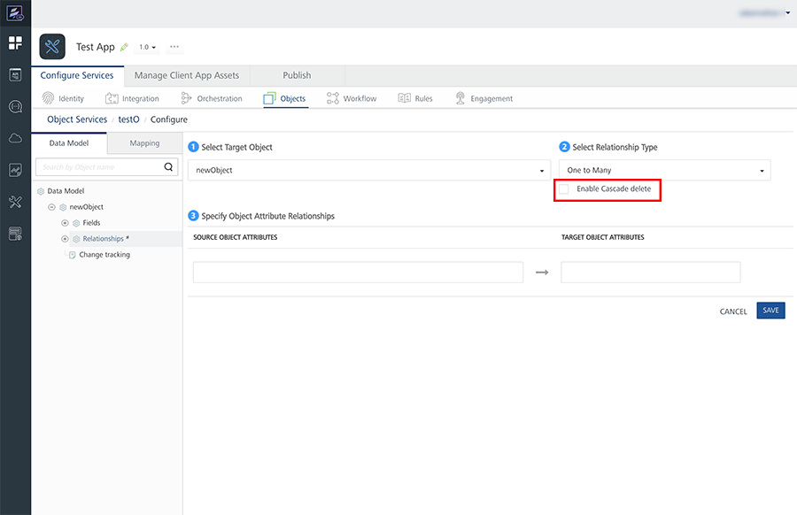

Cascade Delete
==============

In the hierarchy of parent data and child data, if the parent data is deleted, no action can be performed on the child data. To avoid this dysfunctionality, the Cascade Delete feature deletes the referenced child data when the parent data is deleted.

You can enable the Cascade Delete while configuring relationships in the Data Models of the Objects Service. Hence, this is an optional feature.

