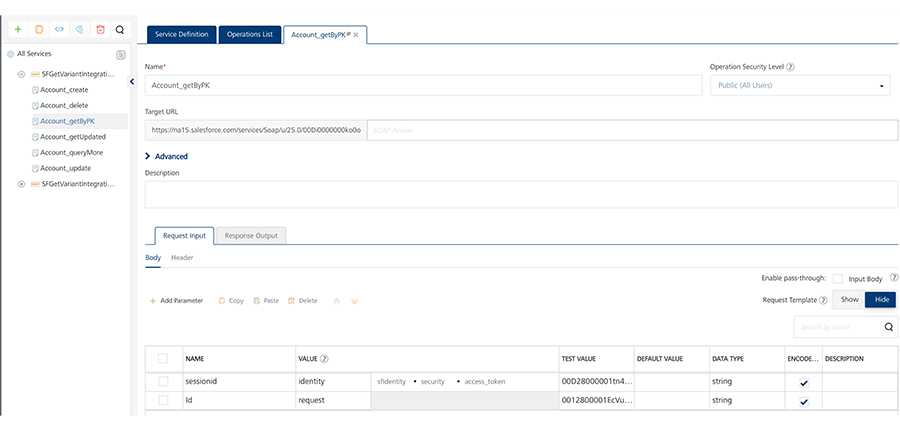
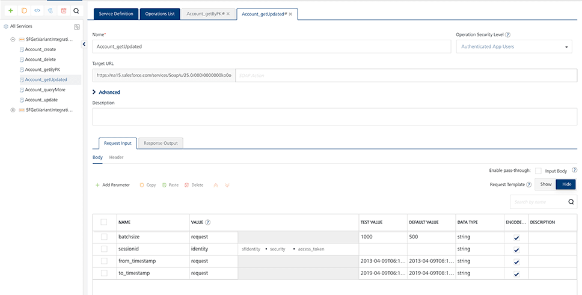
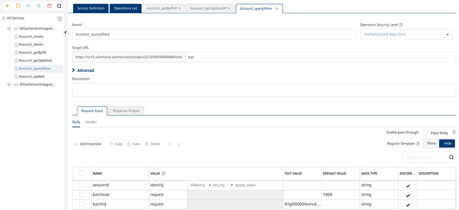
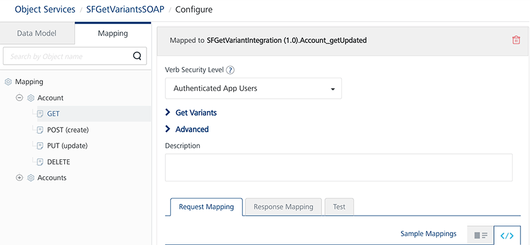
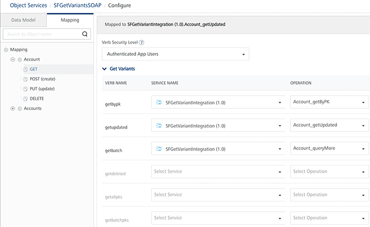
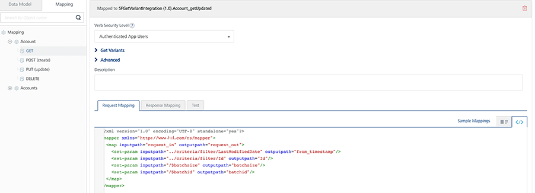
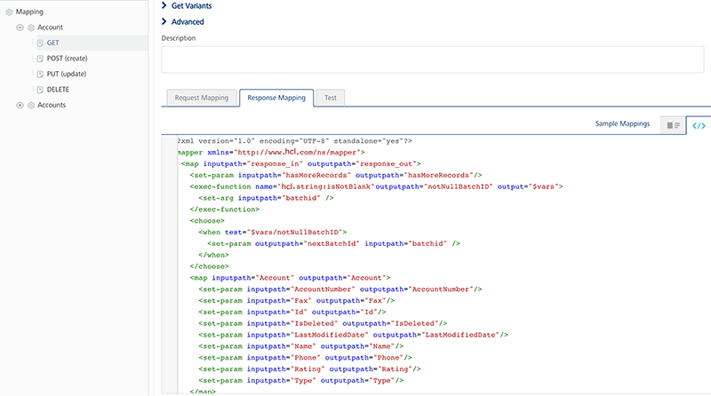

---
layout: "documentation"
category: "offline_objects_user_guide"
---                      

Conflict Resolution Policy
==========================

When more than one client alters the same record and synchronizes to the backend, one of the client's version might conflict with that of the server. Custom Conflict Resolution helps to resolve such conflicts.

You can enable conflict resolution policy in Foundry Console under the Objects Service section. The **Conflict Resolution Policy** check box is displayed only when you select the Offline enabled check box. The default value is None.


Conflict Resolution Policy contains the following options:

*   **None**: If you select None, the server does not check for conflicts. We recommend the None option when the conflicts are not expected such as in the cases of download only and upload only.
*   **Client Wins**: If you select Client Wins, changes made by the client are retained.
*   **Server Wins**: If you select Server Wins, changes made by the server are retained.
    
    While determining the conflict, the end data source is queried with the primary key that has to be uploaded.
    
    Conflict is said to have occurred if a record’s value is different from the current client data. In the offline mode, this form of GET is referred to as **getbypk** variant.
    
    getbypk Service
    ---------------
    
    If the conflict needs to be supported by SDO, define the **getbypk** service. The getbypk service takes the primary key of an object as an input parameter and downloads the record that is in the conflict.
    
    **Input**: A parameter that represents the primary key of an object.
    
    **Output** returns all the fields of the record.
    
    > **_Note:_** In Object Service Mapping, getVerbMapping can be mapped to the getbypk verb.
    
    There are different modules of GET that support initial sync, delta sync, batching, and conflict functionality of Offline Objects.
    
    
    
    getupdated Service
    ------------------
    
    The **getupdated** service is required to support delta sync. It takes timestamp as input and fetches the data from the timestamp.
    
    **Input**: It takes timestamp as the input parameter. If batching is supported, you can also add batchsize as the input parameter.
    
    **Output** returns the following:
    
    All the records of an object.
    
    The hasMoreRecords parameter, which determines if there are any more records to be downloaded.
    
    The nextBatchId, which represents the current download generated in the current batch and also represents the next batchPointer. This is a mandatory parameter only when batching is required.
    
    > **_Note:_** In Object Service Mapping, getVerbMapping can be mapped to the getupdated verb. If the same service can download all the records for a default value of timestamp, this service can also be mapped to the GET verb.
    
    
    
    getbatch Service
    ----------------
    
    The **getbatch** service is used to download progressive batches. This service takes the batch point as an input and downloads the respective batch.
    
    **Input**: It takes batchid as the input parameter.
    
    **Output** returns the following:
    
    A list of records of an object.
    
    The hasMoreRecords parameter, which determines if there are any more records to be downloaded.
    
    The nextBatchId, which represents the current download generated in the current batch and also represents the next batchPointer.
    
    > **_Note:_** In Object Service Mapping, getVerbMapping can be mapped to the getbatch verb. In this case, the batchPointer parameter should return the values from the earlier mentioned GET services.
    
    
    
    To create an object service mapping by using a defined integration service, follow these steps.
    
    1.  Sign in to [VoltMX Foundry Console](https://manage.hclvoltmx.com/).
    2.  Open your application.
    3.  Go to the **Objects** tab and select the corresponding SDO object service. The **Configure** screen opens.
    4.  Select the Mapping tab. The following screen appears.
    
    
    
    
    
    5.  Map the GET variants with the corresponding integration services.
    
    
        
    6.  All the Get variants share the same request and response mappers. Define the required parameters for the earlier mentioned GET variants as follows.
    
   Request Mapper
        
```

        <?xml version="1.0" encoding="UTF-8" standalone="yes"?>
        <mapper xmlns="http://www.voltmx.com/ns/mapper">
        <map inputpath="request_in" outputpath="request_out">
        <set-param inputpath="../criteria/filter/LastModifiedDate" outputpath="from_timestamp"/>
        <set-param inputpath="../criteria/filter/Id" outputpath="Id"/>
        <set-param inputpath="/$batchsize" outputpath="batchsize"/>
        <set-param inputpath="/$batchid" outputpath="batchid"/>
        </map>
        </mapper>
```
        
   Response Mapper
        
```

        <?xml version="1.0" encoding="UTF-8" standalone="yes"?>
        <mapper xmlns="http://www.voltmx.com/ns/mapper">
        <map inputpath="response_in" outputpath="response_out">
        <set-param inputpath="hasMoreRecords" outputpath="hasMoreRecords"/>
        <exec-function name="voltmx.string:isNotBlank" outputpath="notNullBatchID" output="$vars">
        <set-arg inputpath="batchid" />
        </exec-function>
        <choose>
        <when test="$vars/notNullBatchID">
        <set-param outputpath="nextBatchId" inputpath="batchid" />
        </when>
        </choose>
        <map inputpath="Account" outputpath="Account">
        <set-param inputpath="AccountNumber" outputpath="AccountNumber"/>
        …..
        <default generated mapper ctnd…>
        </map>
        </map>
        </mapper>
```


   


   
        
    
*   **Custom**: If any of the earlier mentioned options do not meet your requirements, you can specify either a Java or a JavaScript class that contains a custom code to resolve a conflict. Upload the JAR file of Java or a JavaScript class from the [Advanced](../../../Foundry/voltmx_foundry_user_guide/Content/ObjectsServices/Objectservices_Stage1.md#Custom_JAR-Objects) section.
    
    For sample Java class codes, refer to [Java Sample Codes for Custom Conflict Resolution](Java_Sample_Code_for_Custom_Conflict_Resolution.md).
