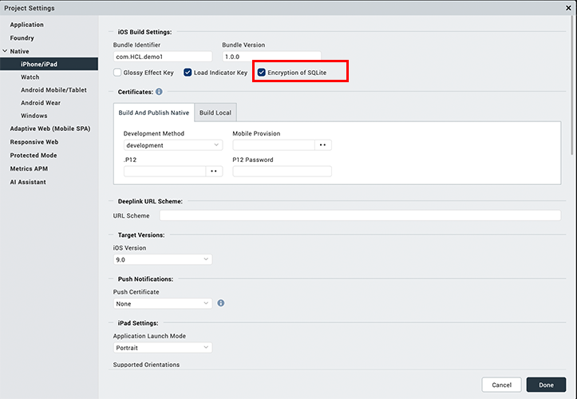
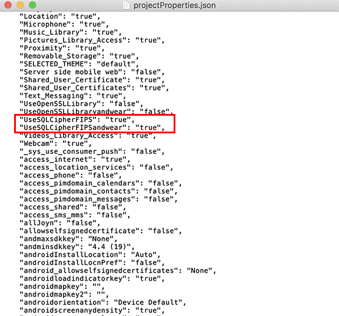

Device Database Encryption
==========================

Device Database Encryption lets you encrypt the Offline Objects database on the device (SQLite) by using a passphrase. The encryption is done through an open-source, FIPS-compliant SQLCipher library (Android v3.5.7, iOS v3.4.1), which provides a transparent and secure 256-bit AES encryption. Device Database Encryption is an optional feature and is supported in Android, iOS, and Windows platforms.

You must meet the following prerequisites to encrypt a device database.

*   The encryption of the device database should be decided before setting up the sync environment. After you create the device database, it cannot be encrypted later unless it is reset by using the reset API.
*   Ensure that the passphrase, **deviceDbEncryptionKey** option is passed in the Application-level APIs (setup, drop, and reset).  
    
    > **Note:**  
    *   Encryption passphrase must be a string and contain at least six characters.  
    *   The keys and values supplied in the API options are case sensitive.  
    *   Passphrase reset is not supported.  
    
Sample Code

```
function successCallback(status) {
    voltmx.print("Application setup successful");
}

function failureCallback(error) {
    voltmx.print("Application setup failed with error:" + error.code);
}
//Encrypt the device database using a passphrase
var options = {
    "deviceDbEncryptionKey": "myencryptionpa$$phrase1"
};
VMXFoundry.OfflineObjects.setup(options, successCallback, failureCallback);
```

> **_Note:_** For web channels, IndexedDB is used as local database and encryption capability is not supported for the same.

Encryption in an iOS Device
---------------------------

To enable encryption in an iOS device, select the **Encryption of SQLite** option in Volt MX Iris. To do so, go to **Project Settings** > **Native** > **iPhone/iPad** and select the **Encryption of SQLite** check box.



Encryption in an Android Device
-------------------------------

To enable encryption in an Android device, follow these steps.

1.  Go to your project workspace.
2.  Search for the **projectProperties.json** file.
3.  Change the values of the following parameters to **true**.
    
    *   **"UseSQLCipherFIPS"** (for Android Mobile/Tablet)
    *   **"UseSQLCipherFIPSandwear"** (for Android Wear)
    
    
    
4.  After making these configurations, refresh your Iris project and build the project. By doing so, the encryption feature will be enabled for the Android devices.
