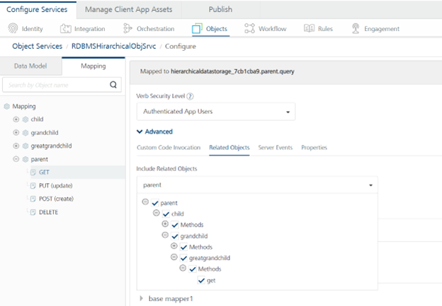
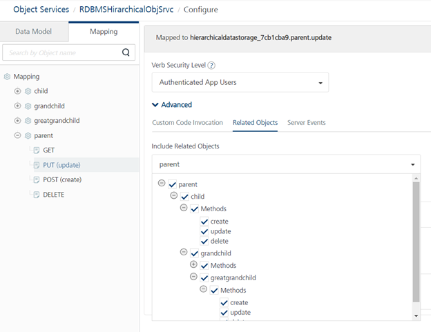
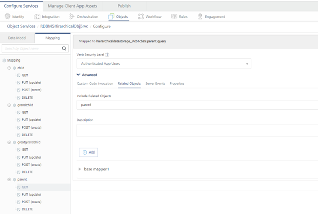

Configuring hierarchical data models in offline objects
=======================================================

When defining relationships among objects of an object service, make sure to select the correct hierarchy for every verb from **Objects > mapping > Advanced > Related objects**.

For example, here is a related object mapped for GET verb of Parent data-model.



When defining related objects, one can also specify the type of actions supported for the child entities. For example, the Parent Update operation supports the child entity Create and Update operations. 



Invoking sync at Application or Object Service level uploads and downloads the data in hierarchical fashion when relationships and related objects are defined in Foundry console. Syncing at Object level does the upload and downloads in non-hierarchical fashion even if the relationships and related objects are defined.

**_Note:_** To support operations like get/create/update on any data model, all of its direct or indirect children must have its verbs configured into them.

For example:



**_Note:_** In case of data storage and rdbms object services, each data model gets its own verbs respectively. These data models are intended to be used in this manner.

### Limitations

- The hierarchical data model depends upon the supported `group_concat_max_len` option value from the DB as query length increases with this hierarchical relationship. You might get this error while performing sync:

```
{
"errmsg": "Error while executing the SQLData truncation: Invalid JSON text in argument 1 to function cast_as_json: \"Invalid value.\" at position 1025.",
      "opstatus": 20005,
      "httpStatusCode": -1
}
```

   To fix this,increase the value of property `group_concat_max_len` at database level to at least 2MB.

