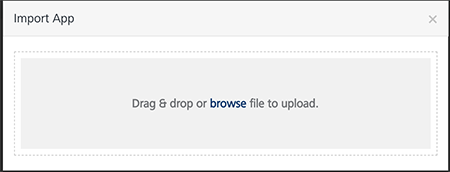
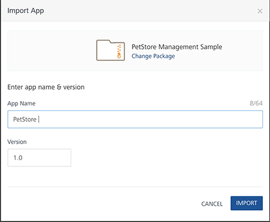
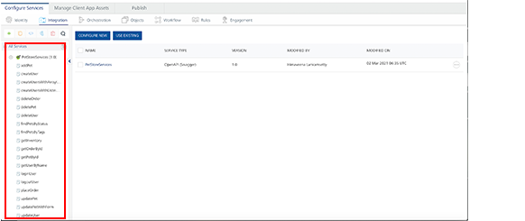

# Pet Store Management Sample

The PetStore Management Sample is a ready to use Sample App developed through OpenAPI Specification(OAS). Swagger is the world’s largest framework of API developer tools for the OpenAPI Specification(OAS), enabling development across the entire API lifecycle, from design and documentation, to test and deployment. The OpenAPI specification creates the RESTful contract for your API, detailing resources and operations in a better readable format for easy development and integration.

The PetStore Management Sample helps a customer to search and view details about pets, stores, and users. The app helps create new orders for pets, select stores and update orders as required. To learn more about PetStore OpenAPI Specification, see [Swagger UI](http://petstore.swagger.io/).

The app is built with predefined functionality. You can set the required properties and events, map the app with your back end service, and build the app. Now, the PetStore Management Sample is ready to use.

This following sections explains the functionality of the PetStore Management Sample.

- [Prerequisites](#prerequisites)
- [Importing the PetStore Management Sample](#setting-the-environment)
- [Configuring the PetStore Management Sample](#configuring-the-petstore-management-sample)
  - [Setting The Environment](#setting-the-environment)
  - [Console Access Control](#console-access-control)
  - [Configuring Integration Service](#configuring-integration-service)
- [Publishing the App](#publishing-the-app)

## Prerequisites

Before you start using the PetStore Management Sample, ensure you have the following:

- [VoltMX account](https://manage.hclvoltmx.com/)

## Importing the PetStore Management Sample

The PetStore Management Sample is a readily available app for all new Trial and Starter accounts of the voltmx Foundry. 

Before you start importing the PetStore Management Sample to Volt MX Foundry, you must download the app to your local folder.

1.  Log on to your [VoltMX account](https://manage.hclvoltmx.com/). The **Dashboard** page appears by default.
2.  In the left pane, click the **Apps** menu. The **Custom Apps** page appears.
3.  Click **Import**. A **Import App** dialogue appears.

    

4.  Drag and Drop the zip folder into the **Import App** window to import the PetStore Management Sample.

5.  Alternatively, Click **Browse**. The **Open** dialog appears.

    

6.  Navigate to the location where you downloaded the component (zip file) on your computer, select the component, and click **Open**. The **PetStore Management Sample** is imported into your Volt MX Foundry Account.

After importing the app, you can access the pre-configured services of the Sample app and view the response output as needed.

## Configuring the PetStore Management Sample

When you import the PetStore Management Sample into Volt MX Iris, a Volt MX Foundry app, **PetStore Management Sample**, is uploaded to your Volt MX account.

> **_Note:_** The PetStore Management Sample fails to upload if already any Volt MX Foundry app exists with the same name (PetStore Management Sample). If you do not want to use the existing PetStore Volt MX Foundry app, rename or delete the existing Volt MX Foundry app, delete the PetStore project from Iris, and import it again.

The PetStore Management Sample contains a set of identity, integration, orchestration, and objects services by default. Using the Volt MX Foundry console, you can configure the services as you require and then publish the app.

The following sections help you configure the PetStore Management Sample.

- [Setting the Environment](#setting-the-environment)
- [Console Access Control](#console-access-control)
- [Configuring Integration Service](#configuring-integration-service)

### Setting the Environment

The PetStore Management Sample is a readily published App.

**To select the environment, do the following:**

1.  Log on to your [VoltMX account](https://manage.hclvoltmx.com/). The **Dashboard** page appears by default.
2.  In the left pane, click the **Apps** menu. The **Custom Apps** page appears.
3.  Find and click **PetStore Management Sample**.
4.  In the left pane, click the **Environments** menu. If the user has no environment available, choose from the environment section a **Clouds** or **On-premises** environment.  
    
5.  Find the appropriate contact from **Owners** or **Administrators** list available and click on the contact to request the On-premises license.  
    
6.  In case of already deployed samples, this App is already published. If the user has made any changes in the environment or to the access permissions, the App need to be published again with the choice of environment.

The PetStore Management Sample is public and has no user authentication required. However, if the user wants to associate a Login component he needs Volt MX User Repository service available in the Volt MX Foundry app. The repository service helps you authenticate customers when they try to log on to the PetStore Management Sample using the user credentials.

### Console Access Control

> **_Note:_** By default all the users have **FULL ACCESS**.

You can provide **Specific Access** to new users or selected users. To provide access to new users select **Add** provide access through **Console Access Control**. After selecting access to the selected users click **SAVE**.

### Configuring Integration Service

The integration services help you define the type of integration and the connection parameters. In the service definition, you can view the Service Type, Version, and Connection Parameters related to the App. The service definition also specifies the Authenticity provider, if any. To learn more about object services and mapping, see [Integration Services](../../../Foundry/voltmx_foundry_user_guide/Content/Services.md).

By default, the PetStore Management Sample is mapped with the Volt MX Foundry Services.

The PetStore Management Sample contains the following :

1.  **Service type** contains the **Open API (Swagger)**. This cannot be modified.
2.  **Connection Parameters** has **petswagger.json** by default. If needed, the user can delete the available .json and upload his own .json object or zip file.

**To view the integrated services and its operations, do the following**:

1.  After logging on to your Volt MX account, open the **PetStore Management Sample**.
2.  Click the **Integration** sub-tab. The **Integration** sub-tab opens with a list of services and corresponding operations.
3.  From the list of integration services, you can see a service type as **PetStoreServices** which is predefined. The **Service Definition** tab of the selected integration service opens by default.

    

4.  Click the plus icon to expand the **PetStoreServices** section in the left navigation. The list of preconfigured operations appears.

5.  Click any one of the preconfigured operation. For example, **getPetsByID**.

    

6.  In the **Name** box, the name of the operation is displayed by default.
7.  On the **Request Input** tab, in the **Body** section, for the following parameters, specify the values in the respective boxes under the **Test Value** column and **Default Value** column.

    Mandatory Parameters

    - **petID:** It takes number values. Enter the **TEST VALUE** 100.

8.  Click **SAVE AND FETCH RESPONSE**. The **Output Result** dialog appears with the response. Otherwise, the **Output Result** shows an error if the value entered is invalid.

> **_Note:_** All the operations are predefined and preconfigured. Provide the corresponding values for the **Test Value** and **Default Value** to fetch the appropriate output responses.

## Publishing the App

The PetStore Management Sample is readily published as a sample app (scenario). After configuring the necessary configurations, or making new edits you must republish the app to Volt MX Foundry.

