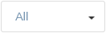
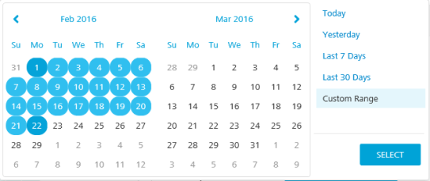
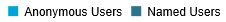
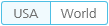
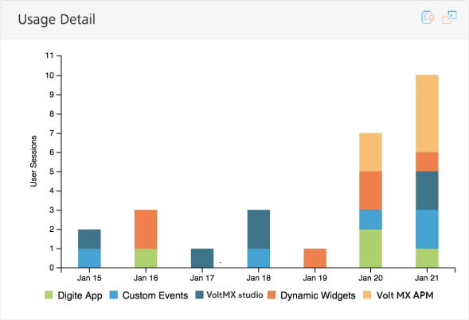
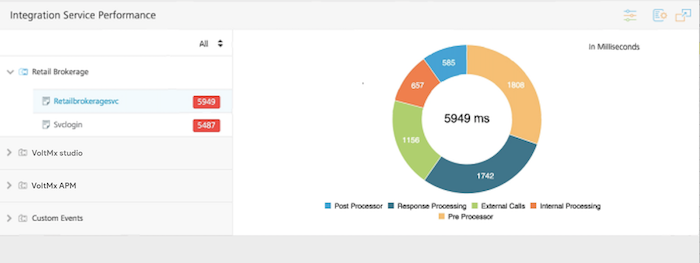

                            

You are here: Analytics Dashboard Configuration

Analytics Dashboard
===================

Analytics Dashboard provides the most relevant reports of application metrics on a page. It collects a set of metrics for your application and presents it in the form of pre-built reports. You can filter the reports by the environment, application, and time range.

The Dashboard contains the following reports:

*   [Daily Users](#daily-users-report)
*   [Activity Per Location](#activity-per-location-report)
*   [Usage Detail](#usage-detail-report)
*   [Integration Service Activity](#integration-service-activity-report)
*   [Integration Service Performance](#integration-service-performance-report)
*   [Error Summary](#error-summary-report)
*   [Sync Integration Service Activity](#sync-integration-service-activity)
*   [Sync Integration Service Performance](#sync-integration-service-performance)

  

Analytics Dashboard Configuration
---------------------------------

By default, the Dashboard displays reports for all your environments and Volt MX Foundry apps in the environment, for the last seven days. You can configure the dashboard to display your desired reports of an environment for a selected time range. You can also change the default position of any report on the Dashboard.

1.  To access the Dashboard, follow these steps:
    1.  Sign in to [VoltMX Foundry Console](https://manage.hclvoltmx.com/).
    2.  From the left navigation panel, click **Reports**.
    3.  Select the **Dashboard** tab.
2.  To configure your Dashboard reports, follow these steps:
    1.  From the Environment field, select an environment from the list.
    
    
    
    3.  From the Application field, select an application from the list.
    
    
    
    5.  Select a date range.
    
    
    
    You can either select a preset range or a custom range.
    
    The preset ranges are Today, Yesterday, Last 7 Days, Last 30 Days.
    
    To select a custom range, select the start date and the end date from the calendar.
    
    
    
    11.  Click **Apply**.
3.  To change the layout of the Dashboard, drag and drop the report to the desired location of the Dashboard.

> **_Note:_** The position of the layout is saved in the browser and will be preserved across sessions. If you use a different browser to log on to Volt MX Foundry, Dashboard loads the reports in the default layout and you will need to reset your layout preferences.

5.  To view the report in a full-screen mode, click .
6.  To download the report, click . Select **Download as PNG** to download the report as an image and **Download as PDF** to download the report as a PDF.

### Daily Users Report

The Daily Users report is a bar graph that shows the count of active users of an application over a given time range. It displays the count of the users using your application on a particular day. You can choose to view either existing users or new users. Existing users are classified into Named Users and Anonymous Users.

*   **Named Users**: Users who have a unique identifier are the Named Users. The unique identifier can be set by using the voltmx.setUserID API in the app code. By default, it is the user ID obtained from the Identity API invoked by the app. The Named Users are tracked as a single user across different devices when the same Volt MX userID is received for an application in an environment.
*   **Anonymous Users**: Users who do not have a unique identifier are anonymous users. The unique identifier is used to track the Anonymous Users.

If there is at least one request from a user on a day, it is counted as one for that user. If there are more requests from the same user, it does not increase the count for that aggregation period.

You can perform the following actions on a Daily Users report:

*   Click **New** to view the number of new users of an application for each day in a given time range.

By default, the Dashboard displays the existing users upon loading.

*   To view the number of active users of an application for each day in the given time range, click **Existing**.
*   To highlight the number of named users in the graph, point to **Named Users** in the legend.

*   To highlight the number of anonymous users in the graph, point to **Anonymous Users** in the legend.
*   To remove named users from the graph, click **Named Users**.
*   To remove anonymous users from the graph, click **Anonymous Users**.
*   To view the number of daily users on a specific date, point to the bar in the graph that represents the date.

### Activity Per Location Report

The Activity per Location report is a map-based graph that shows the percentage of user sessions either on a World map or the United States map. The user sessions are displayed based on geolocation. By default, the Dashboard shows the United States map upon loading.

You can perform the following actions on an Activity Per Location report:

*   To view the total number of user sessions of an application for each country, click **World**.

To view the number of user sessions for a country, point to the respective country.

*   To view the total number of user sessions of an application for the United States, click the **USA**.

To view the number of user sessions for a state, point to the respective state.

### Usage Detail Report

The Usage Detail report is a stacked bar graph that shows the count of user sessions used in an application for a given time range. The applications in the report are shown in the legend of the graph.

You can perform the following actions on a Usage Detail report:

*   To remove an application's data from the report, click on the application name in the legend.
*   To highlight an application in the bar graph, point to the application in the legend.
*   To view the total number of daily user sessions for all the applications in the report for a specific date, point to the bar in the graph that represents the date.

### Integration Service Activity Report

The Integration Service Activity report is a line graph that shows the average number of service requests per day from an application. The report helps to identify what features and modules of the app are used and how often they are being used.

The Integration Service Activity report includes all the services from the applications of an environment, specified in the Environment filter. By default, the graph displays data for all the services of the applications.

The Application Panel on the left side of the report displays the following:

*   Applications in the report.
*   The total number of service calls for each application.

You can perform the following actions on an Integration Service Activity report:

*   In the application panel, click on application name.

The list of services in the application appears, and the service calls for the application are displayed in the graph. The Application Panel shows the count of requests for each service.

*   To highlight the number of requests for a particular service in the graph, point to the corresponding service in the legend.
*   To view the service requests only for a particular service, click a service in the Application Panel.

If the data for the service covers only a single day, it appears as a single point for that day in the graph.

*   To view the total number of requests for each service shown on the graph, point to a date in the graph.
*   To remove a service from the graph, click the name of the service in the legend.

### Integration Service Performance Report

The Integration Service Performance report is a pie chart report that provides information about the average service call duration. It also displays the time taken for each phase of the service call.

The time spent to service a client request is split into logical components. The splitting helps to enable an application developer to identify areas in a service that consume more time than expected and try to optimize the time.

*   Preprocessor: Time spent in executing preprocessing logic for the selected service. This is a custom code written by an application developer.
*   External Call: Time spent by Volt MX middleware server while waiting for the back end URL, configured for the selected service to respond.
*   Response Processing: Time spent to parse the response from the back end with the Xpath notations configured in the service definition for output parameters of the selected service.
*   Postprocessor: Time spent in executing postprocessing logic for the selected service. This is a custom code written by an application developer.
*   Internal processing: Time spent in Volt MX Server code for common internal processing logic of the selected service call. This is (total duration from the time the service request is received in Volt MX Server until the response is returned to the client) minus (preprocessing duration + postprocessing duration + response processing duration + external call duration).

The Integration Service Activity report includes all the services from applications of the environment, specified in the Environment filter. By default, the graph displays data for all the services of the applications.

The Application Panel on the left side of the report displays the applications in the report. By default, data for the first application in the Application Panel is displayed in the graph.

The color used by the Dashboard to display a response time is determined by the thresholds configured for the response time. The default threshold for a warning is 2,000 milliseconds. The default threshold for critical is 3,000 milliseconds. You can configure the threshold limits for the response time. The configured threshold limits are retained as a user preference and used as the default settings the next time you access Dashboard.

*   Green indicates normal
*   Amber indicates warning
*   Red indicates critical

You can perform the following actions on an Integration Service Performance report:

*   In the application panel, click an application name.

The list of services in the application appears. By default, the response time for the first service listed is displayed in the chart. The response time for each service is shown.

*   To view the response time for a particular service in the chart, click the service.
*   Click the response range menu. Click one or two range options, or click **All**.

*   To highlight a phase of a service call, either point to the phase of a service call in the legend or point to the phase of a service call in the chart.
*   To remove a phase of the service call from the graph, click the name of the phase in the legend. For example, click **External Calls** to remove that phase from the chart.

To set the thresholds for the response times, follow these steps:

1.  Click the **Threshold** button (sliders control icon).

A dialog box appears.

4.  In the **Critical Limit** field, enter a time in milliseconds.
5.  In the **Warning Limit** field, enter a time in milliseconds.
6.  Click **Update**.

The configured threshold limits are retained as a user preference.

### Error Summary Report

The Error Summary report is a stacked bar graph that shows the number of exceptions (handled exceptions), errors (unhandled exceptions), and crashes occurred in an application over a given time range.

You can perform the following actions on an Error Summary report:

*   To highlight that error category in the graph, point to one of the error categories in the legend,.

For example, point to **Exceptions** to highlight the exceptions in the graph.

*   To remove an error category from the graph, click the error category in the legend. For example, click **Error** to remove errors from the graph.
*   To view the total number of errors and crashes that occurred on a specific date, point to the bar in the graph that represents the date.

### Sync Integration Service Activity

The Sync Integration Service Activity report is a line graph that shows the number of service requests per day from an application for each request type (upload or download). The report helps to identify what features and modules of the app are used and how often they are being used.

The Sync Integration Service Activity report includes all the services from the applications of an environment, specified in the Environment filter. By default, the graph displays data for all the services of the applications for each request type.

The Application Panel on the left side of the report displays the following:

*   Applications in the report.
*   The total number of service calls for each application.

You can perform the following actions on a Sync Integration Service Activity report:

*   In the application panel, click on application name.
    
    The list of services in the application appears, and the service calls for the application are displayed in the graph. The Application Panel shows the count of requests for each service.
    
*   To highlight the number of requests for a particular service in the graph, point to the corresponding service in the legend.
*   To view the service requests only for a particular service, click a service in the Application Panel.
    
    If the data for the service covers only a single day, it appears as a single point for that day in the graph.
    
*   To view the total number of requests for each service shown on the graph, point to a date in the graph.
*   To remove a service from the graph, click the name of the service in the legend.

### Sync Integration Service Performance

The Integration Service Performance report is a pie chart report that provides information about the average service call duration. It also displays the time taken for each phase of the service call.

The time spent to service a client request is split into logical components. The splitting helps to enable an application developer to identify areas in a service that consume more time than expected and try to optimize the time.

*   External Duration
*   Custom Duration
*   Internal Duration
*   Trace Duration
*   Request Parse Duration
*   Response Parse Duration

The Integration Service Activity report includes all the services from applications of the environment, specified in the Environment filter. By default, the graph displays data for all the services of the applications.

The Application Panel on the left side of the report displays the applications in the report. By default, data for the first application in the Application Panel is displayed in the graph.

You can perform the following actions on a Sync Integration Service Performance report:

*   In the application panel, click an application name.

The list of services in the application appears. By default, the response time for the first service listed is displayed in the chart. The response time for each service is shown.

*   To view the response time for a particular service in the chart, click the service.
*   Click the response range menu. Click one or two range options, or click **All**.

*   To highlight a phase of a service call, either point to the phase of a service call in the legend or point to the phase of a service call in the chart.
*   To remove a phase of the service call from the graph, click the name of the phase in the legend. For example, click **External Calls** to remove that phase from the chart.

To set the thresholds for the response times, follow these steps:

1.  Click the **Threshold** button (sliders control icon).

A dialog box appears.

4.  In the **Critical Limit** field, enter a time in milliseconds.
5.  In the **Warning Limit** field, enter a time in milliseconds.
6.  Click **Update**.

The configured threshold limits are retained as a user preference.
