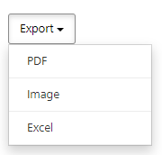

                             
Export Standard Reports
==============================

You can download standard reports by using the **Export** feature. You can download a report in the following formats:

*   PDF (.pdf)
*   Image (.png)
*   Excel (.xls)

To download a standard report, follow these steps:

1.  Sign in to [VoltMX Foundry](https://manage.hclvoltmx.com/).
2.  From the left navigation panel, click **Reports**.
3.  On the **Standard Reports** tab, select the report that you want to download. A dialog box appears.
4.  Configure the filter criteria, and then click **Generate**. The report is generated.
5.  Click **Export**, and then select the required format from the list.  

      
    The selected format of the report is downloaded to your local system.

The following table provides information about the supported formats of each report.

  
| Report Name | PDF | Image | Excel |
| --- | --- | --- | --- |
| Active Users |  |  |  |
| App Crash Breadcrumbs |  |  |  |
| App Session Length |  |  |  |
| Application Error Detail |  |  |  |
| Application Error Summary |  |  |  |
| Application Usage Detail |  |  |  |
| Application Usage Summary |  |  |  |
| Event Activity |  |  |  |
| Event Summary |  |  |  |
| Frequency of App Usage |  |  |  |
| New Users |  |  |  |
| Object Service Performance |  |  |  |
| Object Service Performance Detail |  |  |  |
| Requests per Form |  |  |  |
| Requests per Service |  |  |  |
| Service Duration |  |  |  |
| Service Duration Detail |  |  |  |
| Service Performance |  |  |  |
| Service Usage Detail |  |  |  |
| Service Usage Summary |  |  |  |
| Sessions per Device |  |  |  |
| Time Spent per Form |  |  |  |
| US Map of User Activity |  |  |  |
| World Map of User Activity |  |  |  |
| Sync - Requests per Service |  |  |  |
| Sync - Service Duration |  |  |  |
| Sync - Service Duration Detail |  |  |  |
