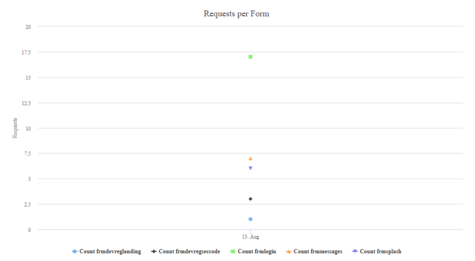
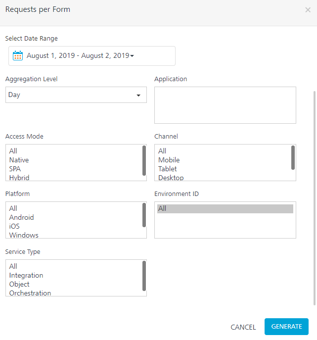
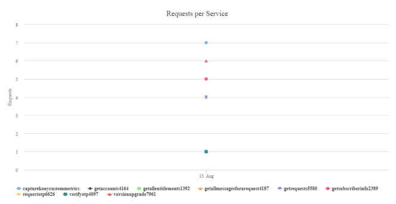
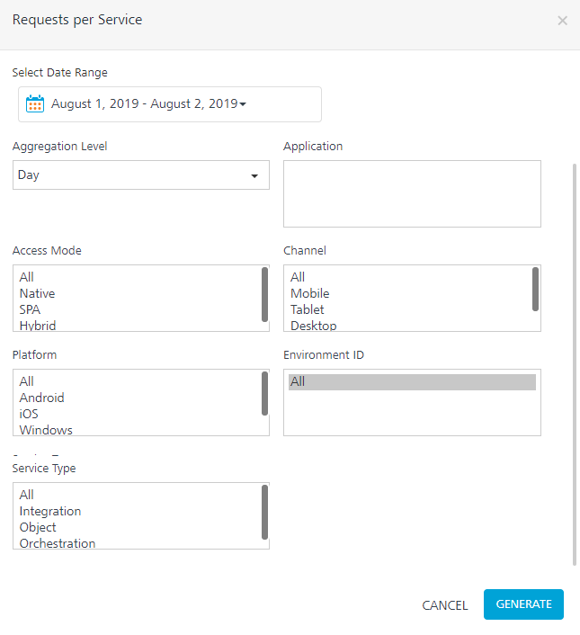
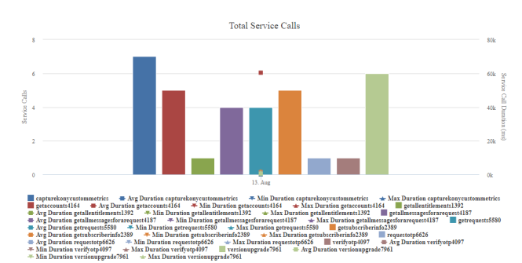
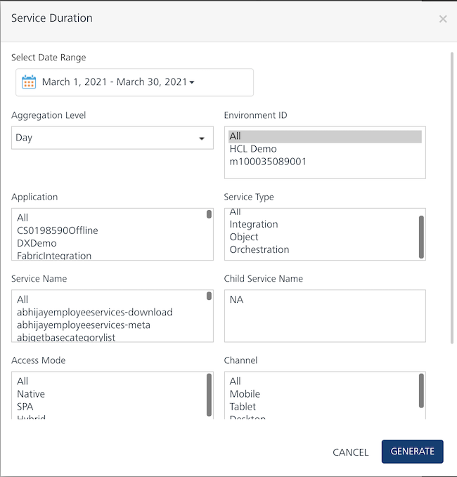
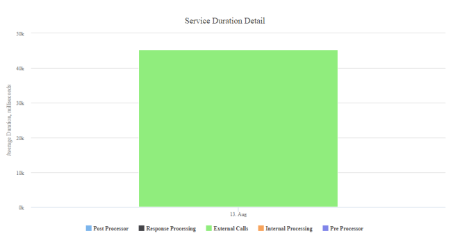
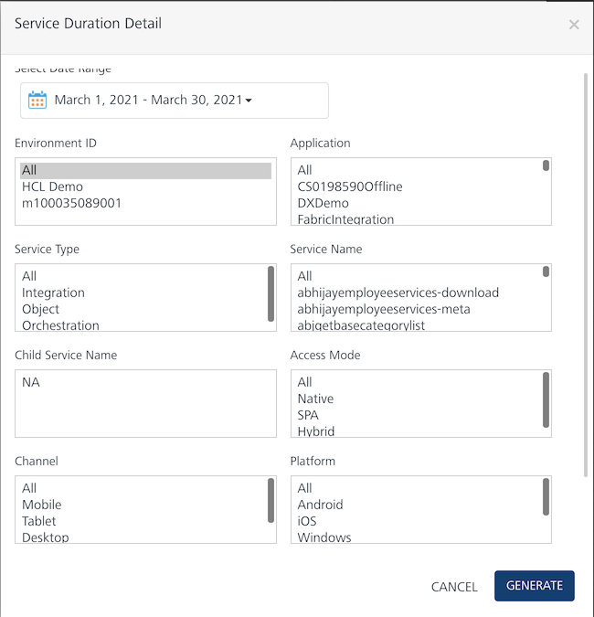

                            

You are here: Requests per Form

Server Requests and Performance Reports
=======================================

Service requests include service calls from a client app to a Volt MX Foundry app running on Volt MX Server such as Integration service, Object service, and Orchestration service.

Requests per Form
-----------------

The Requests per Form report provides the count of calls from various forms (pages) of an app. It helps to identify what features and modules of the app are used and how often they are being used.

### Filter Criteria

For more information about Filter Criteria, refer to [Reports Filter Criteria](Reports_Filter_Criteria.md).

Requests per Service
--------------------

The Requests per Service report provides the count of service requests from an application. It helps to identify what features and modules of the app are used and how often they are being used.

### Filter Criteria

For more information about Filter Criteria, refer to [Reports Filter Criteria](Reports_Filter_Criteria.md).

Service Duration
----------------

The Service Duration report provides you the information about the total number of calls per application service request. It includes minimum, average, and maximum time taken for the selected aggregation level.

This report helps to identify the following:

*   Performance of the service requests during peak hours and off-peak hours.
*   How an average response time of a call varies depending on the number of service calls.

### Filter Criteria

For more information about Filter Criteria, refer to [Reports Filter Criteria](Reports_Filter_Criteria.md).

Service Duration Detail
-----------------------

The Service Duration Detail report provides information about the average service call duration. It is represented as a stacked bar that shows the time taken for each phase of the service call.

The time spent to service a client request is split into components to enable an application developer to identify areas of the service that consume more time than expected and try to optimize the time.

*   Preprocessor: Time spent in executing preprocessing logic for the selected service. This is a custom code written by an application developer.
*   External Call: Time spent by Volt MX middleware server while waiting for the back end URL, configured for the selected service to respond.
*   Response Processing: Time spent to parse the response from the back end with the Xpath notations configured in the service definition for output parameters of the selected service.
*   Postprocessor: Time spent in executing postprocessing logic for the selected service. This is a custom code written by an application developer.
*   Internal processing: Time spent in Volt MX Server code for common internal processing logic of the selected service call. This is (total duration from the time the service request is received in Volt MX Server until the response is returned to the client) minus (preprocessing duration + postprocessing duration + response processing duration + external call duration).

### Filter Criteria

For more information about Filter Criteria, refer to [Reports Filter Criteria](Reports_Filter_Criteria.md).

> **Note:**  
*   Preprocessor, Postprocessor, Response Processing, and External Calls are customer-controlled datapoints. Internal Processing is due to common Volt MX Foundry logic.  
*   In the Service Duration Detail report, data is aggregated and retrieved either for parent service or child service.  
    *   When you do not select child service, the data is aggregated and retrieved only for the selected parent services.  
    *   When you select child services, the data is aggregated and retrieved for the child services. In this case, parent service data is not considered.  
    