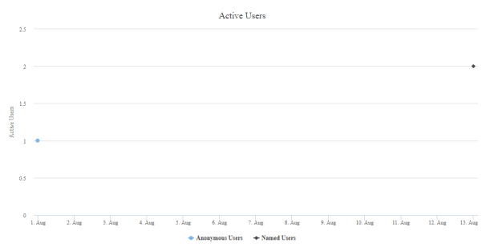

                            

You are here: New Users

User Activity Reports
=====================

New Users
---------

The **New Users** report provides a count of new users for an application in a given date range. It helps to explore the data through charts and track the effects of marketing campaigns by viewing the number of new users of an application after a particular campaign.

### Filter Criteria

For more information about Filter Criteria, refer to [Reports Filter Criteria](Reports_Filter_Criteria.md).

Active Users
------------

The **Active Users** report provides the count of active users of an application within a specified date range.

For more information about types of users, click [here](Reports_Filter_Criteria.md#UserTypes).

> **Note:**  
*   The unique identifier for the user is sent by the app.  
*   If there is at least one request from a user on a particular aggregation period for the report, that request is counted as one for that user. More requests from the same user will not increase the count for that aggregation period.  

### Filter Criteria

For more information about Filter Criteria, refer to [Reports Filter Criteria](Reports_Filter_Criteria.md).

### Licensing

To retrieve detailed information on the licensing usage for a year in terms of users, follow these steps:

1.  Set **Start Date** as **Contract Start**.
2.  Set **End Date** as **End of the Year**.
3.  Set **Aggregation Level** as **None**.
4.  Run the report.

For more information about types of users, click [here](Reports_Filter_Criteria.md#UserTypes).

### Anonymous User Count

The count of anonymous users is obtained by checking for the users who do not have an associated userID in the entire date range. For example, if an end-user uses the app without signing in for the first month but then he/she signs in for the second month, then the end-user is not considered as an anonymous user for the first month. This can result in a change of the anonymous users count for the following scenarios:

*   If the report is run after the first month with the Aggregation Level set as **Month** and Date Range as **month1**.
*   If the report is run at the end of the second month with Aggregation Level set as **Month** and Date Range as **month1** to **month2**.

To avoid this, you must run the report for the relevant date range with Aggregation Level set as **None**.

In the example mentioned, to obtain an accurate user count for the second month, you must set the Date Range as **month2** and Aggregation Level as **None**.

Run the report for several months with Aggregation Level set as **Month** for the following scenarios:

*   If an app does not have unauthenticated sections.
*   If the possibility of unauthenticated devices authenticating after the end of the aggregation period is not a concern.

For more information about types of users, click [here](Reports_Filter_Criteria.md#UserTypes).

Repeat Users (Sticky Factor)
----------------------------

This report shows the fraction of monthly users using the app during a particular month.

A sticky factor of 15 percent means 15 percent of users from the previous 30 days used this application on a particular month.

Filter Criteria: Start Date, End Date, Aggregation Level (Day, Week, Month), Application, Access Mode, Channel, Platform, Volt MX Foundry Clouds, User Types

A user type can be:

*   Named users: Users for whom we have a unique identifier sent by an app using voltmx.setUserID API. Named users are tracked as a single user across different devices when the same voltmxUserID is received for the application in an environment.
    
    Sticky factor = Number of named users on a particular day or month that used the app 30 days before to that date/Total number of named users in the last 30 days.
    

*   Anonymous users: Users for whom we have not obtained a unique identifier from the app and are being tracked by a unique device identifier.
    
    Sticky factor = Number of anonymous users on a particular day or month that used an app in 30 days before that date/Total number of anonymous users in the last 30 days.
    

*   Named and anonymous users: A combination of both named users from voltmx.setUserID API and anonymous users tracked by a device identifier.
    
    Sticky factor = Number of named and anonymous users on a particular day or month that used the app in 30 days before that date/Total number of named and anonymous users in the last 30 days.
    

