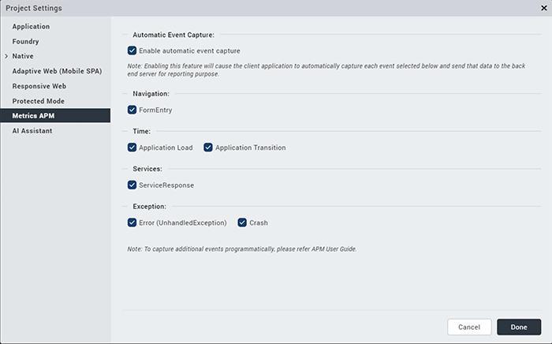

                           

You are here: Enabling Auto Event Capture

Enabling Auto Event Capture
===========================

To enable auto event capture, follow these steps:

1.  Launch Volt MX Iris.
2.  In the Application Properties dialog, click the **Metrics APM** tab and select the **Enable automatic event capture** check box and choose the events to capture automatically as in the below image:
    
    
    
    > **_Note:_**  API overrides are available to modify the events that are automatically captured at any point of time from the application. Refer to [setEventTracking](Tuning_Auto_Event_Capture.md#seteventtracking)
