                           

You are here: Prerequisites

Funnel Reports
--------------

Funnel Reports add new visualization capability to Volt MX analytics that lets a business user to analyze the app usage and the user drop rate in an application by using the form Entry Events captured as part of [User journey and APM](../../../Foundry/user_journey_app_events_apm/Content/App_Events_and_APM_Guide.md). A funnel report provides a quick view of how many users are using the app or a particular feature.

The cloud management portal enables a user to define funnel reports. Administrators and owners of the cloud account will see funnel reports under the Reports tab.

The Funnel Reports tab enables a user create, modify, delete, or save funnel reports. A user can save the reports as private reports (accessible only to the creator) or shared reports (accessible to all users who have permission to view custom reports in that account).

### Use Case

For example, in the case of an e-commerce app, to know the user checkout flow, the steps a business user considers are the end user’s log-in (user logs in to the form named frmLogin), searching a product (frmSearch), adding a product to cart (frmAddToCart), and purchasing the product (frmCheckOut).

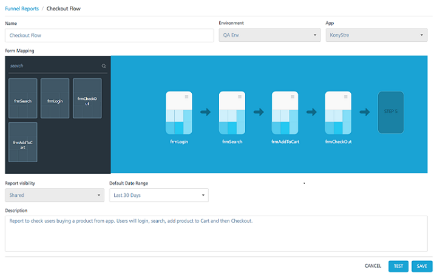

The below funnel report displays the flow between the user login (frmLogin) and product checkout (frmCheckOut) process.

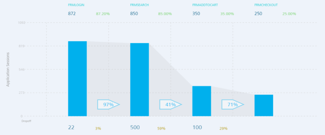

The top section of the funnel report provides the count and percentage of total user sessions through the forms in the application.

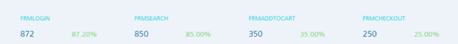

In the above scenario, Login form (FRMLOGIN) was visited in 872 sessions, which is 87.2 percent of the total application sessions. Search form (FRMSEARCH) was visited in 850 sessions, AddToCart form (FRMADDTOCART) was visited in 350 sessions and Checkout form(FRMCHECKOUT) was visited in 250 sessions.

The arrows between the forms in the funnel report display the percentage of total users that moved through each of the selected forms in the flow.

In the above scenario, 97 percent of the user sessions in which users logged in(FRMLOGIN), visited the search form(FRMSEARCH). 41 percent of the user sessions in which user logged in and searched products have added the products to cart (FRMADDTOCART). 71 percent of the user sessions in which users logged in, searched products, and added a product to cart have also purchased the product (FRMCHECKOUT).

The bottom section displays the user drop rate at each chosen point in the flow.

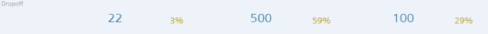

In the above scenario, the funnel report shows that three percent of the users (22 user sessions) who accessed the login form(FRMLOGIN) did not proceed to search a product(FRMSEARCH). 59 percent of the users (500 user sessions) who logged in and searched a product, did not add the product to cart (FRMADDTOCART). In 29 percent of the cases (100 user sessions) where the users have logged in, searched products and added a product to cart did not purchase or checkout the product (FRMCHECKOUT).

The funnel view can provide insights into an app usage for the business user. For example, in the above scenario, funnel report shows that most of the users who logged into the app searched for a product. Most of the users dropped between searching a product (FRMSEARCH) and adding a product to the cart (FRMADDTOCART). The percentage of user who purchased a product is less than percentage of user who added a product to the cart. The above report can be used by a business user to understand the customer behavior and offer discounts accordingly to sell more products.

Funnel reports can be filtered by channel, platform in addition to the date range for which data is being viewed.

### Prerequisites

Following are the prerequisites for creating funnel reports in Volt MX Cloud:

1.  A working account in Volt MX Cloud.
2.  Active Volt MX Foundry Cloud.
3.  An application deployed to Volt MX Foundry Cloud.  
    The application must be configured to send the FormEntry event which is enabled by default In Volt MX Iris Enterprise.  
    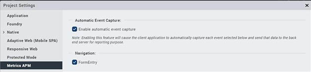  
    You can verify the configuration in the project settings under the **Metrics APM** tab.  
    You need to select the **Enable automatic event capture** check box for at least the FormEntry event.  
    Third party apps can support Funnel reports by using the [SendEvent API](../../../Foundry/voltmx_foundry_user_guide/Content/Android/Installing_Android_SDK.md#InvokingMEtrics) in the Volt MX Foundry SDK.  
    
4.  An application which has the data of the last 30 days.

#### How to Create a Funnel Report

To create a Funnel Report, follow these steps:

1.  In your Volt MX Foundry account, in the left-pane, click on **Reports**. The **Reports** page appears.
2.  In the **Reports** page, click on **Funnel Reports**. The **Funnel Reports** page appears.
3.  Click **CREATE NEW**. The **New** page appears.
    
    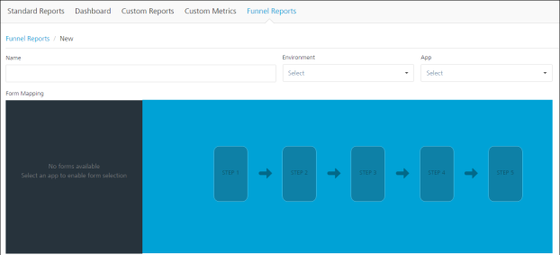
    
4.  In the **NAME** field, enter a name for the funnel report.
    
5.  From the **Environment** drop-down list, select an environment.
6.  From the **App** drop-down list, select an app.
7.  From the **Form Mapping** list, select the required forms by clicking on the forms. You can search the forms by name.
8.  The forms will be arranged in steps based on your order of selection.
    
    > **_Note:_** You can select maximum five forms and minimum two forms.
    
9.  From the **Report visibility** drop-down list, select an option.
    
    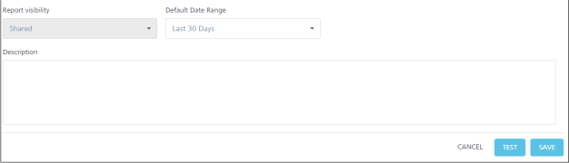
    
10.  From the **Default Date Range** drop-down list, select a date range.
11.  In the **Description** text box, provide description about the funnel report if required.
12.  Click **TEST** to validate your configuration.
13.  Click **SAVE.**

#### How to Run a Funnel Report

To run a Funnel Report, follow these steps:

1.  Go to **Funnel Reports** page. A list of funnel reports is displayed.
2.  Click on the options icon of the required funnel report.
    
    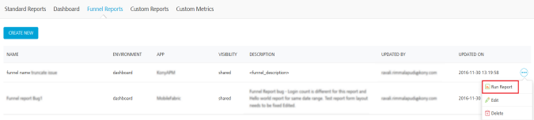
    
3.  Click **Run Report**. The Funnel Report run page appears.
    
    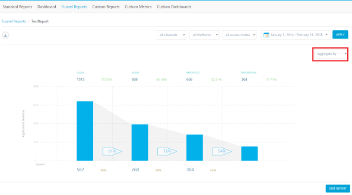
    
    In the Funnel Report run page, follow these steps:
    
    *   From the **All Channels** drop-down list, select a channel.
    *   From the **All Platforms** drop-down list, select a platform.
    *   From the **All Access Mode** drop-down list, select a mode.
    *   From the **Aggregate by** drop-down list, select aggregation (channel/platform).
    *   In the Date field, select a date range.
    *   Click **APPLY**. Based on your configuration, the funnel report will be displayed.
    
    The below chart shows data aggregated by **channel**.
    
    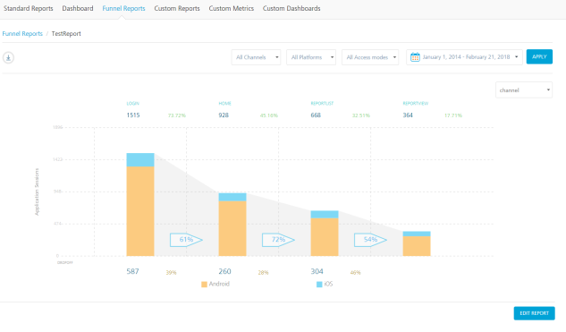
    
    The below chart shows data aggregated by **platform**
    
    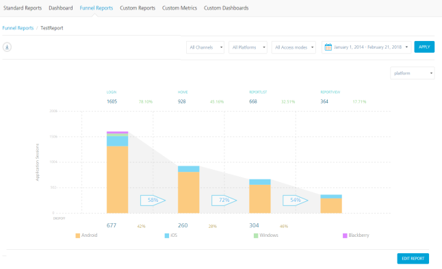.
    

#### How to Edit a Funnel Report

To edit a funnel report, follow these steps:

1.  Go to **Funnel Reports** page. A list of funnel reports is displayed.
2.  Click on the options icon of the required funnel report.
    
    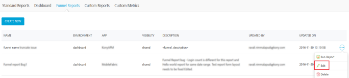
    
3.  Click **Edit**. The Funnel Report edit page appears.
    
    > **_Note:_** Environment, App, and Report Visibility fields cannot be modified.
    
    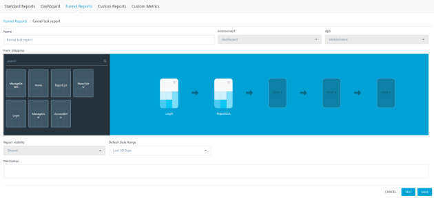
    
4.  From the **Form Mapping** list, select the required forms.
5.  From the **Default Date Range** drop-down list, select a date range.
6.  In the **Description** text box, provide description about the funnel report if required.
7.  Click **TEST** to validate your configuration.
8.  Click **SAVE**.

#### How to Download a Funnel Report

To download a funnel report, follow these steps:

1.  Run a Funnel Report.
    
    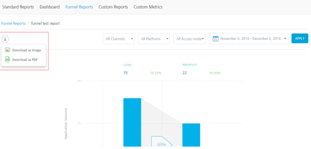
    
2.  In the Funnel Report run page, click on download icon. A list of download options appear.
3.  Click **Download as Image** to download Funnel Report as an image.
4.  Click **Download as PDF** to download Funnel Report as a PDF file.

#### How to Delete a Funnel Report

To delete a funnel report, follow these steps:

1.  Go to **Funnel Reports** page. A list of funnel reports is displayed.
    
    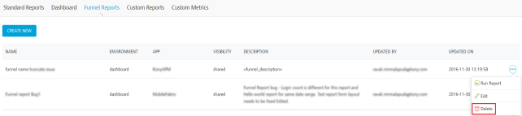
    
2.  Click on the options icon of a funnel report which needs to be deleted.
3.  Click **Delete**. A confirmation dialog appears.
    
    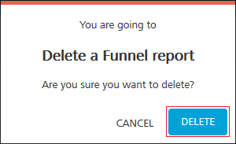
    
4.  Click **DELETE**. The funnel report will be deleted.
