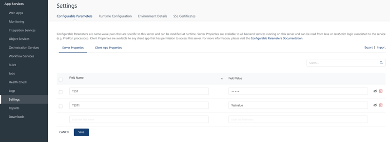
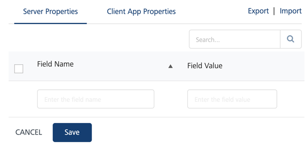
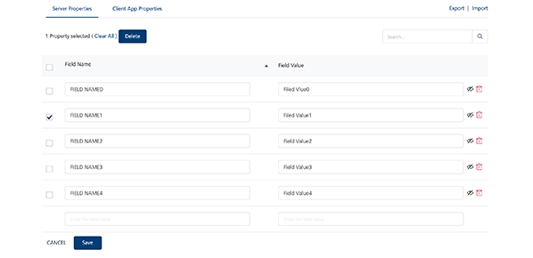
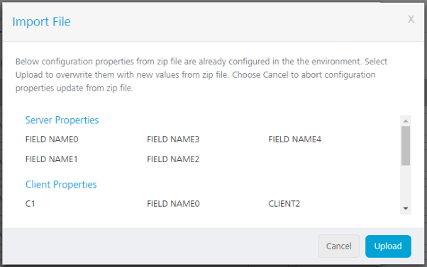

                             

Volt MX  Foundry console User Guide: [Settings](Settings.md) > Configurable Parameters

Configurable Parameters
-----------------------

Configurable Parameters provides an interface to define a set of key value pairs at the server and the client level. You can access the configured server and client properties from the custom code. The configured properties are available to custom code such as preprocessor, postprocessor and Java services at run time. Any updates made to the configured properties are reflected in the custom code.

From the left pane, click **Settings** > **Configurable Parameters** tab. Here you can define the key value pairs for Server Properties and Client App Properties. By default, the Server Properties tab is selected.



The configured server properties are available to all the back-end services running on that server. The configured client properties are available to any client app that has permission to access the server. You can read these properties from Java or JavaScript logic associated to the service.

> **_Note:_** Steps to add, delete, export, and import key value pairs for server properties and client properties are same.

The following fields are displayed in this screen:

  
| Field | Description |
| --- | --- |
| Field Name | Name of the key value pair. |
| Field Value | Value of the key value pair. |
| Save | Saves the entered information. |
| Cancel | Resets the changes. |
| Delete | Removes the key value pair from the list. > **_Note:_** The delete option is displayed only after you select any key value pair check-box. |
| Mask | It masks the value in the key value pair in the UI. The masked values are stored in an encrypted format in the database. When you export the key value pairs, the values which are masked are empty. Once you mask a value, they cannot be unmasked. > **_Note:_** If you want to update the **Key** or **Value** after you have masked a value, you must remove the existing value and retype the required value. |
| Export | Downloads a zip file which contains the list in CSV files. |
| Import | Uploads the key value pair list. You can only upload zip files. |
| Sort | Displays the list in alphabetical order (ascending or descending). |
| Search | Enter the field name or field value to search for any existing key value pairs. |

If you have not configured any property, the Server Properties tab displays a blank row where you can enter the key value pair. If the properties are available, by default, they are displayed in an alphabetical order (ascending) based on Field Name. The provision to add a new key value pair is provided at the bottom.

Click the Sort icon if you want to change the alphabetical order.

> **_Note:_** If you re-load the page, the alphabetical order changes to the default order.

### Adding a key value pair

To add a set of key value pairs, perform the following actions:

1.  Log on to **App Services** and from the left pane click **Settings**.
2.  From the top pane of the Settings screen, click **Configurable Parameters** tab.  
    
3.  Enter a field name and field value in the blank row to configure the key value pair.
4.  Click **Save** to save the changes.

### Deleting a key value pair

To delete an existing key value pair, perform the following actions:

1.  Log on to **App Services** and from the left pane click **Settings**.
2.  From the top pane of the Settings screen, click **Configurable Parameters** tab.
3.  Select the check-box of the key value pair which you want to delete, and click **Delete**. You can also hover on the key value pair which you want to delete and click the delete icon.  
    
4.  You can also delete multiple key pair values (bulk delete) at the same time. Perform the following steps to bulk delete the key pair values:
    *   Select the check-boxes of the required key value pairs and click **Delete**.
    *   If you want to delete all the key value pairs, select the check-box available in the header section of the configurable parameters table and click **Delete**.

### Export the key value pair list

To export the key value pair list, perform the following actions:

1.  Log on to **App Services** and from the left pane click **Settings**.
2.  From the top pane of the Settings screen, click **Configurable Parameters** tab.
3.  Click **Export**. The key value pair list is downloaded as CSV file within a zip file.
    
    > **_Note:_** To export the Configurable Parameters using MFCLI command, refer to [Export and Import Configurable Parameters for App Services through MFCLI](../../../Foundry/voltmx_foundry_user_guide/Content/Export_Import_Configuration_Parameters_AppServices_MFCLI.md)
    

### Import the key value pair list

To import the key value pair list, perform the following actions:

1.  Log on to **App Services** and from the left pane click **Settings**.
2.  From the top pane of the Settings screen, click **Configurable Parameters** tab.
3.  Click **Import** to upload the required zip file.
4.  Click **Browse and Validate** and select the required zip file that contains the CSV files.

> **_Important:_** Name the files as **serverProperties** and **clientAppProperties**. Each file must contain two columns. Header of the first and second column should be **Field Name** and **Field Value** respectively. It is mandatory to follow these naming conventions.

If the name of the keys in the imported file matches with the existing names, you will see a conflict message while importing with the list of keys that have the conflict. Click **Upload** to overwrite the existing keys and values with the new keys and values or click **Cancel** to stop the upload.

> **_Note:_** If the imported file contains same key name with different key values, the last key value takes the precedence for that key name.



> **_Note:_** To import the Configurable Parameters using MFCLI command, refer to [Export and Import Configurable Parameters for App Services through MFCLI](../../../Foundry/voltmx_foundry_user_guide/Content/Export_Import_Configuration_Parameters_AppServices_MFCLI.md)

### Access properties from Java PostProcessor

Add the following code to the existing code to access the configured properties from Java PostProcessor:

```
package com.custom.preprocessor;
import com.hcl.voltmx.middleware.common.DataPostProcessor2;
import com.hcl.voltmx.middleware.controller.DataControllerRequest;
import com.hcl.voltmx.middleware.controller.DataControllerResponse;
import com.hcl.voltmx.middleware.dataobject.Param;
import com.hcl.voltmx.middleware.dataobject.Result;
import com.hcl.voltmx.middleware.api.ConfigurableParametersHelper;
import com.hcl.voltmx.middleware.api.ServicesManager;
import java.util.Map;
public class ServerConfigParamsPostProcessor
implements DataPostProcessor2 
{
	@Override
	public Object execute(Result result, DataControllerRequest request,
	DataControllerResponse response)
	throws Exception 
	{
		ServicesManager sm = request.getServicesManager();
		ConfigurableParametersHelper paramHelper = sm.getConfigurableParametersHelper();

		// encryption is the key configured under Server Properties tab in App Services
		String myServerParam = paramHelper.getServerProperty("encryption");

		// MAX_EVENTS_SIZE is the key configured under Client App Properties in App Services
		String myClientParam = paramHelper.getClientAppProperty("MAX_EVENTS_SIZE");
		Map<String,String> serverProperties = paramHelper.getAllServerProperties();
		Map<String,String> clientAppProperties = paramHelper.getAllClientAppProperties();
	}
	return result;
}

```

### Access properties of Java PreProcessor

Add the following code to the existing code to access the configured properties from Java PreProcessor.

```
package com.custom.preprocessor;

import com.hcl.voltmx.middleware.common.DataPreProcessor2;
import com.hcl.voltmx.middleware.controller.DataControllerRequest;
import com.hcl.voltmx.middleware.controller.DataControllerResponse;
import com.hcl.voltmx.middleware.dataobject.Param;
import com.hcl.voltmx.middleware.dataobject.Record;
import com.hcl.voltmx.middleware.dataobject.Result;
import com.hcl.voltmx.middleware.api.ConfigurableParametersHelper;
import com.hcl.voltmx.middleware.api.ServicesManager;
import java.util.HashMap;

import java.util.Map;

public class ServerConfigParams
implements DataPreProcessor2 
{
	@Override
	public boolean execute(HashMap inputMap, DataControllerRequest request,
	DataControllerResponse response, Result result)
	throws Exception 
	{
		ServicesManager sm = request.getServicesManager();
		ConfigurableParametersHelper paramHelper = sm.getConfigurableParametersHelper();
		
		// encryption is the key configured under Server Properties tab in App Services
		String myServerParam = paramHelper.getServerProperty("encryption");

		// MAX_EVENTS_SIZE is the key configured under Client App Properties in App Services
		String myClientParam = paramHelper.getClientAppProperty("MAX_EVENTS_SIZE");
		Map<String, String> serverProperties = paramHelper.getAllServerProperties();
		Map<String, String> clientAppProperties = paramHelper.getAllClientAppProperties();
		return true;
	}
}
```

### Access properties of Java PreProcessor and PostProcessor

Add the following code to the existing code to access the configured properties of JavaScript PreProcessor and PostProcessor.

```
var paramHelper = request.getServicesManager().getConfigurableParametersHelper();
var serverProp = paramHelper.getServerProperty('encryption');
var clientProp = paramHelper.getClientAppProperty('MAX_EVENTS_SIZE');

var serverParam = new com.hcl.voltmx.middleware.dataobject.Param('encryption', serverProp);
var clientParam = new com.hcl.voltmx.middleware.dataobject.Param('MAX_EVENTS_SIZE', clientProp);
result.addParam(serverParam);
result.addParam(clientParam);


// allServerProps and allClientProps is of Map<String,String> type
var allServerProps = paramHelper.getAllServerProperties();
var allClientProps = paramHelper.getAllClientAppProperties();
var serverPropertyKeyset = allServerProps.keySet().toArray();
for(var index=0; index<serverPropertyKeyset.length>; index++)
{
	var serverPropFromMap = allServerProps.get(serverPropertyKeyset[index]);
	var serverParamFromMap = new com.hcl.voltmx.middleware.dataobject.Param(serverPropertyKeyset[index], 
	serverPropFromMap);
	result.addParam(serverParamFromMap);
}
var clientPropertyKeyset = allClientProps.keySet().toArray();
for(index=0; index<clientPropertyKeyset.length>; index++)
{
	var clientPropFromMap = allClientProps.get(clientPropertyKeyset[index]);
	var clientParamFromMap = new com.hcl.voltmx.middleware.dataobject.Param(clientPropertyKeyset[index], 
	clientPropFromMap);
	result.addParam(clientParamFromMap);
}
```
