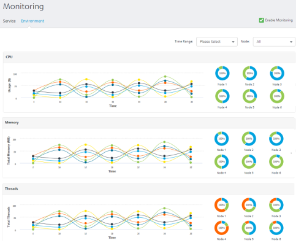
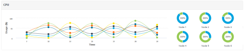
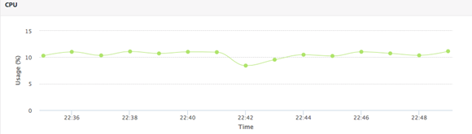
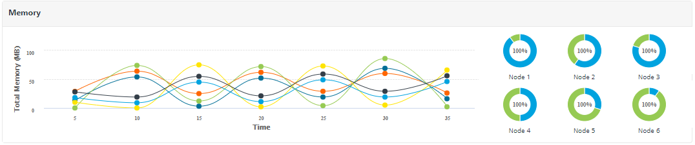
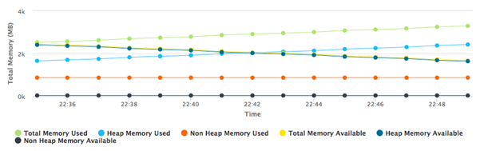
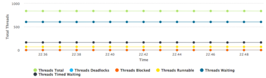

                            

Volt MX  Foundry console User Guide: [Monitoring](Monitoring.md) > Environment

Environment
-----------

> **_Important:_** **Environment** tab in **Monitoring** is available only in on-premise environments.

> **_Note:_** The environment monitoring data by default is shown for the last 15 minutes. If necessary, you can customize the time for an hour, a day or any custom range. Environment monitoring data is stored in the database for 7 days from the date of generation. You can use Standard or Custom reports from Volt MX Foundry Console to view data for longer durations. For more details view [Custom Time Range](Monitoring.md#Custom_Time_Range).

> **_Note:_** Few Features of environment monitoring like CPU usage graph will not work in AIX.  

The **Environment** tab displays line graphs, and doughnut charts for each of the following three sections:

*   [CPU](#CPU)
*   [Memory](#Memory)
*   [Threads](#Threads)

CPU

The line graph displays the CPU usage across each node within the selected time period by default, with each line representing a node. Select a node in the [Node Filter](Monitoring.md#Node) to view the line graph specific to that node.  

The doughnut charts display the average usage of the CPU power in a chosen time range and the available CPU power.

Click a **doughnut** chart of a specific node to display the line graph and the doughnut chart specific to that node.

Memory

The line graph displays the memory usage across all the nodes within the selected time period by default, with each line representing a node. Select a node in the [Node Filter](Monitoring.md#Node) to view the line graph specific to that node.

The memory usage for each node will be shown in terms of:

*   Total Memory Available
*   Total Memory Used
*   Heap Memory Available
*   Heap Memory Used
*   Non Heap Memory Available
*   Non Heap Memory Used

The doughnut charts display the average usage of Heap Memory and Non-Heap Memory in the Total Memory.

Click a **doughnut** chart of a specific node to display the line graph and the doughnut chart specific to that node .

Threads

The line graph displays the total number of threads processed across all the nodes within the selected time period by default, with each line representing a node. Select a node in the [Node Filter](Monitoring.md#Node) to view the line graph specific to that node.

The threads processed for each node will be shown in terms of:

*   Total Threads
*   Threads Deadlocks
*   Threads Blocked
*   Threads Runnable
*   Threads Waiting
*   Threads Timed Waiting

The doughnut charts for threads processed displays various states of the threads such as Waiting, Runnable, Timed Waiting, Blocked and so on.

Click a **doughnut** chart of a specific node to display the line graph and the doughnut chart specific to that node.
