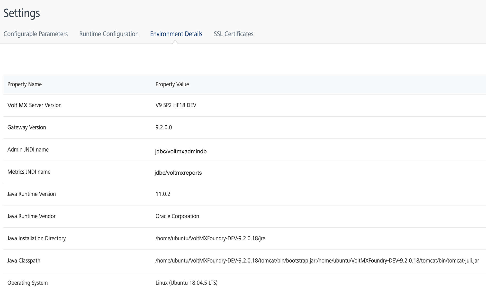

                            

Volt MX  Foundry console User Guide: [Settings](Settings.md) > Environment Details

Environment Details
-------------------

The environment details page displays the environments details of the Volt MX server. This page displays a table with two columns the Property Name and Property Value.

The **Property Name** column displays the names of different properties such as the version of the Volt MX server used, the Gateway version, the JNDI name, JNDI version, Operating system on which the Volt MX server is installed, Environment Name, Environment API version and so on.

The **Property Value** column displays the value against each property name displayed in the table.

