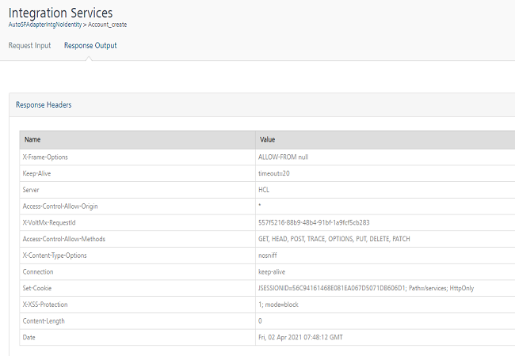
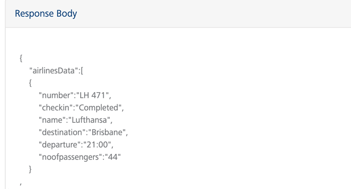
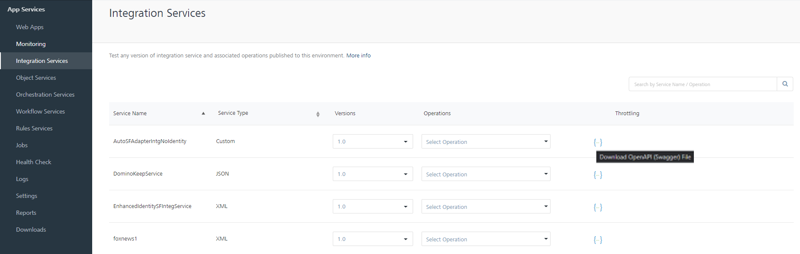

                            

Volt MX  Foundry console User Guide: Integration Services

Integration Services
====================

The Integration Services is used to test the service defined with its associated operations. The services defined in the **Integration** tab and published in Volt MX Foundry Console are displayed in this page. You can test an integration service using different operations available in each service. To know more on integration service, refer [Integration](../../../Foundry/voltmx_foundry_user_guide/Content/Services.md).

Click the **Integration Services** from the left pane of the App Services to view a list of Integration services which are available across the applications within your Volt MX Foundry environment.

The following fields are displayed for each integration service:

  
| Column | Description |
| --- | --- |
| Service Name | Name of the service deployed. |
| Service Type | Type of the service. To know the different types of services available in Integration Service, refer [VoltMX Foundry Supported Endpoints.](../../../Foundry/voltmx_foundry_user_guide/Content/Services.md#supported-endpoint-adapters) |
| Version | Version number selected while creating the service. Click the drop-down list to view the different versions of the selected service.For more information on versioning, refer [API Versioning](../../../Foundry/voltmx_foundry_user_guide/Content/API_Versioning.md). |
| Operations | The operations configured for each service. Click the drop-down list and select an operation to test a service. |
| Throttling | Throttling is an interim state, and is used to control the rate of requests which clients can make to an API. |
| Documentation | Download the Swagger API file using the download link provided across each service. For more information, refer [Downloading a Swagger API file](#downloading-a-swagger-api-file). |

Testing a Service
-----------------

Select an operation from the drop-down list under the **Operations** column for a service.

The selected operation displays the page with two toggles:

*   Request Input
*   Response Output

### Request Input

The Request Input page displays the input parameters for the operation selected. You must provide the values across the parameters displayed in the page to get the response from the server.

The following fields are displayed in the **Request Input** page:

  
| Field | Description |
| --- | --- |
| Server URL | The middleware URL under which the request is posted. The operation selected from the drop-down list is automatically encoded in the server URL. |
| Target URL | The back-end server URL to which the response is filtered based on the requested parameter. |
| Body | Displays the **Parameter Name** and **Parameter Value** editor. Set a parameter value for the parameter name displayed |
| Header | Displays the field name and value editor. You can give any string as the header name.- Click **Add** icon displayed above the table in Header toggle to add a new field and value.- Click **Delete** button across the row displayed to delete a field. |
| Get Response | Encodes the parameter name and field name with their values provided. |

### Response Output

The response received for the input request sent is displayed in the **Response Output** page. The page contains two sections:

*    Response Header
*    Response Body

**Response Header**: The response header section displays the header values for the request sent.

**Response Body**: The **Response Body** for the request sent is displayed in the code format.

**To test an integration service, follow these steps**:

1.  Log in to the App Services and click **Integration services** from the left pane of the screen.
2.  Select an operation from the drop-down list of a service from the list of services displayed.
3.  In the **Request Input** page, perform the following actions:
    1.  In the **Body** section, provide the **Parameter Value** across the parameter names.
    2.  In the **Header** toggle, provide the **Field Name** and **Field Value**.
4.  Click **Get Response**.
    
    The response for the input parameters provided is displayed in the **Response Header** and **Response Body** sections of the **Response Output** screen.
    

Downloading a Swagger API File
------------------------------

Swagger is a standard way of defining and documenting the APIs. An option to download the Swagger files is provided in App Services.

**To download the Swagger file, follow these steps:**

*   Log in to the **App Services** and click **Integration Services** from the left pane of the screen.
    
    The list of available services are displayed.
    
*   Click **Download** for a selected service provided in the **Documentation** column.
    
    
    
    A JSON file for the selected service is downloaded to your local system.
    
*   The downloaded JSON file can be invoked into a third-party interface [https://apigee.com](https://apigee.com/) and view(or) invoke the downloaded code in UI format.

