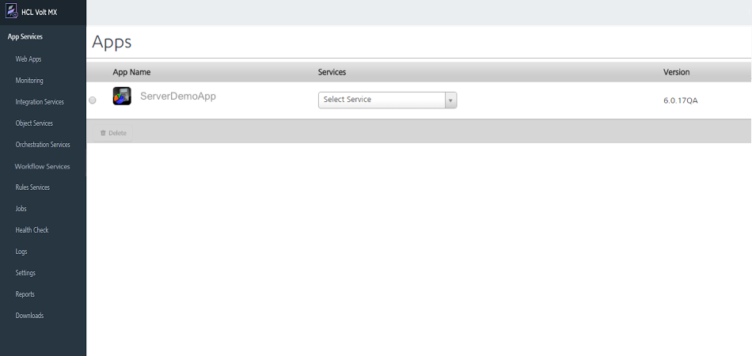

# Introduction  

Volt MX Foundry Integration Service App Services portal allows you to delete an application, application's services, generate application reports, and configure settings.

You can select an application's services and delete them from the Volt MX Foundry Integration Service Admin Console portal.