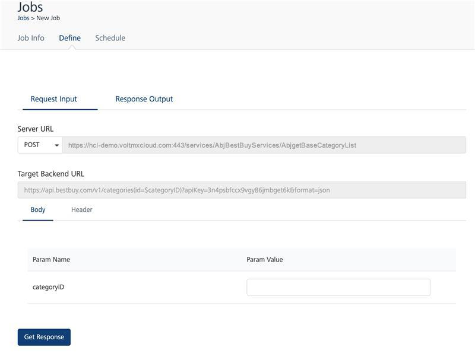

                            

Volt MX  Foundry console User Guide: Jobs

Jobs
====

A Volt MX Foundry user has an option to invoke published APIs with defined input through a definite schedule as a job. The scheduled jobs run on the server and send emails automatically before the user’s renewals expire.

**To access Volt MX Foundry Jobs in App Services, follow these steps:**

1.  Log on to **VoltMX Foundry Console** and click **Environments**.
    
    Under **Environments**, you can find all the consoles available for the cloud account.
    
2.  Click **Server** to access the App Services.
    
    The **App Services** UI appears.
    
3.  Click **Jobs** from the left pane of the screen.
    
    The new window appears with the list of jobs created.
    

You can perform the following actions from the screen:

*   [Searching for an existing job](#searching-for-an-existing-job)
*   [Adding a new job](#adding-a-new-job)

The **Jobs** screen displays the following UI elements:

  
| UI Element | Description |
| --- | --- |
| Name | Name of the job. |
| Updated by | Name of the logged in user (provided at the time of registration). |
| Success Rate | The rate of success and failure over the total number of scheduled intervals. |
| Last run status | Status of the last run performed. |
| Job Status | Current status of the job. This includes: Active/Inactive Status Scheduled Date and Time of the next run More options: An icon with a circle and three dots is displayed across each row. You can perform the following actions by clicking the icon:
  
| Field Name | Description |
| --- | --- |
| Edit | Edit the selected job. |
| View Job History | View the history of the selected job. For detailed information on Job History page, refer <<>>. |
| Inactive | Deactivate an active job. |
| Delete | Delete the selected job. |
| Run Once Now | Ability to run the job immediately. |

 

Searching for an existing job
-----------------------------

You can search for a job from the existing list of jobs displayed on the **Jobs** screen. To perform a search, follow these steps:

1.  On the **Jobs** page, click the text field provided at the upper left corner.
    
2.  Type a keyword.
3.  Click the **Search** icon provided beside the text box.
    
    The page displays the list of jobs matching the entered search criteria.
    

Adding a new job
----------------

You can create a new job for the Integration, Object, and Orchestration Services.

To create a new job, click **Add New** from the upper right corner of the **Jobs** screen. The **New Job** windows displays the following three tabs:

*   [Job Info](#job-info)
*   [Define](#define)
*   [Schedule](#schedule)

### Job Info

The **Job Info** window displays the fields required to create a new job. Enter the required details in the fields provided:

Searching for an existing job
-----------------------------

You can search for a job from the existing list of jobs displayed on the **Jobs** screen. To perform a search, follow these steps:

On the **Jobs** page, click the text field provided at the upper left corner. Type a keyword. Click the **Search** icon provided beside the text box.The page displays the list of jobs matching the entered search criteria.

Adding a new job
----------------

You can create a new job for the Integration, Object, and Orchestration Services. To create a new job, click **Add New** from the upper right corner of the **Jobs** screen. The **New Job** windows displays the following three tabs: [Job Info](#job-info) [Define](#define) [Schedule](#schedule) 

### Job Info

The **Job Info** window displays the fields required to create a new job. Enter the required details in the fields provided:

Searching for an existing job
-----------------------------

You can search for a job from the existing list of jobs displayed on the **Jobs** screen. To perform a search, follow these steps:

1.  On the **Jobs** page, click the text field provided at the upper left corner.
    
2.  Type a keyword.
3.  Click the **Search** icon provided beside the text box.
    
    The page displays the list of jobs matching the entered search criteria.
    

Adding a new job
----------------

You can create a new job for the Integration, Object, and Orchestration Services.

To create a new job, click **Add New** from the upper right corner of the **Jobs** screen. The **New Job** windows displays the following three tabs:

*   [Job Info](#job-info)
*   [Define](#define)
*   [Schedule](#schedule)

### Job Info

The **Job Info** window displays the fields required to create a new job. Enter the required details in the fields provided:

  
| Field Name | Description |
| --- | --- |
| Name | Enter the name of the job. |
| Service Type | Select the service type from the list: Integration Orchestration Object Services |
| Service Name | Select the service name from the displayed list. The service name displays the list of available services for the selected service type. **_Note:_** Based on the service type selected, the service name field displays the services created and published in Volt MX Foundry Console. |
| Service Version | Select the version number of the service. By default, the service version list displays the version number 1.0. The service version is predefined during the process of creating a service in Volt MX Foundry Console. |
| Objects | Select the objects for the selected service. The Objects list displays the predefined objects for the selected service. The objects field displays the services in Volt MX Foundry Console during the process of creating a service. **_Note:_** The **Objects** field is displayed only when the user selects the service type as **Object Services**. |
| Operations | Select the operation from the list. The operations are predefined while creating the service in Volt MX Foundry Console. **_Important:_** Public, Anonymous App User and Authenticated App User operations are available under **Operations** list while creating the Jobs. |
| Service Security Level | Based on the selected operation, the security level (Public, Anonymous App User or Authenticated App User) is displayed. |
| Authentication | For **Anonymous App User** and **Authenticated App User** operations, you have two options. You can select any option and provide your login credentials for authenticating the selected operation. **Admin**: If you are an admin, select the option and perform the following actions: Enter your login credentials Click **Test** to validate the login details. **_Note:_** Admin credentials are used only for the services which does not require the backend authentication. **App User**: App Users are considered as two types: Authenticated App User and Anonymous App User. **Authenticated App User**: On selecting a private operation, you are considered as an Authenticated App User. **Anonymous App User**: On selecting a protected operation, you are considered as an Anonymous App User. If you are an Authenticated App User (for Private operation), click the **App User** option and perform the following actions: **App**: Select the app to which the service is associated. **Identity**: Select the identity associated with the selected service. **Username** and **Password**: Provide the login credentials. **Test**: Click **Test** to validate the provided details. If you are an Anonymous App User (for Protected operation), click the **App User** option and select the app to which the service is associated. **_Note:_** Login credentials are not required for an Anonymous App User. |
| History Strategy | Displays the following options to view the job history. **No History**: History will not be tracked. **Audit History**: The history related to the audits is saved and displayed.> **_Note:_** The history of request and response of the job run is not logged. **Full History for Failed Runs**: The complete history of failed runs is displayed. **Full History for All Runs**: The complete history of all the runs is displayed. |
| History Retention Period | Enter the period of history maintenance in the server. By default, the field displays 30 days as the retention period. **_Note:_** The server removes the history after the retention period expires. |
| Description | Enter the description of the new job created. |
| Email notifications on Failure | Email notifications are automatically sent by the server on the failure of the created jobs. The email notifications contains the job failure information. You can select any of the following options for the email notifications to be sent: **All Account Owners**: Email notifications are sent to all the owners of the logged in account. **All Account Admins**: Email notifications are sent to all the administrators of the logged in account. **All Users with Full Access on this Environment**: Email notifications are sent to all the users having full access to the environment associated to the logged in account. **Custom Users List**: You can customize the list of users by entering their email address to receive the email notifications. |
| Cancel | Abort the operation or cancel creating a new job. |
| Next | Proceed to the next screen. |

To create a new job, perform the following steps:

1.  Click the **Add New** button from the top right corner of the Jobs screen.
    
    The **Job Info** window appears.
    
2.  Enter/select the mandatory fields to create a new job.
3.  Click **Next** to move to the next screen.

### Define

In the process of creating a new job, you need to define the request input parameters. To access the **Define** window, perform the following actions:

1.  Click **Add New** from the upper right corner of the **Jobs** screen.
    
    The **New Job** window displays the following three tabs:
    
    *   Job Info
    *   Define
    *   Schedule
2.  Enter the required information in the fields displayed in the **Job Info** window and click **Next**.
    
    The **Define** window appears.
    

The **Request Input** window displays the following fields:

  
| Field | Description |
| --- | --- |
| Operation | The selected operation in the **Add New** window is displayed. |
| URL | The server URL for the selected service and operation is displayed. |
| Query Params | Enter the query parameter for the selected operation. |
| Field Name | All the field names provided while creating the service are displayed. |
| Field Value | Enter the field values across the field names. |
| Get Response | Select to parse the input values and get the response. |

To get the response parameters for the new job added, follow these steps:

1.  In the **Add New Job** window, fill all the mandatory fields and click **Next**.
    
    The **Define** window appears.
    
2.  Enter the query parameters against the selected operation.
3.  Provide the field values against the field names displayed.
4.  Click **Get Response**.
    
    The **Response Output** tab displays the response for the request parameters provided. The **Response Header** and **Response Body** sections display the response for the input parameters provided.
    
    > **_Note:_** When user sets the string, it acts as a criteria for a job success or failure. If the specified string is present in the response output the job is considered as success, else the job is considered as a failure. After entering the success criteria, you can click **Test** to check the number of matches for the string in response.
    
    > **_Note:_** Success criteria can be set only for the responses whose opstatus is 0.
    
5.  Click **Next**.
    
    The **Schedule** window appears.
    
    > **_Note:_** The job might fail with an error **Internal error during job execution**, if the service does not return proper JSON response or if the service is modified/deleted after creating the job.
    

### Schedule

You can schedule the next run of an active job by setting the timer in the **Schedule** page. The scheduler displays the date and time fields to set the timer.

To access the **Schedule** window, perform the following actions:

1.  Click the **Add New** button from the top right corner of the Jobs screen.
    
    The **New Job** window appears with three tabs.
    
    *   Job Info
    *   Define
    *   Schedule
2.  In the **Job Info** window, fill the required fields and click **Next**.
    
    The **Define** window appears.
    
3.  Enter the request parameters to receive the response parameters.
4.  Once you receive the response output, click **Next**.
    
    The **Schedule** window appears.
    

The **Schedule** window displays the following fields:

  
| Field Name | Description |
| --- | --- |
| Every | The time frame displays: Hour Minute Day Week Month Advanced |
| Hour | Select the time (in hours) to run the job. You need to select the hour and minute to schedule the time to run a job. **_Note:_** This field is inactive when you select **Hour** from the **Every** list |
| Minute | Select the minute field to schedule the next run of the selected job. |
| Day | Displays the hour and minute fields. Select the time frame to schedule the run for the job, The job will run every day on the selected time. **_Note:_** By default, the **Day** option displays the current date. |
| Week | Determines the specific day of a week to run the job. Selecting this option displays the day (with the names of days of a week), hour and minute. Select the day of a week and the time frame to schedule the run. The job will run every week on the selected day and time. |
| Month | Displays the **Date** and **Time** fields. Select the date and the time frame to schedule the run for the selected job. The job will run every month on the selected date and time. |
| Year | Displays the **Date**, **Month** and **Time** fields. Select the date, month and the time frame to schedule the run for the selected job. The job will run every year in the selected month, date and time. |
| Advanced | You can provide a cron expression to define the schedule for the selected job. For example: 0 0/5 8-18 ? \* \* \* **_Note:_** The minimum time interval between two successive job executions is 5 minutes. For example, a valid cron expressions can be like \* 0/7 \* \* \* ? \*,   \* 0/5 5,10 \* \* ? \*, \* 5,10,15 \* \* \* ? \*. Invalid cron expressions can be like \* \* \* \* \* ? \*,    \* 5-10 \* \* \* ? \*, \* 0/2 \* \* \* ? \*,   \* 5,6,7 \* \* \* ? \*.By default, all intervals in seconds will be considered as 0.You can use the tools like [free formatter](https://www.freeformatter.com/cron-expression-generator-quartz.md) to create quartz expression. |

To schedule the run of an active job, follow these steps:

1.  Click **Add New** in the **Jobs** page.
    
2.  On the **Add Jobs** page, enter the required information in all the fields in **Job Info** window and click **Next**.
    
3.  Enter the required information in all the fields in **Define** page and click **Next**.
    
4.  In the **Schedule** window, click the **Every** field list and select a time frame.
    
    The selected time frame displays the remaining fields depending on the field selected.
    
5.  Select the time frame and click **Save and Schedule**.
    

#### Limitations

*   Only identities that have user name and password are supported to authorize.
*   Oauth logins such as Facebook, Google and so on are not supported. You cannot view these oauth identities under the identity list.
    
*   API Proxy services and response pass-through services are not supported.
    

