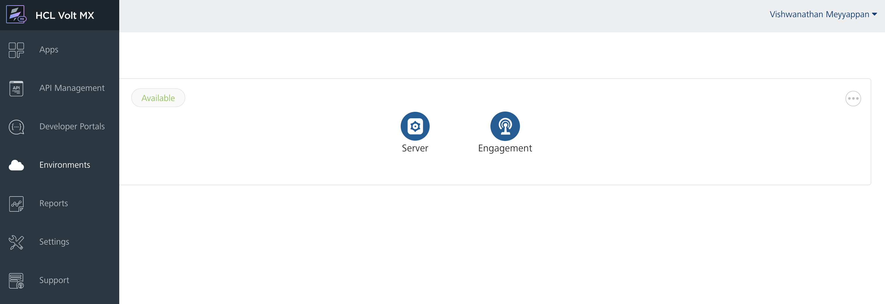
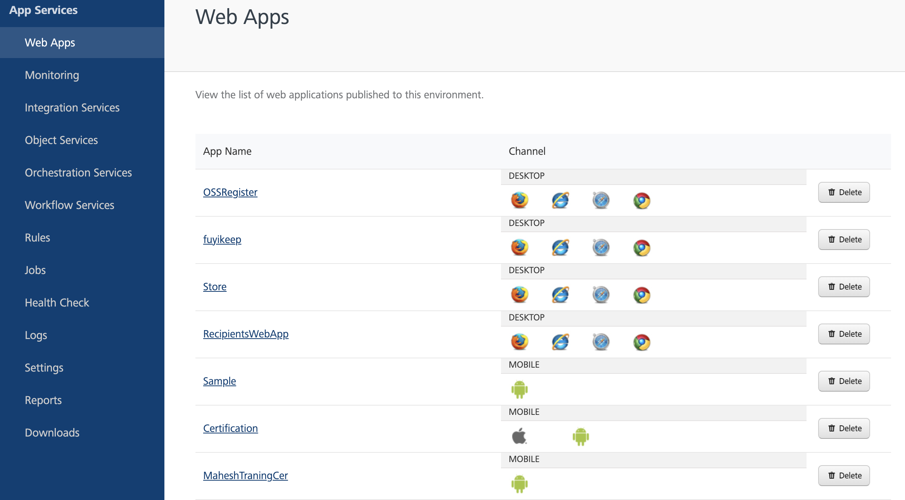

Volt MX Foundry console User Guide: Functional Flow

# Launching App Services

Prior to accessing the App Services, you need to launch the console and log in with your credentials. You can launch the App Services in two ways:

- [From Volt MX Foundry Console](#MFConsole)
- [Through App Services URL](#Through_Admin_Console_URL)

**From Volt MX Foundry Console**

If you have the App Services server configured in **VoltMX Foundry Console** under the **Environments** section, you can access the App Services from **VoltMX Foundry Console**.

**To access the App Services from Volt MX Foundry Console, follow these steps:**

1.  Log in to Volt MX Foundry Console by entering the URL and providing your valid login credentials. For more information on accessing Console, refer [How to log in to Volt MX Foundry Console](../../../Foundry/voltmx_foundry_user_guide/Content/How_to_access_VoltMX_Foundry_Portal_on-Prem.md#how-to-log-in-to-foundry-console).
2.  Upon successful login, the apps page of the Console is displayed.
3.  Click **Environments** from the left pane of Console.
    
4.  Click **Server** to access the App Services.

    The **App Services** is displayed in another tab of the web browser. By default, the Web Apps page is displayed.

**Through an App Services URL**

**To access App Services directly from the URL, follow these steps:**

1.  Enter the URL  http://\<hostname>:\<port>/admin in the web browser and press **Enter**.

    For example, http://10.10.1.105:9090/admin

    The **Login** page of the App Services is displayed.

2.  Enter the user name and password to login to the system.

    **User name**: Enter the default user name received after the installation of App Services.

```
For example, admin
```

**Password**: Enter the valid password received after the installation of App Services.

```
For example, admin123
```

Upon successful authentication, you are redirected to **Web Apps** page.



> **_Note:_** You can find the logged in user name displayed on the top right corner of the page.

## Functional Flow

**The following modules are available in App Services:**

- [Web Apps](Web_Apps.md)
- [Monitoring](Monitoring.md)
- [Integration Services](Integration_Services.md)
- [Object Services](Object_Services.md)
- [Orchestration Services](Orchestration_Services.md)
- [Workflow Services](Workflow.md)
- [Rules](Rules_Services.md)
- [Jobs](Jobs.md)
- [Health Check](Health_Check.md)
- [Logs](Logs.md)
- [Settings](Settings.md)
- [Reports](Using_Basic_Reports.md)
- [Downloads](Downloads.md)

**Version**: You can find the version number of the App Services accessed from the bottom of the left pane.

**Logout**: At any point of time, you can log out of the App Services by clicking on the **Logout** option displayed on the top right corner of the page.
