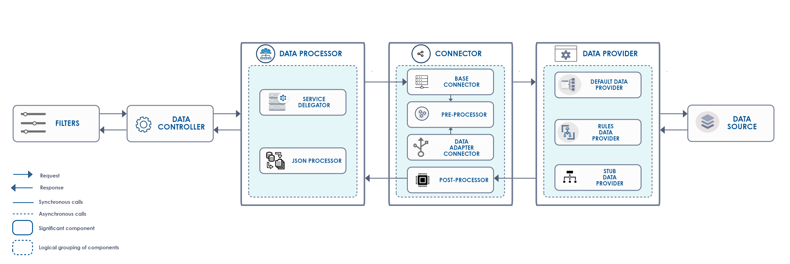
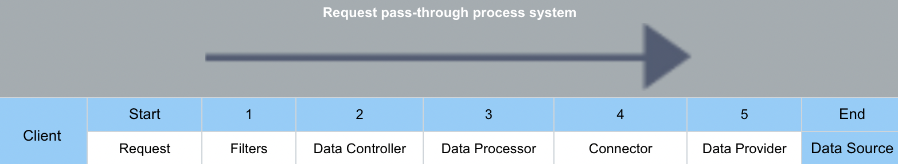
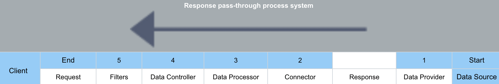

# Middleware Pipeline Overview

Volt MX Server is a pass-through system. Whenever a client sends a request, the server routes the request to an external data source (a Database, MongoDB, JSON service) and sends back the back-end response to the client.

*   Volt MX Server does not generate responses; however, it receives the external source's result and sends to the client. During this stage, the Server must process each request before it is sent to the external data source and each response before it is sent to the client.
*   The middleware pipeline is divided into different layers, and each layer has its functionality, which applies transformations required for request and response objects.
*   Each layer is responsible for transforming requests and responses.
*   Each request and response object is propagated through these layers sequentially to apply transformations, as shown in the following flow diagram.

## Middleware Pipeline Flow Diagram

The following middleware flow diagram details all the layers involved in the request and response transformation process:

*   A client request passes through a series of different middleware layers before the request is sent to the data source.
    
*   A data source response passes through a series of different middleware layers before the response is sent to the client.   

    >  **_Note:_** The sequence of layers processed for the response is in the request's opposite direction.
    
    

## Layers in Middleware Pipeline

<ol>
<li>

Filters

<b>Request</b>
<ul>
<li>The Filters intercept a client request and perform pre-processing before passing them to Middleware Pipeline.  
For example, you can use custom filters to transform request objects before the request is sent to the data source, such as validation checks, security checks, and logging metrics.</li>
</ul>

<b>Response</b>
<ul>
<li>Filters are used to intercept the responses and perform post-processing before passing it to the client.</li>
</ul>

</li>

<li>

Data Controller

<b>For Requests</b>
<ul>
<li>Data Controller layer transforms HTTP servlet requests into Data Controller request objects for processing.Sends data controller request object to service delegator.</li>
<li>It encapsulates data controller request objects.</li>
<blockquote><em><b>Note: </b></em>Data controller request objects help you configure additional parameters required in subsequent layers in the pipeline to process requests.</blockquote>
</ul>   

<b>For Responses</b>
<ul>
<li>Data Controller layer transforms the data controller response objects into HTTP Serverlet responses for processing.</li>
<li>Sends HTTP servlet responses to the Filters layer.</li>
<li>It encapsulates data control response objects.</li>
<blockquote><em><b>Note: </b></em>Data controller response objects help you configure additional parameters required in subsequent layers in the pipeline to process responses.</blockquote>
</ul>

</li>

<li>

Data Processor

After a request is passed through the Data Controller, the request enters the Data Processor layer containing two different entities, the Service Delegator and JSON Processor. These entities have different functionality.

<b>Service Delegator functionality</b>

<ul>
<li>Identifies appropriate data source connector based on the service configuration parameters.</li>
<li>Invokes data source connectors which eventually make a service call to the external data source.</li>
<li>After a request passed through the Data Controller layer, the <code>Service Delegator</code> is invoked. And the Service Delegator passes the request object to the <code>Connector</code> layer.</li>
</ul>

<b>JSON Processor functionality</b>

<ul>
<li>After the Connector layer passes a result/response object to <code>Data Processor</code> layer, the <code>JSON Processor</code> is invoked.
   <blockquote><em><b>Note:</b></em> At this stage, the result/response objects are in the form of Data Controller requests and responses.</blockquote>
    The <code>JSON Processor</code> converts the response object data structure to JSON string and sends it to the Data Controller layer. At this stage, the response is in the form of a Data Controller response.</li>
<li> The Data Controller layer sends back the response to the device.
    <blockquote><em><b>Note: </b></em>When you have multiple back-end sources, different responses must be captured in a standard way. The Data Models play a vital role in encapsulating these multiple responses from different back-end sources.</blockquote></li>
</ul>

<b>Data Models encapsulating data source response</b>

The Data Models contain the following data structures:

Result: 
    <ul>
    <li>Abstraction of the result of a back-end service call.</li>
    <li>Collection of Params, Datasets, and Records.</li>
    </ul>
DataSet: 
    <ul>
    <li>Abstraction of the result of a back-end service call.</li>
    </ul>
Record: 
    <ul>
    <li>A record is an item in the Dataset.</li>
    <li>A record, in turn, can have Records or Datasets.</li>
    <li>A record can also contain Params.</li>
    </ul>
Param: 
    <ul>
    <li>Param represents a parameter or variable part of the Result or Record object.</li>
    <li>It has parameter name, parameter value along with meta-data like data type, data format, and so on.</li>
    </ul>

</li>
<li>

Data Connector

<ol>
<li>
Transforms a request object.The Service Delegator chooses a connector based on the service configurations. The Connector layer helps transforms multiple data sources into expected data formats. A Pre-processor utility contains custom logic to transform the request object.  
For example, you have an integration service type of XML service configuration. The Service Delegator selects the XML connector. And the Connect layer transforms data controller requests into the XML format. After that, a connector layer invokes pre-processor utility if configured, and the pre-processor executes classes and transforms the request object. A Pre-preprocessors utility allows developers to choose logic for data transformation. 
The following base connectors are supported for pre-processor utility configuration:
<table>
<tr>
<th>Base Connectors/Technology Adapters</th>
<th>Business Connectors/Data Adapter Connector</th>
</tr>
<tr>
<td>* XML 
* SOAP 
* JSON 
* JAVASCRIPT 
* API Proxy 
* MongoDB 
</td>
<td>
Mock Data 
Relational Database 
Salesforce 
Open API (Swagger) 
IBM MQ 
RAML 
AWS API Gateway 
MuleSoft 
SAP JCO
</td>
</tr>
</table>
</li>
<li>Sends the request object to the Data Provider layer.</li>
<li>Makes a call to the external data source and gets the response, and the response is in the form of a response object.</li>
<li>The Post-processor checks for custom logic and executes it to transform the response object. Transforms the response object based on the custom logic specified in the Post-processor utility, if any.</li>
<li>Sends the transformed response object to the JSON Processor in the previous layer.</li>
</ol>
Volt MX Server provides out-of-the-box support for standard interfaces to back-end data sources.

</li>

<li>

Data Provider

    
<blockquote><em><b>Note: </b></em>The functionality of the Connector layer is to transform the request objects, make a call to the Data Source layer, and get the response. The response is in the form of a response object.</blockquote>

The Data Provider layer establishes a connection to the external Data Source layer. For example, connection throttling and connection timeouts.  

The Data Provider interface allows you to provide a custom implementation for connection establishment and generating the response. 

<ul>
<li>Default Data Provider</li>
<li>Rules Data Provider</li>
<li>Stub Data Provider</li>
</ul>

<blockquote><em><b>Note: </b></em>The functionality of the Connector layer is to transform the request objects, make a call to the Data Source layer, and get the response. The response is in the form of a response object.</blockquote>

</li>
</ol>