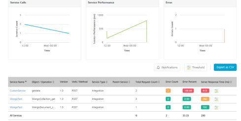
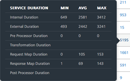
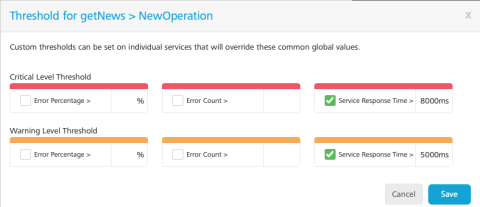

                            

Volt MX  Foundry console User Guide: Service

Monitoring
==========

App Services provides the monitoring capabilities on server performance to provide information on server load, performance, errors and so on to the end user. A dashboard that captures the real time monitoring data such as traffic flow (number of calls per service), performance (total duration of the calls) and error rate (count of errors per service) of the server is displayed. Monitoring data is retained for a week.

Admins can set performance [thresholds](#threshold) for individual services and automatically send email [alerts](#notifications) when thresholds exceed the predefined time settings.

**To access the Monitoring, follow these steps:**

1.  Log on to **App Services**. For more information on accessing App Services, refer [Launching App Services](Launching_Admin_Console.md).
    
    Upon successful login, the **Web Apps** page appears.
    
2.  Click **Monitoring** from the left pane of the screen.
    
    The **Monitoring** page appears with the list of services that hit the server.
    
    
    
    **Enable Monitoring**  
    
    Select the check box to enable monitoring. If Monitoring is disabled and the log level is debug, then it logs the metrics in the DB.  
    If **Log Level** type is set as **Debug** or lower in **Client Log Level** filter, the monitoring is captured only for the users matching the filter criteria in the log. If the service monitoring feature is enabled, the client log level set has no effect on it and data is collected for all the users. For more information on client log filters, refer [](Standard_Logs.md#log-level-by-client-filter)[Log Level by Client Filter](Standard_Logs.md#loglevel_Client).
    
    > **_Note:_** Monitoring has no perceptible performance impact and it is highly recommended to keep the feature enabled.
    
    The **Monitoring** page has two tabs - **[Service](#service)** and **[Environment](Environment.md#environment)**.
    
    Service
    -------
    
    The **Service** tab displays the performance data as graphs to view the overall performance and a table with the information for each specific service such as count of the server requests, duration, and other performance metrics.
    
    The performance data of the services is displayed by default. In the search field, enter a service name/ operation and click the Search icon to view the performance data of the specific service/ operation. The following three graphs represent the real-time data monitoring:
    
    *   [Service Calls](#service-calls)
    *   [Service Performance](#service-performance)
    *   [Error](#error)
    
    
    
    ### Service Calls
    
    The graph displays the number of service calls received by the server within the selected time period.
    
    
    
    ### Service Performance
    
    The graph displays the performance of the server in terms of time taken by the server to respond to the received request within the selected time period.
    
    
    
    ### Error
    
    The graph displays the count of occurrence of errors from the total number of requests within the selected time period.
    
    
    
    The table for **Service Monitoring** displays the following information:
    
    <table style="width: 100%;margin-left: 0;margin-right: auto;mc-table-style: url('Resources/TableStyles/Basic.css');" class="TableStyle-Basic TableStyle-TemenosTables" cellspacing="0"><colgroup><col class="TableStyle-TemenosTables-Column-Column1" style="width: 171px;"><col class="TableStyle-TemenosTables-Column-Column1"></colgroup><thead><tr class="TableStyle-TemenosTables-Head-Header1"><th class="TableStyle-TemenosTables-HeadE-Column1-Header1" scope="col">Field</th><th class="TableStyle-TemenosTables-HeadD-Column1-Header1" scope="col">Description</th></tr></thead><tbody><tr class="TableStyle-TemenosTables-Body-Body1"><td class="TableStyle-TemenosTables-BodyE-Column1-Body1">Service Name</td><td class="TableStyle-TemenosTables-BodyD-Column1-Body1"><p>Name of the displayed service. Click the service name to navigate to the test page of the selected service.</p><p class="Note" data-mc-autonum="<b><span style=&quot;color: #293276;&quot; class=&quot;mcFormatColor&quot;>NOTE: </span></b>"><span class="autonumber"><span><b><span style="color: #293276;" class="mcFormatColor">NOTE: </span></b></span></span>Click on a specific row of a service (other than service name) to view the statistics of that service. To revert to the default graphs page, click anywhere else on the screen.</p></td></tr><tr class="TableStyle-TemenosTables-Body-Body1"><td class="TableStyle-TemenosTables-BodyE-Column1-Body1">Object/Operation</td><td class="TableStyle-TemenosTables-BodyD-Column1-Body1">The object for the Object service or the operation created for the Integration/Orchestration service.</td></tr><tr class="TableStyle-TemenosTables-Body-Body1"><td class="TableStyle-TemenosTables-BodyE-Column1-Body1">Verb/Method</td><td class="TableStyle-TemenosTables-BodyD-Column1-Body1">The verb (or) method created for the service.</td></tr><tr class="TableStyle-TemenosTables-Body-Body1"><td class="TableStyle-TemenosTables-BodyE-Column1-Body1">Service Type</td><td class="TableStyle-TemenosTables-BodyD-Column1-Body1">Type of the created service. (example: Object Service, Integration Service and so on.)</td></tr><tr class="TableStyle-TemenosTables-Body-Body1"><td class="TableStyle-TemenosTables-BodyE-Column1-Body1"><p>Parent Service</p></td><td class="TableStyle-TemenosTables-BodyD-Column1-Body1"><p>Details of the parent service that invoked the service.</p><p>Example: If an Integration service is invoked as part of an Orchestration service, <span style="mc-redacted: none;">the orchestration service's operation name is displayed in the Parent Service</span>.<br><code class="codefirst">&lt;Operation_Name&gt;</code>.</p><p class="Note" data-mc-autonum="<b><span style=&quot;color: #293276;&quot; class=&quot;mcFormatColor&quot;>NOTE: </span></b>" data-mc-conditions="Default.V9SP1-M1"><span class="autonumber"><span><b><span style="color: #293276;" class="mcFormatColor">NOTE: </span></b></span></span>From V9 Service Pack 1 the parent service name is also added to the parent service's operation name to uniquely identify the parent operation.<br><br>Example:  If an Integration service is invoked as part of an Orchestration service, <span style="mc-redacted: none;">the orchestration service's operation name is displayed along with the orchestration service name, in the following format</span>:<br><code class="codefirst"><span style="background-color: #ffff00;">&lt;Orchestration_ServiceName&gt;</span>/&lt;Operation_Name&gt;</code>.</p><p class="Note" data-mc-autonum="<b><span style=&quot;color: #293276;&quot; class=&quot;mcFormatColor&quot;>NOTE: </span></b>" data-mc-conditions="Default.V9SP2M1"><span class="autonumber"><span><b><span style="color: #293276;" class="mcFormatColor">NOTE: </span></b></span></span>From V9 Service Pack 2 the parent service name is also added to the service tasks, which are part of the workflow service to uniquely identify the parent workflow service.<br><br>Example:  If any service is invoked as part of a <b>worflow service task</b>, <span style="mc-redacted: none;">the workflow service's name is displayed along with the workflow service task service name. </span>In the following screen shot, under <b>Parent Service</b> column, the Loan_Approval is the parent service (workflow service) name associated to the workflow service task.<br><br></p></td></tr><tr class="TableStyle-TemenosTables-Body-Body1"><td class="TableStyle-TemenosTables-BodyE-Column1-Body1">Total Request Count</td><td class="TableStyle-TemenosTables-BodyD-Column1-Body1">The count of total requests sent from the service within the selected time range.</td></tr><tr class="TableStyle-TemenosTables-Body-Body1"><td class="TableStyle-TemenosTables-BodyE-Column1-Body1">Error Count</td><td class="TableStyle-TemenosTables-BodyD-Column1-Body1">Count of the errors received from the total requests sent.</td></tr><tr class="TableStyle-TemenosTables-Body-Body1"><td class="TableStyle-TemenosTables-BodyE-Column1-Body1">Error Percent </td><td class="TableStyle-TemenosTables-BodyD-Column1-Body1">Percentage of the errors received from the total requests sent.</td></tr><tr class="TableStyle-TemenosTables-Body-Body1"><td class="TableStyle-TemenosTables-BodyB-Column1-Body1">Server Response Time</td><td class="TableStyle-TemenosTables-BodyA-Column1-Body1"><p>Time taken to respond by the server for the received request.</p><p>Mouse hover across each row to view the time split of service performance. For detailed information on time split refer <a href="#details">Time-split for Server Response time</a>.</p></td>
</tr>
</tbody>
</table>

     
    <a id="details"></a>

    **Time-split for Server Response time**: You can view the details of the service performance in terms of the minimum, maximum and the average time spent on each of the logical components. The details include the time spent while executing the request in terms of external call to backend and in transforming the backend request to fit the requirements of the client app. It also provides the details of pre-processor and post-processor duration along with request and response mapping duration for Object services.
    
    
    
    > **_Note:_** You can sort the displayed data in the table using the Service Name, Object (or) Operation, Service Type, Parent Service, Total Request Count, and Server Response Time.
    

Following actions can be performed in this screen:

*   [Threshold](#threshold)
*   [Notifications](#notifications)
*   [Export as CSV](#export-as-csv)
*   [Time Range Filter](#Time_Range)
*   [Error Filter](#Error_filter)
*   [Node Filter](#Node)

### Export as CSV

You can export the data displayed into CSV format. To export the data, perform the following steps:

*   Click **Export to CSV** button, to export the data into a CSV file.
    
> **_Note:_** The exported CSV has `|(pipe)` as a delimiter.
    

    
> **_Note:_** From V9 Service Pack 1, two new columns to represent 90th percentile (P90) and 95th percentile (P95) are added.
    
<a id="Time_Range"></a>
**Time Range Filter**: You can filter the data using the time range filter. The default time range of the services displayed is 15 minutes. Select a time range to view the list of services that hit the server within the selected time range.

> **_Note:_** Any existing metrics are logged in batches into the DB at the end of every minute.


The following are the different time ranges displayed in the drop-down list:

*   5 minutes
*   15 minutes
*   1 hour
*   4 hours
*   1 day
*   1 week

### Custom Time Range

Excluding the default time range displayed, you can also select the custom time range to view the list of services that hit the server within the selected time range.


To select the custom time range, follow these steps:

*   In the **Time Range** drop-down list, select **Custom**.
    
    A pop-up is displayed to select the custom time range.
    
*   Select a day from **Starting at** drop-down list and select the **Hour** and **Minute** by using the slider.
*   Select the amount of time the data to be captured from **For** drop-down list.
    
    The page displays the list of services that hit the server within the selected custom time range.
    
<a id="Error_filter"></a>
**Error filter**: You can filter the errors displayed from the total requests sent to the server within the selected time range. You can choose the options displayed from the **Error Filter** drop-down list.


*   **Include Errors**: Selecting this option displays the count of errors displayed out of the requests sent to the server within the selected time range.
*   **Exclude Errors**: Selecting this option excludes the count of errors from the list of metrics displayed.
*   **Errors Only**: Selecting this option displays only those service requests that have errors.

<a id="Node"></a>
### Node Filter

Nodes represent the different server instances that comprise the environment. The name of the node is determined by the first value found from a JVM -D of VOLTMX\_SERVER\_NODE\_NAME, the host name of the machine or the MAC address with a generated hash ID.

The performance of **All** the nodes is displayed by default. You can choose the nodes you want to monitor from the **Node** drop-down list.


### Threshold

Threshold is a setting that determines the performance of services. You can set **Warning** or **Critical** thresholds for the given fields:

*   Response Time (in ms.)
*   Error Count
*   Percentage of errors

When the value of any field exceed the threshold, the server sends a notification to your email address. Based on the values of the fields, you can identify the services that have a degraded performance.

The error percent, error count, and response time columns are color coded for quicker identification of services with degraded performance.

*   **Red** indicates critical
*   **Amber** indicates warning
*   **Green** indicates no issues

The admin can set warning and critical thresholds globally for all services or can override the settings for individual services as expected response times can vary across services. Notifications are automatically sent to users through email when the response data exceeds the predefined threshold settings.

> **_Note:_** You can set custom thresholds for individual services. These thresholds override the thresholds that are set globally.

To set a threshold globally, perform the following actions:

1.  In **Admin Console**\>> **Monitoring**\>> click **Threshold**. The **Threshold** pop-up appears.
    
    
    
2.  You can set the threshold using one or more as a combination of
    
    *   Percentage of Errors
    *   Count of Errors
    *   Service Response Time exceeding a certain value in milliseconds
    
    > **_Note:_** If a combination of thresholds is set, the email notification is sent even if one of the values is triggered.  
    >  
    > For example, if the warning threshold is set for error > 5 and service response time > 5000, the warning notification is sent to the users if the error count>5 or if the service response time>5000.
    
    The server calculates the parameters for every operation of the service.
    
    > **_Note:_** The parameters are calculated for the duration that you have selected for the monitoring data.
    
    > **_Note:_** Critical thresholds are expected to be higher than warning.
    
    Global thresholds can be overridden with different threshold values at individual operations as some services are expected to take more time to respond.
    
    For example, a three second response time is considered slow for a service, whereas a complicated orchestration service which connects to multiple back ends and receives more data as response can be expected to be normal even for eight seconds response time.
    
3.  To set threshold for an individual service, in **Admin Console**\>> **Monitoring**, click **Threshold** icon next to service to set the threshold. The **Threshold** pop-up for the selected service appears.
    
    
    
4.  Click the check box next to each parameter and enter a value to set a threshold. Critical level threshold must be greater than warning level threshold.
5.  Once the threshold is set, click **Save**.
    
    If the threshold exceeds the predefined settings, the data highlights with amber for warning and red for critical, irrespective of enabling the notifications.
    
    For example, in the above screen shot, we have set a specific threshold for **NewOperation** in the **getNews** service. This allows the admin to ensure that unnecessary alerts are not triggered for this operation when its expected response time is higher than other services.
    

### Notifications

You can configure the time interval for monitoring the performance (ranging from 5 minutes to 60 minutes) and enable email notifications to be set for critical or warning thresholds independently. Email notifications can be sent to all account owners, or admins, or custom users who have access to the environment. The threshold criteria is evaluated by calculating the average performance data over a configurable time window.

The flexibility of configuring the time interval and setting the notifications independently allows the admin, for example, to check for warnings only once an hour and possibly notify the on-call support person, and for critical alerts send mails to all admins to ensure more people troubleshoot the issue.

To enable notifications at different levels, perform the following actions.

1.  In **Admin Console**\>> **Monitoring**\>> click **Notifications**. The **Notifications** window appears.
    
    
    
2.  Under **Enable Notification on Critical level** and/or **Enable Notification on Warning Level**, select any of the following options
    *   **All Account Owners** - Select the check box to enable notifications at critical level for all account owners.
    *   **All Account Admin** - Select the check box to send notifications to all admins of the account.
    *   **All Users with Full Access on this Environment** - Select the check box to send notifications to all the users having full access on this environment.
    *   **Custom User List** - Select the check box to send notification to custom users. You can enter the email IDs of the custom users in the text box .
        
        > **_Note:_** Custom users must have access to the environment to receive the email alerts.
        
    *   You can select the time interval to check the services in the critical (or) warning state. The available options are 5 mins, 10 mins, 15 mins, 20 mins, 30 mins, and 60 mins.
3.  Click **Save** to save the changes.
    
    Email notifications are sent on Critical and Warning level thresholds.
    
    
<details close markdown="block"><summary>Click here to view sample email alert for Critical and Warning threshold.</summary>
    
**Sample email alert for Critical Threshold**
    

    
**Sample email alert for Warning threshold** 


    
</details>


### Configuring Email Alerts (On-Premises)

To configure email alerts, perform the following actions:

1.  Add the following server configuration parameters:
    
    
    
    *   **MAIL\_TEMPLATE**: The Engagement email request payload API.
    
    Sample Payload:
    
```
{
      "emailServiceRequest": {
        "emails": {
          "email": {
            "recipients": {
              "recipient": [
                {
                  "emailId": "$mailId",
                  "type": "TO"
                }
              ]
            },
            "senderName": "VoltMX",
            "subject": "$mailSubject",
            "content": "<p> This is a system generated notification that one or more of the services has exceeded the threshold limit and your email is part of the notification distribution list for this alert. The settings for this notification can be changed by an admin at by logging to admin console</p> <p>Environment Services Detail: </p> $mailContent",
            "priority": "true",
            "startTimeStamp": 0,
            "endTimeStamp": 0
          }
        }
```

*   **ENGAGEMENT\_USER\_NAME/ENGAGEMENT\_PASSWORD**: The Engagement user login credentials.
    *   **AUTH\_URL**: Auth service login URL to generate claims token.
    *   **ENGAGEMENT\_URL**: Engagement services runtime URL with API for adhoc email.
        
        Example: `https://<runtime_url>/api/v1/message/email`.
        
    
    Click **Save**.
    
2.  Create custom servlet to make adhoc email request call to the Engagement services
```
package com.voltmx.sample;
    
    import java.io.IOException;
    
    import javax.servlet.ServletException;
    import javax.servlet.http.HttpServlet;
    import javax.servlet.http.HttpServletRequest;
    import javax.servlet.http.HttpServletResponse;
    
    import org.apache.commons.io.IOUtils;
    import org.apache.commons.lang.StringEscapeUtils;
    import org.apache.commons.lang.StringUtils;
    import org.apache.http.client.ClientProtocolException;
    import org.apache.http.client.methods.CloseableHttpResponse;
    import org.apache.http.client.methods.HttpPost;
    import org.apache.http.entity.StringEntity;
    import org.apache.http.impl.client.CloseableHttpClient;
    import org.apache.http.impl.client.HttpClients;
    import org.apache.logging.log4j.LogManager;
    import org.apache.logging.log4j.Logger;
    import org.json.simple.JSONObject;
    import org.json.simple.parser.JSONParser;
    
    import com.hcl.voltmx.middleware.api.ServicesManagerHelper;
    import com.hcl.voltmx.middleware.servlet.IntegrationCustomServlet;
    
    @IntegrationCustomServlet(urlPatterns = {
        "sendmail"
    })
    public class MailServlet extends HttpServlet {
    
        private static final Logger LOGGER = LogManager.getLogger(MailServlet.class);
    
        private static final long serialVersionUID = -7623066890220333243 L;
    
        private String authToken;
    
        @Override
        protected void doPost(HttpServletRequest request, HttpServletResponse response)
        throws ServletException, IOException {
            String json = IOUtils.toString(request.getInputStream(), "UTF-8");
    
            try {
                String requestpayload = ServicesManagerHelper.getServicesManager(request).getConfigurableParametersHelper()
                    .getServerProperty("MAIL_TEMPLATE");
                Object obj = new JSONParser().parse(json);
                JSONObject jsonObj = (JSONObject) obj;
                JSONObject notifyList = (JSONObject) jsonObj.get("NotifyList");
                String mailId = (String) notifyList.get("users");
                JSONObject alerts_services_details = (JSONObject) jsonObj.get("alerts_services_details");
                String mailContent = ](String) alerts_services_details.get("services\.md_content");
                String mailSubject = (String) jsonObj.get("type");
                mailSubject = mailSubject.replace("_", " ");
                requestpayload = requestpayload.replace("$mailId", mailId);
                requestpayload = requestpayload.replace("$mailSubject", mailSubject);
                requestpayload = requestpayload.replace("$mailContent", StringEscapeUtils.escapeJava(mailContent));
                CloseableHttpResponse httpResponse = getAuthTokenAndCallAPI(request, requestpayload);
                if (httpResponse.getStatusLine().getStatusCode() == 200) {
                    response.setContentType("application/json");
                    response.getWriter().write("{\"message\":\"Mail request initiated successfully\"}");
                } else {
                    LOGGER.error("Faild to trigger mail, with response code {} ",
                        httpResponse.getStatusLine().getStatusCode());
                    response.setContentType("application/json");
                    response.getWriter().write("{\"message\":\"Failed to trigger mail\"}");
                }
            } catch (Exception e) {
                LOGGER.error("Failed to trigger mail", e);
                response.setContentType("application/json");
                response.getWriter().write("{\"message\":\"Failed to trigger mail\"}");
            }
        }
    
        private CloseableHttpResponse getAuthTokenAndCallAPI(HttpServletRequest request, String requestPayload)
        throws Exception {
            if (StringUtils.isBlank(authToken)) {
                LOGGER.debug("Generating auth token using the configured user credentials");
                authToken = getAuthToken(request);
            }
            String url = ServicesManagerHelper.getServicesManager(request).getConfigurableParametersHelper()
                .getServerProperty("ENGAGEMENT_URL");
            CloseableHttpResponse response = executeRequestAndGetResponse(url, requestPayload, authToken);
            if (response.getStatusLine().getStatusCode() == 401 || response.getStatusLine().getStatusCode() == 403) {
                authToken = getAuthToken(request);
                response = executeRequestAndGetResponse(url, requestPayload, authToken);
            }
            return response;
        }
    
        private String getAuthToken(HttpServletRequest request) throws Exception {
            String userId = ServicesManagerHelper.getServicesManager(request).getConfigurableParametersHelper()
                .getServerProperty("ENGAGEMENT_USER_NAME");
            String password = ServicesManagerHelper.getServicesManager(request).getConfigurableParametersHelper()
                .getServerProperty("ENGAGEMENT_USER_PASSWORD");
            String url = ServicesManagerHelper.getServicesManager(request).getConfigurableParametersHelper()
                .getServerProperty("AUTH_URL");
            CloseableHttpResponse response = executeRequestAndGetResponse(url,
                "{\"userid\": \"" + userId + "\",\"password\": \"" + password + "\"}", null);
            String responseContent = IOUtils.toString(response.getEntity().getContent(), "UTF-8");
            Object claimTokenObj = ((JSONObject) new JSONParser().parse(responseContent)).get("claims_token");
            if (claimTokenObj != null) {
                return (String)((JSONObject) claimTokenObj).get("value");
            } else {
                LOGGER.debug("Failed to get the cliams token, check if the user credentials are valid");
            }
    
            return null;
        }
    
        private CloseableHttpResponse executeRequestAndGetResponse(String url, String payload, String authToken)
        throws ClientProtocolException, IOException {
            CloseableHttpClient client = HttpClients.createDefault();
            HttpPost httpPost = new HttpPost(url);
            httpPost.setEntity(new StringEntity(payload));
            if (StringUtils.isNotBlank(authToken)) {
                httpPost.setHeader("X-VoltMX-Authorization", authToken);
            }
            httpPost.setHeader("Accept", "application/json");
            httpPost.setHeader("Content-type", "application/json");
            CloseableHttpResponse httResponse = client.execute(httpPost);
            return httResponse;
        }
    }
```
    
> **_Note:_** Following are the third party libraries required to compile the MailServlet code:  
    \- Commons-io-2.6.jar  
    \- Commons-lang3-3.8.1.jar  
    \- Httpclient-4.5.6.jar  
    \- Log4j-api.jar  
    \- Json-simple.jar
    
3.  Create a custom jar with the custom servlet created in the earlier step.
4.  Upload the asset to the Volt MX Foundry server and publish the app.
5.  Configure the servlet endpoint URL -D parameter **VOLTMX\_SERVER\_ALERTS\_NOTIFY\_ENDPOINT**.
    
    Example: `-DVOLTMX_SERVER_ALERTS_NOTIFY_ENDPOINT=http://<host>:<port>/services/sendmail`.
    

**Best Practices**

*   The thresholds must be set appropriately to avoid false alarms.
    
*   Use caution while setting the alert monitoring interval.
    
    For example, if alert interval is set at 5 minutes and the threshold criteria is met for every 5 minutes, an alert is sent for every such interval. To avoid such clutter, consider the time intervals for warning and critical and set individual thresholds.
    
*   Ensure that appropriate users are copied for email alerts.
