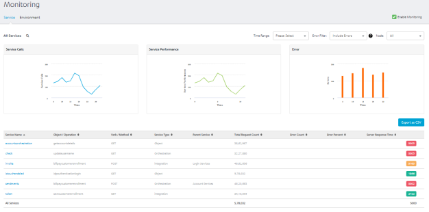

                            

Monitoring
==========

App Services has provided the monitoring capabilities on the server performance to provide information on server load, performance, errors and so on to the end user. A dashboard is created that captures the real time monitoring data such as traffic flow (number of calls per service), performance (total duration of the calls) and error rate (count of errors per service) of the server. Monitoring data is retained for a week.

**To access the Service Monitor, follow these steps:**

1.  Log on to **App Services**. For more information on accessing App Services, refer [Launching App Services](Launching_Admin_Console.md).
    
    Upon successful login, the **Web Apps** page appears.
    
2.  Click **Monitoring** from the left pane of the screen.
    
    The **Monitoring** page appears with the list of services that hit the server.
    
    
    
    The **Monitoring** page has two tabs - **[Service](#service)** and **[Environment](#Environm)**.
    
    Service
    -------
    
    The Service tab displays the performance data in a tabular form with the information such as count of the server requests, duration, and other performance metrics.
    
    The tabular data is represented in the form of graphs. The Service page displays the following three graphs representing the real time data monitoring :
    
    *   [Service Calls](#Calls)
    *   [Service Performance](#Performance)
    *   [Error](#Error)
    
    
    
    Service Calls
    
    The graph displays the number of service calls received by the server within the selected time period.
    
    
    
    Service Performance
    
    The graph displays the performance of the server in terms of time taken by the server to respond to the received request within the selected time period.
    
    
    
    Error
    
    The graph displays the count of occurrence of errors from the total number of requests within the selected time period.
    
    
    
    The table for Monitoring displays the following information:
    
    | Field | Description |
    | --- | --- |
    | Service Name | Name of the displayed service. Click the service name to navigate to the test page of the selected service.> **_Note:_** Click on a specific row of a service (other than service name) to view the statistics of that service. To revert to the default graphs page, click anywhere else on the screen. |
    | Object/Operation | The object for the Object service or the operation created for the Integration/Orchestration service. |
    | Verb/Method | The verb (or) method created for the service. |
    | Service Type | Type of the created service. (example: Object Service, Integration Service and so on.) |
    | Parent Service | Details of the parent service associated with the service.Example: If an Integration service is part of an Orchestration service and invoked as part of Orchestration service, the orchestration service name is displayed in the parent service and integration service name is populated in the service name field. |
    | Total Request Count | The count of total requests sent from the service within the selected time range. |
    | Error Count | Count of the errors received from the total requests sent. |
    | Error Percent | Percentage of the errors received from the total requests sent. |
    | Server Response Time | Time taken to respond by the server for the received request.Mouse over across each row in the server response time column, to view the time split taken by each process in the server to send the response. |
    | Enable Service Monitor | Select the checkbox to enable the service monitor. Clear the checkbox to disable the service monitor feature.> **_Note:_** If the Service Monitor is disabled, it logs the metrics in the DB if the log level is Debug.> **_Note:_** If **Log Level** type is set as **Debug** or lower in **Client Log Level** filter, service monitoring is captured only for the users matching the filter criteria in the log. If the service monitoring feature is enabled, the client log level set has no effect on it and data is collected for all the users. For more information on client log filters, refer [Log Level by Client Filter](Settings.md#loglevel_Client). |
    
    > **_Note:_** Monitoring has no perceptible performance impact and it is highly recommended to keep the feature enabled. 

     > **_Note:_** If the Root Logger is set to OFF, logs will not be added to the database, resulting in no data being displayed on the monitoring page
      
    You can sort the displayed data in the table using the Service Name, Object (or) Operation, Service Type, Parent Service, Total Request Count, and Server Response Time.
    

Following actions can be performed in this screen:

*   [Export as CSV](#Export_CSV)
*   [Time Range Filter](#Time_Range)
*   [Error Filter](#Error_filter)
*   [Node Filter](#Node)

**Export as CSV**: You can export the data displayed into CSV format. To export the data, perform the following steps:

*   Log on to **App Services**. The **Web Apps** page appears.
*   Click **Service Monitor** from the left pane. The **Service Monitor** page appears.
*   Click **Export to CSV** button, to export the data into a CSV file.
    
    > **_Note:_** The exported CSV has **| (pipe)** as a delimiter.
    
    
    

**Time Range Filter**: You can filter the data using the time range filter. The default time range of the services displayed is 15 minutes. Select a time range to view the list of services that hit the server within the selected time range.

> **_Note:_** Any existing metrics are logged in batches into the DB at the end of every minute.

The following are the different time ranges displayed in the drop-down list:

*   5 minutes
*   15 minutes
*   1 hour
*   4 hours
*   1 day
*   1 week

**Custom Time Range**: Excluding the default time range displayed, you can also select the custom time range to view the list of services that hit the server within the selected time range.

To select the custom time range, follow these steps:

*   In the **Time Range** drop-down list, select **Custom**.
    
    A pop-up is displayed to select the custom time range.
    
*   Select a day from **Starting at** drop-down list and select the **Hour** and **Minute** by using the slider.
*   Select the amount of time the data to be captured from **For** drop-down list.
    
    The page displays the list of services that hit the server within the selected custom time range.
    

**Error filter**: You can filter the errors displayed from the total requests sent to the server within the selected time range. You can choose the options displayed from the **Error Filter** drop-down list.

*   **Include Errors**: Selecting this option displays the count of errors displayed out of the requests sent to the server within the selected time range.
*   **Exclude Errors**: Selecting this option excludes the count of errors from the list of metrics displayed.
*   **Errors Only**: Selecting this option displays the services only that has errors.

**Node filter**: Nodes represent the different server instances that comprise the environment. The name of the node is determined by the first value found from a JVM -D of VOLTMX\_SERVER\_NODE\_NAME, the host name of the machine or the MAC address with a generated hash ID.

The performance of **All** the nodes is displayed by default. You can choose the nodes you want to monitor from the **Node** drop-down list.

