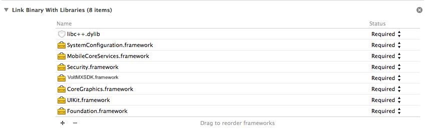
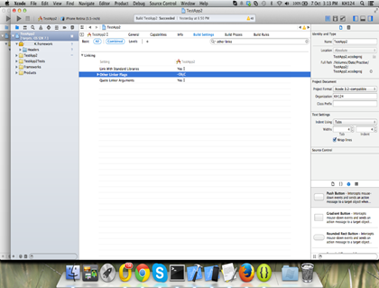
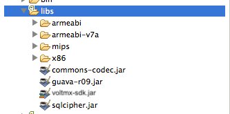

# Native Android or iOS SDK

## Getting Sync Instance

### On-premises

To get sync service instance pass context of the activity.

#### Android

<pre><code>Sync s = null;   
try {   
s = SyncFactory.getSyncInstance(this);  
} catch (VoltMXException e) {   
//failed   
}   
</code></pre>

#### iOS

<pre><code>VoltMXSync *sync = nil;   
@try {   
sync = [VoltMXSync sharedInstance];   
}   
@catch (VoltMXSyncException *exception) {   
//failed to encrypt offline database   
}   
//start to be removed</code></pre>

### Cloud

<pre><code>//initializing sync service
try {
new VoltMXFactory().getSyncService();
//init success
} catch (VoltMXException e) {
//init failed
}
//end of to be removed
</code></pre>

## Initializing the Sync Service

Before using any sync related API you have to initialize sync services.

### Initializing the Sync Service

#### Initializing Sync

#### Android

<pre><code>//initializing sync service
try {
SyncFactory.getSyncInstance(this).initSync();
//init success
} catch (VoltMXException e) {
//init failed
}
</code></pre>

#### iOS

<pre><code>@try {
         [[VoltMXSync sharedInstance]initSync];
         //init sucess
    }
    @catch (VoltMXSyncException *exception) {
        //init failure
    }
</code></pre>

#### Initializing Sync in Background

#### Android

<pre><code>//Get sync instance
Sync s = null;
try {
s = SyncFactory.getSyncInstance(this);
} catch (VoltMXException e) {
// TODO Auto-generated catch block
e.printStackTrace();
}
//initialize sync
s.initSyncInBackground(new SyncCallback() {
@Override
public void onFailure(VoltMXException arg0) {
//init failed
}
@Override
public void onSuccess() {
//init success
}
});
</code></pre>

#### iOS

<pre><code>  [[VoltMXSync sharedInstance]initSyncInBackground:^(BOOL succeeded, NSError *error) {
        if(error)   {
            //init failed
        } else{
            //init success
        }
	    }];
</code></pre>

## Encrypting the Offline Database

To encrypt offline database (SQLite) on device we use SQL Cipher. Encryption has to be specified while initializing sync services. After the sync service is initialized without encryption, you cannot encrypt it. If you want to use encryption, you must initialize the sync service with encryption for the first time. After you encrypt the database, you cannot decrypt it.

#### Android

<pre><code>Sync s = null;
try {
s = SyncFactory.getSyncInstance(this);
s.initSync("someKey");
} catch (VoltMXException e) {
//failed
</code></pre>

#### iOS

<pre><code>VoltMXSync *sync = nil;
    @try {
        sync = [VoltMXSync sharedInstance];
        [sync initSyncWithPassPhrase:@"somekey"];
        //successfully encrypted offline database
    }
    @catch (VoltMXSyncException *exception) {
        //failed to encrypt offline database
    } }
</code></pre>

## Creating a Sync Object

1.  Getting generated code
    *   You need to have the following files to use Sync SDK’s:
        1.  Portal is present, where user will upload the sync config file and get the generated code. For iOS, the generated code will contain
            1.  Metadata Files:
                1.  SyncGeneratedMetatadata.h
                2.  SyncGeneratedMetatadata.mm
            2.  Codegen Files: 
                1.  YourObjectName.h
                2.  YourObject.mm
        2.  For Android, two packages are present:

            1.  com.voltmx.sdk.services.sync.codegen

                1.  yourobject.java

            2.  com.voltmx.sdk.services.sync.metadata

                1.  SyncGeneratedMetadata.java

2.  Using Native SDK in iOS.
    1.  Add the generated files in step1 in your project.
    2.  Link the following libraries in your project.

        

    4.  Add linker flags to your project.

        

3.  Using Native SDK in Android:
    1.  Launch Eclipse.
    2.  Copy the generated packages into your project.
    3.  Unzip the VoltMX Android SDK.zip
    4.  Unzip libs.zip
    5.  Copy libs file into your project libs folder.
    6.  Copy voltmx-sdk.jar inside libs folder.
    7.  Your project libs folder should look like:

        

    9.  Add the following permissions in your AndroidManifest.xml:  

        `<uses-permission android:name="android.permission.INTERNET" />`

        `<uses-permission android:name="android.permission.ACCESS_NETWORK_STATE" />`
        
        `<uses-permission android:name="android.permission.ACCESS_WIFI_STATE" />`

## Error Codes

| Error Code | Error Message | How to reproduce | Cause | Comments |
| ------ | ------ |------ | ------ |------ |
| VoltMX1000E |Unknown Error | | | |
| VoltMX1001E |Please initialize init before calling any other API|Call any API before init | | | |
|VoltMX1002E | Out of memory| Out of memory| |http://www.cplusplus.com/reference/new/bad_alloc/ |
|VoltMX1003E |Input Output Exception |Input Output Exception | |http://www.cplusplus.com/reference/ios/ios_base/failure/ |
| VoltMX1004E| Error occurred while creating database path:| | | |
|VoltMX1005E |Null Pointer Exception |Use wrong scope name for scope APIs, etc. | | |
|VoltMX1006E |Error occurred while parsing metadata |It will occur if metadata is not proper | | |
|VoltMX1007E |Row Doesn't Exist |Try to delete some row which doesn't exist | | |
|VoltMX1008E |Session in progress |call sync multiple times | | |
|VoltMX1009E |Cannot delete as child record(s) with cascades false exist for this record |deleting a record which has relationships with other records | | |
|VoltMX8888E |whatever message comes from server | | | |

| Error Code | Cause |  Error Message | How to reproduce |
| ------ | ------ |------ | ------ |
|1000 |Unknown error occurred at network layer |Unknown Error occurred | |
| 1005 | Invalid input url. Please check the url | Invalid input url. Please check the url | Provide wrong url |
| 1012 | Network Request Failed | Request Failed |  |
| 1011 |  | Device has no data connectivity. Please try the operation after establishing connectivity. |  |
| VoltMX2005E |  | Invalid Arguments for the API (Messages Differ as per the API Calls) For example, eventType can not be null. Provide a proper eventType, eventSubType value is greater than 256 characters. Provide Event Subtype with at most 256 chars etc. | Provide invalid arguments |
| VoltMX2000E | 1\. Not able to add header or param to service 2. Not able to start a thread for making network call | <Generic exception, error message will be thrown by android layer> | Don't know |
| VoltMX2001E | fetchDetailsIn Background | [http://docs.oracle.com/ javase/7/docs/ api/java/lang/ InstantiationException.html](http://docs.oracle.com/javase/7/docs/api/java/lang/InstantiationException.html) |  |
| VoltMX2002E | 1.SyncDataStore.fetchDetailsInBackground 2\. sync.initSync | [http://docs.oracle.com/javase/ 7/docs/api/java/lang/ IllegalAccessException.html](http://docs.oracle.com/javase/7/docs/api/java/lang/IllegalAccessException.html) |  |
| VoltMX2003E | sync.initSync | [http://docs.oracle.com/javase/7 /docs/api/java/lang/ NoSuchFieldException.html](http://docs.oracle.com/javase/7/docs/api/java/lang/NoSuchFieldException.html) |  |
| VoltMX2004E | sync.initSync | [http://docs.oracle.com/javase/7/ docs/api/java/lang/ SecurityException.html](http://docs.oracle.com/javase/7/docs/api/java/lang/SecurityException.html) |  |
| VoltMX2009E | sync.initSync | [http://docs.oracle.com/javase/7/ docs/api/java/lang/ IllegalAccessException.html](http://docs.oracle.com/javase/7/docs/api/java/lang/IllegalAccessException.html) |  |
| VoltMX2006E | sync.initSync | [http://docs.oracle.com/javase/7 /docs/api/java/lang/ ClassNotFoundException.html](http://docs.oracle.com/javase/7/docs/api/java/lang/ClassNotFoundException.html) | Remove syncgeneratedmetadata.java from project |

| Error Code | Cause |  Error Message | How to reproduce | Supported Docs |
| ------ | ------ |------ | ------ | ------ |
| VoltMX2006E | sync.initSync |class not found exception | | [Supported Doc](https://developer.apple.com/library/mac/documentation/Cocoa/Conceptual/Exceptions/Concepts/PredefinedExceptions.html#//apple_ref/doc/uid/20000057-BCIGHECA) |
|Predefined ios Exception |Predefined ios Exception | | | |
|Predefined networkError codes | network error codes| | | [Supported Doc](https://developer.apple.com/library/mac/documentation/Networking/Reference/CFNetworkErrors/index.html#//apple_ref/c/tdef/CFNetworkErrors)|
| | | | |[Supported Doc](http://nshipster.com/nserror/) |
|Below errors are same as common layer error codes but will be thrown in asyncronous APIs as they can't use string error code. | | | | |
|NSError Code |Error |ErrorDomain | | |
|1000 |Unknown Error |com.voltmx.foundry.sync | | |
|1001 |Please initialize init before calling any other API |com.voltmx.foundry.sync | | |
|1002 |Out of memory |com.voltmx.foundry.sync | | |
|1003 |Input Output Exception |com.voltmx.foundry.sync | | |
|1004 |Error occurred while creating database path: |com.voltmx.foundry.sync | | |
|1005 |Null Pointer Exception |com.voltmx.foundry.sync | | |
|1006 |Error occurred while parsing metadata |com.voltmx.foundry.sync | | |
|1007 |Row Doesn't Exist | com.voltmx.foundry.sync | | |
|1008 |Session in progress |com.voltmx.foundry.sync | | |
|3000 |native iOS error |com.voltmx.foundry.sync | | |

## Create, Read, Update, and Delete (CRUD) operations in Native SDK

### Create/Update

For both Create and Update, we have the same APIs. If object passed is a new object then create happens, otherwise if object is fetched from device update happens.

### For Android and iOS

### Creating a Record

**API Used**: public <T extends SyncObject> void save(T syncObject) throws VoltMXException.

**Sample Code**:

#### Android

<pre><code>try{
   Categories cat = new Categories();
   cat.setCategoryName ("Fruits");
   cat.setDescription("Apple");
   SyncFactory.getSyncDataStoreInstance().save(cat);
   //save success
  }catch(VoltMXException e){
   //save failed
  }
</code></pre>

#### iOS

<pre><code>	API Used: - (void) saveSyncObject:(VoltMXSyncObject*) voltmxSyncObject;
	           CODE:
	@try{
        Categories *cat = [[Categories alloc]init];
        [cat setCategoryName:@"Fruits"];
        [cat setDescription:@"Apple"];
        [[VoltMXSyncDataStore sharedInstance]saveSyncObject:cat];
        //save success
    }
    @catch(VoltMXSyncException* e){
        //save failed
    }</code></pre>

### Creating a Record in Background

**API Used**: public <T extends SyncObject> void saveInBackground(T dataObject, SyncObjectCallback<T> callback)

**Sample Code**:

#### Android

<pre><code>Categories c = new Categories();
  c.setCategoryName("Fruit");
  c.setDescription("Apple");

  SyncFactory.getSyncDataStoreInstance().saveInBackground(c, new SyncObjectCallback<Categories>() {
   @Override
   public void onFailure(VoltMXException e) {
    //save failed
   }

   @Override
   public void onSuccess(Categories arg0) {
    //save success

   }
  });
</code></pre>

#### iOS

<pre><code>API Use - (void) saveSyncObjectInBackground:(VoltMXSyncObject*) voltmxSyncObject withCompletionBlock:(VoltMXSyncObjectResultBlock) result;

Categories *cat;
@try{
cat = [[Categories alloc]init];
    [cat setCategoryName:@"Fruits"];
     [cat setDescription:@"Apple"];
}
@catch(VoltMXSyncException *e)
{
NSLog(@”Exception occurred : %@”,e);
}
     [[VoltMXSyncDataStore sharedInstance]saveSyncObjectInBackground:cat withCompletionBlock:^(VoltMXSyncObject *syncObject, NSError *error) {
         if(error)   {
             //error in saving syncobject in background
         } else {
             //successfully saved the syncobject in background
         }
               }];
</code></pre>

### Bulk Create

#### Android

<pre><code>try{
   List<Categories> catList = new ArrayList<Categories>();

   //create first category
   Categories cat = new Categories();
   cat.setCategoryName ("Fruits");
   cat.setDescription("Apple");

   //create 2nd category
   Categories cat1 = new Categories();
   cat1.setCategoryName ("Fruits1");
   cat1.setDescription("Apple1");

   //create 3rd category
   Categories cat2 = new Categories();
   cat2.setCategoryName ("Fruits2");
   cat2.setDescription("Apple2");

   catList.add(cat);
   catList.add(cat);
   catList.add(cat2);

   SyncFactory.getSyncDataStoreInstance().bulkSave(catList);
   //bulk save success
  }catch(VoltMXException e){
   //bulk save failed 
  }
</code></pre>

#### iOS

<pre><code>-	(void) bulkSave:(NSArray*)voltmxSyncObjects;
    @try {
        Categories *cat = [[Categories alloc]init];
        [cat setCategoryName:@"Fruits"];
        [cat setDescription:@"Apple"];

        Categories *cat1 = [[Categories alloc]init];
        [cat1 setCategoryName:@"Fruits1"];
        [cat1 setDescription:@"Apple1"];

        Categories *cat2 = [[Categories alloc]init];
        [cat2 setCategoryName:@"Fruits2"];
        [cat2 setDescription:@"Apple2"];

        NSArray* catArray = @[cat,cat1,cat2];
        [[VoltMXSyncDataStore sharedInstance] bulkSave:catArray];
        //bulk save success
    }
    @catch (VoltMXSyncException *exception) {
        //bulk save failed
}
</code></pre>

### Bulk Create in Background

#### Android

<pre><code>List<Categories> catList = new ArrayList<Categories>();

  //create first category
  Categories cat = new Categories();
  cat.setCategoryName ("Fruits");
  cat.setDescription("Apple");

  //create 2nd category
  Categories cat1 = new Categories();
  cat1.setCategoryName ("Fruits1");
  cat1.setDescription("Apple1");

  //create 3rd category
  Categories cat2 = new Categories();
  cat2.setCategoryName ("Fruits2");
  cat2.setDescription("Apple2");

  catList.add(cat);
  catList.add(cat);
  catList.add(cat2);

  SyncFactory.getSyncDataStoreInstance().bulkSaveInBackground(catList, new SyncObjectListCallback<Categories>() {

   @Override
   public void onFailure(VoltMXException arg0) {
    // TODO Auto-generated method stub

   }

   @Override
   public void onSuccess(List<Categories> arg0) {
    // TODO Auto-generated method stub

   }
  });
</code></pre>

#### iOS

<pre><code>VoltMXQuery *query;  
NSArray* catArray;

@try{
query = [[VoltMXSyncDataStore sharedInstance]createQueryWithClassObj:[Categories class]];
    [query addWhereClause:@"CategoryName='Fruits'"];
 catArray = [[VoltMXSyncDataStore sharedInstance]executeQuery:query];
    for (Categories *cat in catArray) {
        [cat setDescription:@"Fruits Updated"];
    }
}
@catch(VoltMXSyncException *exception)
{
    // Catch the exception and print if required.
}
    [[VoltMXSyncDataStore sharedInstance] bulkSaveInBackground:catArray withCompletionBlock:^(NSArray *objects, NSError *error) {
        if (error) {
            //bulk save failed in background
        } else  {
            //bulk save success in background
        }
                    }];
</code></pre>

### Bulk Update

#### Android

<pre><code>//bulkupdate
  try{
   //First get records from db
   Query<Categories> query = SyncFactory.getSyncDataStoreInstance().createQuery(Categories.class);
   query.addWhereClause("CategoryName='Fruits'");
   List<Categories> categoriesList = SyncFactory.getSyncDataStoreInstance().executeQuery(query);

   //update categories list
   for(Categories cat:categoriesList){
    cat.setCategoryName("Fruits Updated");
   }
   SyncFactory.getSyncDataStoreInstance().bulkSave(categoriesList);
   //save success
  }catch(VoltMXException e){
   //save failed
  }
</code></pre>

#### iOS

<pre><code>	@try {
        VoltMXQuery *query = [[VoltMXSyncDataStore sharedInstance]createQueryWithClassObj:[Categories class]];
        [query addWhereClause:@"CategoryName='Fruits'"];
        NSArray* catArray = [[VoltMXSyncDataStore sharedInstance]executeQuery:query];
        for (Categories *cat in catArray) {
            [cat setDescription:@"Fruits Updated"];
        }
        [[VoltMXSyncDataStore sharedInstance] bulkSave:catArray];
         //bulk save success
    }
    @catch (VoltMXSyncException *exception) {
        //bulk save failed
    }
</code></pre>

### Bulk Update in Background

#### Android

<pre><code>//bulkupdateinbackground
  //First get records from db
  Query<Categories> query = SyncFactory.getSyncDataStoreInstance().createQuery(Categories.class);
  query.addWhereClause("CategoryName='Fruits'");
  SyncFactory.getSyncDataStoreInstance().executeQueryInBackground(query, new SyncObjectListCallback<Categories>() {

   @Override
   public void onFailure(VoltMXException arg0) {
    //get failure

   }

   @Override
   public void onSuccess(List<Categories> arg0) {
    //update categories list
    for(Categories cat:arg0){
     cat.setCategoryName("Fruits Updated");
    }
    SyncFactory.getSyncDataStoreInstance().bulkSaveInBackground(arg0, new SyncObjectListCallback<Categories>() {

     @Override
     public void onFailure(VoltMXException arg0) {
      // update failure

     }

     @Override
     public void onSuccess(List<Categories> arg0) {
      //update success

     }
    });
   }
  });
</code></pre>

#### iOS

<pre><code> VoltMXQuery *query; 
NSArray* catArray;
@try{
query = [[VoltMXSyncDataStore sharedInstance]createQueryWithClassObj:[Categories class]];
    [query addWhereClause:@"CategoryName='Fruits'"];
    catArray = [[VoltMXSyncDataStore sharedInstance]executeQuery:query];
    for (Categories *cat in catArray) {
        [cat setDescription:@"Fruits Updated"];
    }
}
@catch(VoltMXSyncException *exception)
{
    // Catch the exception and print if required.
}
    [[VoltMXSyncDataStore sharedInstance] bulkSaveInBackground:catArray withCompletionBlock:^(NSArray *objects, NSError *error) {
        if (error) {
            //bulk save failed in background
        } else  {
            //bulk save success in background
        }
                    }];
</code></pre>

## Updating a Sync Object

### Updating a Record

#### Android

<pre><code>try{
   //First get record from db
   PrimaryKey pk = new PrimaryKeyImpl();
   pk.setAttribute("CategoryID", 1);
   Categories cat = SyncFactory.getSyncDataStoreInstance().getObject(Categories.class, pk);

   //update the record
   cat.setCategoryName ("Fruits Updated");
   cat.setDescription("Apple Updated");
   SyncFactory.getSyncDataStoreInstance().save(cat);
   //save success
  }catch(VoltMXException e){
   //save failed
  }
</code></pre>

#### iOS

<pre><code>	  @try {
        VoltMXPrimaryKey *pk = [[VoltMXPrimaryKey alloc]init];
        [pk setAttributeForKey:@"CategoryID" value:@"1"];
        Categories *cat =(Categories*)[[VoltMXSyncDataStore sharedInstance]getSyncObjectWithClass:[Categories class] primaryKey:pk];

        //update the record
        [cat setCategoryName:@"Fruits Updated"];
        [cat setDescription:@"Apple Updated"];
        [[VoltMXSyncDataStore sharedInstance]saveSyncObject:cat];
        //save success
    }
    @catch (VoltMXSyncException *exception) {
        //save failed
	    }
</code></pre>

### Updating a Record in Background

#### Android

<pre><code>//First get record from db
  PrimaryKey pk = new PrimaryKeyImpl();
  pk.setAttribute("CategoryID", 1);
  SyncFactory.getSyncDataStoreInstance().getObjectInBackground(Categories.class, pk, new SyncObjectCallback<Categories>() {

   @Override
   public void onFailure(VoltMXException arg0) {
    //get record failed

   }

   @Override
   public void onSuccess(Categories c) {
    //update the record
    c.setCategoryName ("Fruits Updated");
    c.setDescription("Apple Updated");
    SyncFactory.getSyncDataStoreInstance().saveInBackground(c, new SyncObjectCallback<Categories>() {
     @Override
     public void onFailure(VoltMXException e) {
      //save failed
     }

     @Override
     public void onSuccess(Categories arg0) {
      //save success

     }
    });

   }

  });
</code></pre>

#### iOS

<pre><code>VoltMXPrimaryKey *pk = [[VoltMXPrimaryKey alloc]init];
    [pk setAttributeForKey:@"CategoryID" value:@"1"];
    [[VoltMXSyncDataStore sharedInstance]getSyncObjectWithClassInBackground:[Categories class] primaryKey:pk completionBlock:^(VoltMXSyncObject *syncObject, NSError *error) {
        if(error)   {
            //get syncObject failed
        } else      {
            Categories *cat = (Categories*)(syncObject);
            //update the record
            [cat setCategoryName:@"Fruits Updated"];
            [cat setDescription:@"Apple Updated"];
            [[VoltMXSyncDataStore sharedInstance]saveSyncObjectInBackground:cat withCompletionBlock:^(VoltMXSyncObject *syncObject, NSError *error) {
                if(error)   {
                    //save failed
                } else  {
                    //save success
                }
            }];
        }
	    }];
</code></pre>

## Retrieve an Object

### Executing Queries

Query class can be used to define queries.

### Execute Query

#### Android

<pre><code>SyncDataStore dataStore = SyncFactory.getSyncDataStoreInstance();
		Query<Categories> query = dataStore.createQuery(Categories.class);
		query.addSelectColumn("CategoryId");
		query.addWhereClause("	
		try {
			List<Categories> categoriesList = dataStore.executeQuery(query);
			//query success
		} catch (VoltMXException e) {
			//query failed
		}
</code></pre>

#### iOS

<pre><code>		    @try {
        VoltMXQuery *query = [[VoltMXQuery alloc]initWithSyncObject:[Categories class]];
        [query addSelectColumn:@[@"CategoryId"]];
        [query addWhereClause:@"CategoryName='Fruits'"];
        NSArray *catArray = [[VoltMXSyncDataStore sharedInstance]executeQuery:query];
        //query success
    }
    @catch (VoltMXSyncException *exception) {
        //query failed
	    }
</code></pre>

### Execute Query in Background

#### Android

<pre><code>SyncDataStore dataStore = SyncFactory.getSyncDataStoreInstance();
		Query<Categories> query = dataStore.createQuery(Categories.class);
		query.addSelectColumn("CategoryId");
		query.addWhereClause("CategoryName='Fruits'");
		dataStore.executeQueryInBackground(query, new SyncObjectListCallback<Categories>() {

			@Override
			public void onFailure(VoltMXException arg0) {
				//query failed

			}

			@Override
			public void onSuccess(List<Categories> arg0) {
				//query success

			}
		});
</code></pre>

#### iOS

<pre><code>VoltMXQuery *query = [[VoltMXQuery alloc]initWithSyncObject:[Categories class]];
    [query addSelectColumn:@[@"CategoryId"]];
    [query addWhereClause:@"CategoryName='Fruits'"];
    [[VoltMXSyncDataStore sharedInstance]executeQueryInBackground:query withCompletionBlock:^(NSArray *objects, NSError *error) {
        if(error)   {
            //query failed
        } else  {
            //query success
        }
	    }];
</code></pre>

### Getting an Object

To retrieve an object from database using its primary key.

### getObject

#### Android

<pre><code>//getobject
try{
//define pk
PrimaryKey pk = new PrimaryKeyImpl();
pk.setAttribute("CategoryID", 1);
Categories cat = SyncFactory.getSyncDataStoreInstance().getObject(Categories.class, pk);
//get success
}catch(VoltMXException e){
//get failed
}
</code></pre>

#### iOS

<pre><code>@try {
        VoltMXPrimaryKey *pk = [[VoltMXPrimaryKey alloc]init];
        [pk setAttributeForKey:@"CategoryID" value:@"1"];
        Categories *cat =(Categories*)[[VoltMXSyncDataStore sharedInstance]getSyncObjectWithClass:[Categories class] primaryKey:pk];
        //getSyncObject success
    }
    @catch (VoltMXSyncException *exception) {
        //getSyncObject failed
	    }
</code></pre>

### getObject in background

#### Android

<pre><code>//getobject in background
//define pk
PrimaryKey pk = new PrimaryKeyImpl();
pk.setAttribute("CategoryID", 1);
SyncFactory.getSyncDataStoreInstance().getObjectInBackground(Categories.class, pk, new SyncObjectCallback<Categories>() {

@Override
public void onFailure(VoltMXException arg0) {
//get record failed
}

@Override
public void onSuccess(Categories c) {
//get success
}

});
</code></pre>

#### iOS

<pre><code>    VoltMXPrimaryKey *pk = [[VoltMXPrimaryKey alloc]init];
    [pk setAttributeForKey:@"CategoryID" value:@"1"];
    [[VoltMXSyncDataStore sharedInstance]getSyncObjectWithClassInBackground:[Categories class] primaryKey:pk completionBlock:^(VoltMXSyncObject *syncObject, NSError *error) {
        if(error)   {
            //getSyncObject failed
        } else  {
             //getSyncObject success
        }
	    }];
</code></pre>

### Fetching an Object

To fetch all the details of a partially fetched object.

### Fetching an Object

#### Android

<pre><code>//fetchDetails try{ //Get partial object - Only CategoryIds from Category table SyncDataStore dataStore = SyncFactory.getSyncDataStoreInstance(); 
Query<Categories> query = dataStore.createQuery(Categories.class); query.addSelectColumn("CategoryId"); 
query.addWhereClause("CategoryName='Fruits'"); 
List<Categories> categoriesList = dataStore.executeQuery(query); 
//now fill all the partial objects 
for(Categories c:categoriesList){ dataStore.fetchDetails(C); 
} 
//fetch success }catch(VoltMXException e){ //fetch failed } 
</code></pre>

#### iOS

<pre><code>@try {
        VoltMXQuery *query = [[VoltMXQuery alloc]initWithSyncObject:[Categories class]];
        [query addSelectColumn:@[@"CategoryId"]];
        [query addWhereClause:@"CategoryName='Fruits'"];
        NSArray* catArray = [[VoltMXSyncDataStore sharedInstance]executeQuery:query];
        //fill the partial object
        for (Categories *cat in catArray) {
            [[VoltMXSyncDataStore sharedInstance]fetchDetails:cat];
        }
        //fetch success
    }
    @catch(VoltMXSyncException *exception) {
        //fetch failed
	    }

</code></pre>

### Fetching an Object in Background

#### Android

<pre><code>//fetchDetails in background
try{
//Get partial object - Only CategoryIds from Category table
SyncDataStore dataStore = SyncFactory.getSyncDataStoreInstance();
Query<Categories> query = dataStore.createQuery(Categories.class);
query.addSelectColumn("CategoryId");
query.addWhereClause("CategoryName='Fruits'");
List<Categories> categoriesList = dataStore.executeQuery(query);

//fill first partial object
Categories c = categoriesList.get(0);
dataStore.fetchDetailsInBackground(c, new SyncObjectCallback<Categories>() {
@Override
public void onFailure(VoltMXException arg0) {
//fetch success
							}

				@Override
				public void onSuccess(Categories arg0) {
					//fetch failed

				}
			});

			//fetch success
		}catch(VoltMXException e){
			//fetch failed
		}</code></pre>

#### iOS

<pre><code>VoltMXQuery *query = [[VoltMXQuery alloc]initWithSyncObject:[Categories class]];
    [query addSelectColumn:@[@"CategoryId"]];
    [query addWhereClause:@"CategoryName='Fruits'"];
    NSArray* catArray = [[VoltMXSyncDataStore sharedInstance]executeQuery:query];
    if(0 < [catArray count]) {
        Categories *cat = [catArray objectAtIndex:0];
        [[VoltMXSyncDataStore sharedInstance]fetchDetailsInBackground:cat completionBlock:^(VoltMXSyncObject *syncObject, NSError *error) {
            if(error)   {
                //fetch failed
            }
        }];
	    }
</code></pre>

## Deleting an Object

### Delete

#### Android

<pre><code>try{
//First get record from db
PrimaryKey pk = new PrimaryKeyImpl();
pk.setAttribute("CategoryID", 1);
Categories cat = SyncFactory.getSyncDataStoreInstance().getObject(Categories.class, pk);
SyncFactory.getSyncDataStoreInstance().delete(cat);
//delete success
}catch(VoltMXException e){
//delete failed
}
</code></pre>

#### iOS

<pre><code>  @try {
        VoltMXPrimaryKey *pk = [[VoltMXPrimaryKey alloc]init];
        [pk setAttributeForKey:@"CategoryID" value:@"1"];
        Categories *cat =(Categories*)[[VoltMXSyncDataStore sharedInstance]getSyncObjectWithClass:[Categories class] primaryKey:pk];
        [[VoltMXSyncDataStore sharedInstance]deleteSyncObject:cat];
        //delete success
    }
    @catch (VoltMXSyncException *exception) {
        //delete failure
	    }
</code></pre>

### Delete in Background

#### Android

<pre><code>//Define PK
PrimaryKey pk = new PrimaryKeyImpl();
pk.setAttribute("CategoryID", 1);
SyncFactory.getSyncDataStoreInstance().deleteInBackground(Categories.class, pk, new SyncCallback() {

@Override
public void onFailure(VoltMXException arg0) {
//delete failed
}

@Override
public void onSuccess() {
//delete success
}

});
</code></pre>

#### iOS

<pre><code>VoltMXPrimaryKey *pk = [[VoltMXPrimaryKey alloc]init];
    [pk setAttributeForKey:@"CategoryID" value:@"1"];
    Categories *cat =(Categories*)[[VoltMXSyncDataStore sharedInstance]getSyncObjectWithClass:[Categories class] primaryKey:pk];
    [[VoltMXSyncDataStore sharedInstance]deleteSyncObjectInBackground:cat withCompletionBlock:^(NSError *error) {
        if(error)   {
            //delete failure
        } else  {
            //delete success
        }
	    }];
</code></pre>

### Bulk Delete

#### Android

<pre><code>//bulkdelete
try{
//First get records from db
Query<Categories> query = SyncFactory.getSyncDataStoreInstance().createQuery(Categories.class);
query.addWhereClause("CategoryName='Fruits'");
List<Categories> categoriesList = SyncFactory.getSyncDataStoreInstance().executeQuery(query);

SyncFactory.getSyncDataStoreInstance().bulkDelete(categoriesList);
//delete success
}catch(VoltMXException e){
//delete failed
}
</code></pre>

#### iOS

<pre><code>@try {
        VoltMXQuery *query = [[VoltMXSyncDataStore sharedInstance]createQueryWithClassObj:[Categories class]];
        [query addWhereClause:@"CategoryName='Fruits'"];
        NSArray *catArray = [[VoltMXSyncDataStore sharedInstance]executeQuery:query];
        [[VoltMXSyncDataStore sharedInstance]bulkDelete:catArray];
        //bulk delete success
    }
    @catch (NSException *exception) {
        //bulk delete failed
	    }
</code></pre>

### Bulk Delete in Background

#### Android

<pre><code>//bulkdeleteinbackground
//First get records from db
Query<Categories> query = SyncFactory.getSyncDataStoreInstance().createQuery(Categories.class);
query.addWhereClause("CategoryName='Fruits'");
SyncFactory.getSyncDataStoreInstance().executeQueryInBackground(query, new SyncObjectListCallback<Categories>() {

@Override
public void onFailure(VoltMXException arg0) {
//get failure
}

@Override
public void onSuccess(List<Categories> arg0) {
SyncFactory.getSyncDataStoreInstance().bulkDeleteInBackground(arg0, new SyncCallback() {

@Override
public void onFailure(VoltMXException arg0) {
// delete failure
}

@Override
public void onSuccess() {
//delete success
}
});
}
}); 
</code></pre>

#### iOS

<pre><code>VoltMXQuery *query;
NSArray *catArray;

@try{
query = [[VoltMXSyncDataStore sharedInstance]createQueryWithClassObj:[Categories class]];
    [query addWhereClause:@"CategoryName='Fruits'"];
    catArray = [[VoltMXSyncDataStore sharedInstance]executeQuery:query];
}
@catch(VoltMXSyncException *exception)
{
    // Catch the exception and print if required.
}
    [[VoltMXSyncDataStore sharedInstance]bulkDeleteInBackground:catArray withCompletionBlock:^(NSError *error) {
        if(error)   {
            // bulk delete failed
        } else  {
            //bulk delete success
        }
                    }];
</code></pre>

## Pushing (or syncing ) Changes to the Sync Server

`startSessionInBackgroundAPI` can be used to sync (upload and download/push and pull) changes between device and sync server. This is purely asynchronous API. To get notifications during the API execution you can implement SyncListener interface and pass object of implementing class to synchronize.

#### Android

<pre><code>Sync s;
  try {
   //get sync service
   s = new VoltMXFactory().getSyncService();

   // create instance of sync listener. ListenerImpl which implements SyncListener
   SyncListener listener = new ListenerImpl(this);

   //add sync listener
   s.addListener(listener);

   //start sync session
   s.startSessionInBackground();
  } catch (VoltMXException e) {
   e.printStackTrace();
  }
</code></pre>

#### iOS

<pre><code>VoltMXSync * sync = [VoltMXSync sharedInstance];
 //implement <VoltMXSyncEventDelegate> protocol and setSynceventDelegate
sync.syncEventDelegate = self; //or any class object that implemented <VoltMXSyncEventDelegate> protocol
	[sync startSessionInBackground];
</code></pre>

### Configuring Various Sync Options

You can use sync options class to configure various sync options like:

*   **Upload Error Policy**: This policy can be used to configure whether to continue or abort on getting upload error. Default value is continue on error.
*   **Schema Upgrade Policy**: This policy is used to configure what action to be taken when schema upgrade is available. Default value is upload and upgrade.
*   **Enabling or disabling download/upload for a scope**: Default value is continue on error.
*   **Adding filter for syncing**: This can be used to set download filters. By default, all pass filters are used.
*   **Configuring remove after upload policy**: this can be used to configure removal of records instance from device after successful upload. By default, this option is disabled for all scopes.

### Configuring NetworkOptions

NetworkOptions class can be used to configure various options for APIs that use the network.

For example, startSessionInBackground, performUpgradeInBackground, and isUpgradeRequiredInBackground.

Following options can be configured:

1.  Network Timeout: the time for which device should wait for server to respond. If server does not respond in the specified time, an error is thrown. Default value is ten seconds.
2.  Retry Count: Retry count specifies how many times a request can be sent to server in case of a server error. Default value is five.
3.  **Retry Wait Time**: Time between two retries. Default value is five seconds.
4.  **Retry Listener**: The listener which should be invoked on each retry.