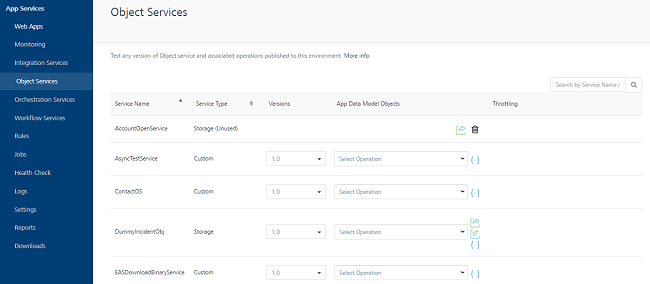
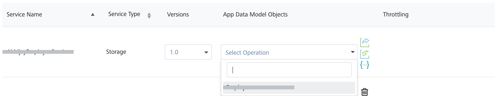

                            
Object Services
===============

The object services are used test the defined app data model in Volt MX Foundry Console. The services defined and published in the **Object Services** tab of Volt MX Foundry Console are displayed in the page. You can test the app data model objects of each service defined using different operations available. To know more, refer [Object Services](../../../Foundry/voltmx_foundry_user_guide/Content/Objectservices.md).



The following fields are displayed in the page:

  
| Column | Description |
| --- | --- |
| Service Name | The name of the service created |
| Service Type | The type of the service created. For more information on different types of services, refer [VoltMX Foundry Supported Endpoints](../../../Foundry/voltmx_foundry_user_guide/Content/ObjectsServices/Objectservices_Stage1.md). |
| Versions | The version number selected while creating the service. For more information on versioning, refer [API Versioning](../../../Foundry/voltmx_foundry_user_guide/Content/API_Versioning.md). |
| App Data Model Objects | The list of predefined objects configured in Volt MX Foundry Console. You can test a service by selecting an object from the drop-down list. |
| Documentation | Download the Swagger API file using the download link provided across each service. For more information, refer [Downloading a Swagger API file](Integration_Services.md#downloading-a-swagger-api-file). |

If any Storage service is unpublished in Volt MX Foundry, its status changes to Storage (Unused) in Services Type and a **Delete** icon appears for that service. Click the **Delete** icon if you want to remove the data associated with that storage service permanently and free up the space in the environment.

> **_Note:_** You can export the data associated to the storage service before deleting it.

Hard Delete option for Storage Services using the X-VoltMX-Soft-Delete Flag
-------------------------------------------------------------------------

The **Delete Strategy** section is displayed in Volt MX Foundry Console for **Storage** services. The **Delete Strategy** contains two options: **Hard Delete** or **Soft Delete**. It helps you delete the selected record data from the database.

*   Select the **Soft Delete** option to mark the selected record data as a soft delete flag. If you have selected the default **Soft Delete** setting in the **Delete strategy** in Volt MX Foundry Console, and when a client request is sent for deleting records, these records are marked for the **SoftDeleteFlag** with value as `1` in the database. This option is selected by default.
*   Select the **Hard Delete** option to delete the selected record data permanently from the database.
    
    > **_Note:_** To configure the **Delete strategy** for Storage services using the Foundry Console, refer to [ObjectsServices > Storage Endpoint](../../../Foundry/voltmx_foundry_user_guide/Content/ObjectsServices/Objectservices_Stage1.md).
    

In case you have published your storage service with the default **Soft Delete** option, you can permanently delete the selected records from the database by passing the header (`X-VoltMX-Soft-Delete`) parameter in the **delete request call** by using the Admin Console, as follows:

1.  To use the hard delete option, go to the **App Services Console** > **Object Services** page.
2.  Under the **App Data Model Objects** column, select the object for a specific service of type **Storage**.
    
    
    
3.  In the **Request Input** tab, select the **delete** operation from the list.
    
4.  Click the **Body** section and specify the field value that you want to delete. The field value must be based on a primary key.
5.  Click the **Header** section, and enter the header parameter for the **Hard Delete** operation as follows:
    *   Field Name: `X-VoltMX-Soft-Delete`
    *   Field Value: `false`
6.  Click **Get Response**.
    
    The response for the delete request is displayed under the **Response Output** tab > **Response Body** section.
    
```
//Sample response code for a Hard delete request call  
    Response Body
    
    {
        "records":[],"opstatus":0,"httpStatusCode":0
    }
```
    
    The records mentioned in the request body are deleted.
    

Testing a Service
-----------------

To test an object service, select an **App Data Model Object** from the drop-down list of a selected service.

*   > **_Note:_** Object services has two types of Operations, **General** and **Binary**. Based on the selected object the operations can be either general or binary.
    
    Click the drop-down list of an app data model and select an object for a service. The selected data model object displays the page with two toggles.
    

*   Request Input
*   Response Output

### Request Input

The **Request Input** page displays the input parameters for the selected services.

  
| Field | Description |
| --- | --- |
| Operation | Select a method from the drop-down list to send the request. The available methods are: Create, Update, Delete, Get. For more information on Methods Mapping, refer [Configure Methods Mapping to the Fields in the Background](../../../Foundry/voltmx_foundry_user_guide/Content/ObjectsServices/Objectservices_Stage3.md#configuring-methods-mapping-to-fields-on-the-back-end). |
| Server URL | Displays the middleware URL under which the request is posted. (this is a non editable field) |
| Query Params | Enter the query parameter for the request to be sent. |
| Body | The **Body** section displays the field names defined for the selected service. The field names are defined while creating the service in Volt MX Foundry Console.Enter the field value across the field name for the request to be sent. |
| Header | The **Header** section displays the table with the field name and field value as the headers. Enter the required field name as the header and provide the value for the field name entered.- You can add more than one header field by clicking on the **Add** button above the header table.- You can delete the existing fields by clicking the **Delete** button across each field. |
| Get Response | Encodes the parameter name and field name with their values provided. |
| Download | You can download the request input records in CSV and JSON formats. |

### Response Output

You can view the response for the request parameters sent in the **Response Output** toggle. This page displays the following fields:

  
| Section | Description |
| --- | --- |
| Response Header | Displays the header values of the response received for the request sent. |
| Response Body | Displays the response for the given request parameters in the code format. |

**To test an object service, follow these steps**:

1.  Login to App Services and click **Object Services** from the left pane of the screen.
2.  Click the drop-down list of an **App Data Model Objects** for a service and select an object.
3.  In the **Request Input** screen, perform the following actions
    1.  Select the method from the drop-down list and enter the parameter value.
    2.  In the **Body** section, enter the field value across the field name.
    3.  Click the **Header** toggle and enter the field name and field value.
4.  Click **Get Response**.
    
    The response for the given input parameters is displayed in the **Response Header** and **Response Body** sections of **Response Output** page.
