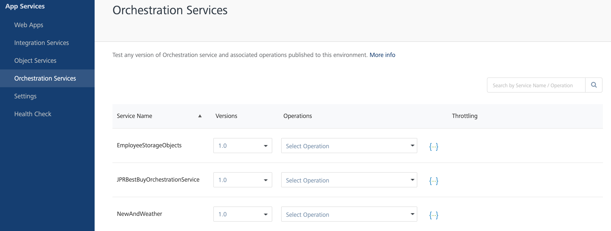

Volt MX Foundry console User Guide: Orchestration Services

# Orchestration Services

Orchestration Services is the coordination of more than one service and exposing them as a single service. The services defined and published in **VoltMX Foundry Console** under **Orchestration Services**are displayed in the tab. The services displayed in the tab are tested using different predefined operations in App Services. For more information, refer [Orchestration Services](../../../Foundry/voltmx_foundry_user_guide/Content/Orchestration.md).

The operations in Orchestration services are classified as

- Concurrent Operation
- Sequential Operation
- Looping Operation

**Concurrent Operation**: Passing a parameter to more than one back-end server at the same time is considered as a **Concurrent** operation.

**Sequential Operation**: Parameters in a **Sequential** operation are processed in an ordered queue. The parameters are passed in a sequential order.

> **_Note:_** An Orchestration service created can be a combination of both Concurrent and Sequential operations.

**Looping Operation**: Only one operation can be added in the orchestration service for selecting looping execution type.It allows to execute the operation repeatedly in a loop using a delimited set of inputs or until a specified condition is met. Following parameters should be defined for executing the operation in a loop:

<ul>
<li><b>Looping Concurrent</b>- On selecting this mode, the operation is executed simultaneously “n” number of times based on the loop count value. The output value of the Orchestration Service will be the list of responses of each loop.</li>
<li><b>Looping Sequential</b>- On selecting this mode, the operation is executed sequentially in a loop till the break loop parameter or loop count is met. The output value of the Orchestration Service will be the list of responses of each loop.</li>
</ul>

The **Orchestration services** page displays the following fields:

| Column        | Description                                                                                                                                                                                                                                                            |
| ------------- | ---------------------------------------------------------------------------------------------------------------------------------------------------------------------------------------------------------------------------------------------------------------------- |
| Service Name  | The name of the service provided while creating the service in Volt MX Foundry Console.                                                                                                                                                                                |
| Version       | The version the number of the service provided while creating the service in Volt MX Foundry Console. For more information on versioning, refer [API Versioning](../../../Foundry/voltmx_foundry_user_guide/Content/API_Versioning.md). |
| Operations    | The predefined operations used to pass the service to the back-end. You can view and select different operations defined for a service by clicking on the drop-down list.                                                                                              |
| Documentation | Download the Swagger API file using the download link provided across each service. For more information, refer [Downloading a Swagger API file](Integration_Services.md#downloading-a-swagger-api-file).                                                            |
| Search        | Search for a service by entering the service name in the text box provided.                                                                                                                                                                                            |

## Testing a Service

You can test a service using the predefined operations configured while creating the service.

Select an operation from the drop-down list of a service. The selected operation displays a page with two toggles

- Request Input
- Request Output

### Request Input

The **Request Input** page displays the input parameters for the selected services.

| Field                | Description                                                                                                                                                                                                                                                                                                                                           |
| -------------------- | ----------------------------------------------------------------------------------------------------------------------------------------------------------------------------------------------------------------------------------------------------------------------------------------------------------------------------------------------------- |
| Input Method and URL | By default, the input method of Orchestration service is considered as Post method and based on the method the input URL is predefined.                                                                                                                                                                                                               |
| Body                 | The Body section displays the configured parameters. Enter the parameter values across each parameter name displayed.                                                                                                                                                                                                                                 |
| Header               | The header toggle displays the table with **Field Name** and **Field Value** as the headers. Enter the field name and provide the value for the header. - You can add rows to the table and enter the field name and values by clicking on **Add** icon.- You can delete the existing rows by clicking the **Delete** icon displayed across each row. |
| Get Response         | Encodes the parameter name and field name with their values provided                                                                                                                                                                                                                                                                                  |

### Response Output

Once the request is passed to the back-end server, the response is displayed in the following sections:

| Section         | Description                                                                                                                         |
| --------------- | ----------------------------------------------------------------------------------------------------------------------------------- |
| Response Header | Based on the field name and values provided the header values are displayed in the **Response Header** section in the table format. |
| Response Body   | Based on the configured parameters and the values provided. The response in **Body** section is displayed in the code format.       |

To test a service, perform the following actions:

1.  Log on to **App Services** and click **Orchestration Services** from the left pane of the screen.
2.  Click the drop-down list and select an operation of a service.
3.  In the **Request Input** page, perform the following actions:
    1.  Enter the parameter value across the parameter names displayed in the **Body** section.
    2.  In the **Header** toggle, enter the **Field Name** and **Field Value**.
4.  Click **Get Response**.

    The response for the provided input parameters is displayed in the **Response Header** and **Response Body** sections of **Response Output** page.
