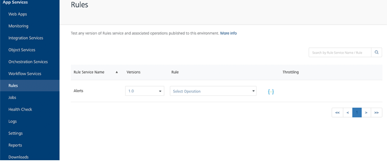
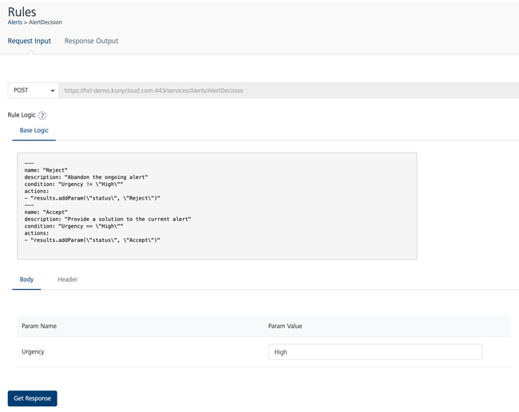
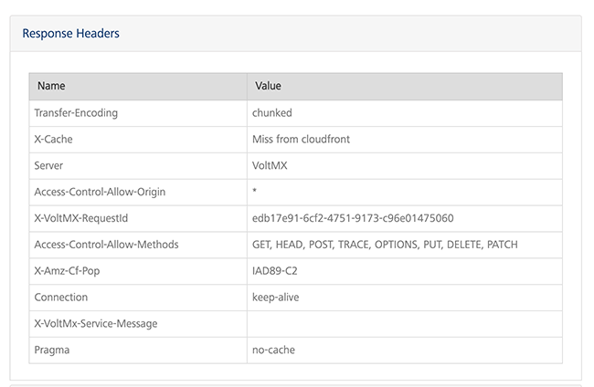
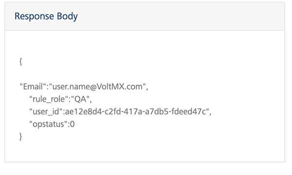
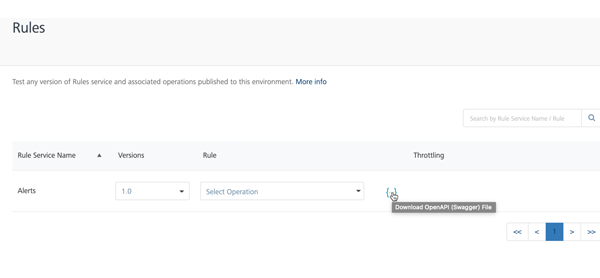

                            

Volt MX  Foundry console User Guide: Rules

Rules
=====

In Volt MX Foundry, **Rules** are snippets of business logic that are written by using [MVEL](http://mvel.documentnode.com/). The rules can be defined as part of a **Ruleset** on the [VoltMX Foundry Console](https://manage.hclvoltmx.com/).

After you publish a Ruleset as part of a Foundry app, you can use the Rules section on the App Services console to test the rules in a run-time environment. For more information, refer to [Rules as a Service](../../../Foundry/voltmx_foundry_user_guide/Content/Rules_as_a_Service.md).

To view the rulesets that are published from Foundry, click **Rules** from the left pane of the App Services console.

The following fields are displayed for each ruleset:

  
| Column | Description |
| --- | --- |
| Rules Service Name | The name of the ruleset that is deployed to the app server. |
| Versions | The version number that is selected while creating the ruleset. You can click the drop-down list to view the different versions of the selected ruleset.For more information on versioning, refer to [API Versioning](../../../Foundry/voltmx_foundry_user_guide/Content/API_Versioning.md). |
| Rule | The rules that are configured in the ruleset. You can select a rule from the drop-down list to test the rule. |
| Throttling | Throttling is an interim state, and is used to control the rate of requests which clients can make to an API. |
| Documentation | Downloads the Swagger API file for the ruleset. For more information, refer [Downloading a Swagger API file](#downloading-a-swagger-api-file). |

Testing a Rule
--------------

For the ruleset that you want to test, select a rule from the drop-down list in the **Rule** column.

The selected rule displays a page with two tabs:

*   Request Input
*   Response Output

### Request Input

The **Request Input** page displays the input parameters for the selected rule. You need to provide values for the input parameters to get a response from the server.

The following fields are displayed in the **Request Input** page:

  
| Field | Description |
| --- | --- |
| Server URL | The URL at which the request is posted. The rule that is selected from the drop-down list is automatically encoded in the server URL. |
| Rule Logic | The business logic (written in [MVEL](http://mvel.documentnode.com/)) of the rule that is selected. Contains the following tabs: **Base Logic**: Rule logic that is defined on the Volt MX Foundry Console **Customized Logic**: Rule logic that is customized by a business administration app (such as Infinity Spotlight) |
| Body | Displays the **Param Name** and **Param Value** editor. You need to set a value for the parameter names that are displayed on the page. |
| Header | Displays the field name and value editor. You can give any string as the header name. Click the **Add** icon displayed above the table in Header toggle to add a new field. Click the **Delete** button across a row to delete the field. |
| Get Response | Fetches the response from the server URL based on the specified body and header parameters. |

### Response Output

The response received for the input request sent is displayed in the **Response Output** page. The page contains two sections:

*    Response Header
*    Response Body

**Response Header**: The response header section displays the key-value pairs from the header of the http response in a table.

**Response Body**: The response body section displays the key-value pairs from the body of the http response in a JSON format.

**To test a rule, follow these steps**:

1.  Sign in to the App Services console, and then from the left pane, click **Rules**.
2.  For the ruleset that you want to test, from the **Rule** column, select a rule from the drop-down list.
3.  On the **Request Input** page, perform the following actions:
    1.  On the **Body** tab, provide the **Param Value** for all the parameters.
    2.  On the **Header** tab, provide the **Field Name** and **Field Value**, if applicable.
4.  Click **Get Response**.
    
    Based on the input parameters, the **Response Header** and **Response Body** are displayed on the **Response Output** page.
    

Downloading a Swagger API File
------------------------------

Swagger is a standard way of defining and documenting APIs. An option to download the Swagger definition of the ruleset is provided in App Services.

To download the Swagger definition for a Ruleset in the App Services console, click the download icon: `{...}`.

