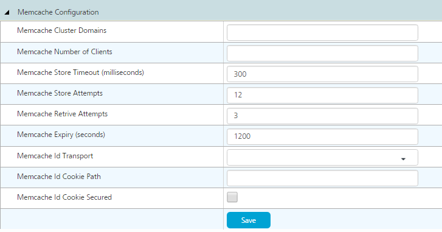

                            

Volt MX  Foundry console User Guide: [Settings](Settings.md) > Runtime Configuration

Runtime Configuration
---------------------

The **Runtime Configuration** tab on the **Settings** screen of App Services enables you to view and edit the runtime configuration settings of the Foundry Server. The configuration details comprise of the following sections:

*   [General Configuration](#general-configuration)
*   [Log Configuration](#log-configuration)
*   [CORS Configuration](#cors-configuration)
*   [SSL Configuration](#ssl-configuration)
*   [Storage Database Configuration](#storage-database-configuration)
*   [GDPR Policy](#gdpr-policy)
*   [File Storage Configuration](#file-storage-configuration)
*   [Web Apps Configuration](#web-apps-configuration)
*   [Cache Configuration](#cache-configuration)
*   [Global Throttling Configuration](#global-throttling-configuration)

### **General Configuration**

The **General Configuration** section displays the general settings of the Foundry server. You can modify any setting and click **Save** to update the change.

The following table describes the settings in the **General Configuration** section:

  
| Property Name | Description |
| --- | --- |
| JSON Array Support | Enable this option to accumulate multiple JSON objects with same ID into an array. If not enabled, the latest JSON object will overwrite the previous one. |
| Send Default User Agent | Enable this to send the default user agent to the backend instead of user agent of the client. This is True by default. The default user agent value is _Mozilla/5.0 (Windows; U; Windows NT 5.1; en-US; rv:1.9.1.7) Gecko/20091221 Firefox/3.5.7 (.NET CLR 3.5.30729)._ |
| Accept only Gzip Compression for Endpoint Response | If enabled, gzip is sent as one of the **Accept-Encoding** formats in the backend request. |
| Exclude Stacktrace from Logs | Option to exclude exception stack trace from the logs. |
| Do Not Escape XML Special Characters | A comma separated list of special characters that should not be escaped in the request template of XML and SOAP Services. |
| Exclude Parameters in Request and Response | A comma separated list of sensitive keys in the request or the response to mask while logging any information. |
| Exclude Input Parameters from Log Context (NDC) | A comma separated list of keys to exclude from the diagnostic thread context of the logs. |
| Server Time Frequency (milliseconds) | The time period in milliseconds between successive load of any change in asset or configuration. If this value is too low, it could lead to performance issues. The default time is 10 seconds. |
| Server Timer Delay in Startup (milliseconds) | The delay in milliseconds after server starts, and before the assets and configurations are loaded. |
| Number of Server Nodes for Throttling | The number of nodes in this server cluster. It is used for calculating API Throttling values. |
| Volt MX Reports Year Drop down Offset | The number of years to be displayed in the **Reports** tab of App Services. |
| Volt MX Services Context Path | The context path of the current Foundry instance. The default path is /services. |
| Enable Proxy | Enable proxy for communication with the backend. The proxy settings are part of the service definition. |
| Service Custom Response Headers | List of additional custom headers to return in every response. The list is in the following JSON array format: `[{"name":"Cache-Control", "value":"no-cache, no-store, must-revalidate"}]` These headers will be appended to the response of integration service requests originating from applications. |

### **Log Configuration**

The **Log Configuration** section displays the configuration settings related to the server logs. You can modify any setting and click **Save** to update the changes.

The following table describes the settings in the **Log Configuration** section:

  
| Property Name | Description |
| --- | --- |
| Server Log Option | Select the log option from the list to specify where the logs can be collected. The available log options are as follows:<br>- **Log file** - User specified log file.<br>- **Database** - Logs are stored in the database of the _server\_application\_log_ table in your adminDB.<br>- **SYSLOG** - Logs stored in the respective system logs. |
| Server Log Location | When log option is logfile, use this to specify the location of the log file. **_Note:_** After upgrading the server to the latest version, verify that the specified log location on the Admin Console matches with the current log location. |
| Server Logger JNDI Name | When log option is database, use this to specify the JNDI name of the data-source. |

### **CORS Configuration**

The **CORS Configuration** section displays the configuration settings related to Cross Origin Resource Sharing (CORS) access. You can modify any setting and click **Save** to update the changes.

The following table describes the settings in the **CORS Configuration** section:

  
| Property Name | Description |
| --- | --- |
| CORS Enabled | Enable this option for Cross Origin Resource Sharing (CORS) support. It will allow users to access resources across internet domains. |
| Foundry Server Access Control Allow Origin Value | If you set the **Foundry Server Access Control Allow Origin Value** to <br> - **ALL.** Sets the value as '\*' for Access-Control-Allow-Origin header.<br> - **NONE.** Does not add **Access-Control-Allow-Origin** header in the response.<br> - **ECHO.** Adds the value of **Origin** header as the **Access-Control-Allow-Origin** header in the response. |
| Foundry Server Access Control Echo Whitelist Domains | If **Foundry Server Access Control Allow Origin Value** is set to **ECHO**, then this whitelist (comma separated list) is used to specify the list of valid domains that you echo back in the response. The request should specify the domain to echo back as “Origin” header. |
| Control Allow Credentials | If the value is not NONE and **Foundry server Access Control Allow Origin Value** is not ALL, then this value is set as Access-Control-Allow-Credentials header in the response. |
| Control Vary Header | If the value is not NONE and **Foundry server Access Control Allow Origin Value** is not ALL, then this value is set as Vary header in the response. |

### **SSL Configuration**

The **SSL Configuration** section is used to connect the Foundry Server to the customer enterprise server using appropriate SSL certificates and settings. This type of configuration is required only when you want to connect the Foundry Server by using the HTTPS protocol. You can modify any setting and click **Save** to update the changes.

The following table describes the settings in the **SSL Configuration** section:

  
| Property Name | Description |
| --- | --- |
| SSL Trust Store | The trust store location where the public SSL certificates are stored. |
| SSL Trust Store Password | The password of trust store file. |
| SSL Trust Store Type | The extension of the trust store file. If not specified, then the default value is jks. |
| SSL Key Store | The key store location where the private SSL certificates are stored. |
| SSL Key Store Password | The password of key store file. |
| SSL Key Store Type | The extension of the key store file. If not specified, then the default value is jks. |
| SSL Algorithm | The SSL algorithm used. For IBM application servers, the algorithm value is SSLv3. For any other application server, the algorithm value is TLS. |
| SSL Socket Factory Provider | The security provider of SSL Socket Factory. |
| SSL Server Socket Factory Provider | The security provider of SSL Server Socket Factory. |
| SSL Socket Factory Host Name Verifier | Select the SSL Socket Factory Host Name Verifier:<br>-  **BROWSER\_COMPATIBLE\_HOSTNAME\_VERIFIER.** Allows you to connect to the servers having wild card certificate as \*.abc.com, abc.com, child.abc.com.<br>- **ALLOW\_ALL\_HOSTNAME\_VERIFIER.** Allows you to connect to the servers having self-signed certificate. For self-signed certificate, change value to ALLOW\_ALL\_HOSTNAME\_VERIFIER.<br>- **STRICT\_HOSTNAME\_VERIFIER.** Allows you to connect to the servers with the specific host name. |

### **Storage Database Configuration**

The **Storage Database Configuration** section displays the database properties of storage services of Foundry server. This is used only for on-premise installs. You can modify any setting and click **Save** to update the changes.

The following table describes the settings in the **Storage Database Configuration** section:

  
| Property Name | Description |
| --- | --- |
| Database Type | The type of database to be used. By default, this will be same as the type of the Foundry database. |
| Database Host Name | The host name of the database. By default, this will be same as the host name of the Foundry database. |
| Database Port | The port number at which your database is running. By default, this will be same as the port number of the Foundry database. |
| Database User Name | The username for accessing the database. By default, this will be same as the username of the Foundry database. |
| Database Password | The password for accessing the database. By default, this will be same as the password of the Foundry database. |
| Database Instance | The name of the database instance, if the database type is Oracle database, |
| Data Tablespace Name | The name of the tablespace in which data is stored, if the database type is Oracle database, |
| Index Tablespace Name | The name of the tablespace in which index is created, if the database type is Oracle database, |
| LOB Tablespace Name | The name of the large object tablespace created in the server, if the database type is Oracle database, |
| SQL Server Default Schema | The default schema of the SQL Server database. |
| Max Allowed Connections | The maximum number of allowed connections to access the database. |
| Connection Timeout in Seconds | The time out interval in seconds for server to reply to the client request for the Storage services. |


<!-- ### **Memcache Configuration**

The **Memcache Configuration** section displays the properties of the memory caching system in the Quantum server. You can modify the settings of each feature, which appears in the list by selecting the available options and clicking **Save** to update the changes.

The following image displays the properties of the **Memcache Configuration** section with their values:



The following table describes the UI elements of the **Memcache Configuration** section:


| Property Name | Description |
| --- | --- |
| Memcache Custer Domains | Displays the IP/Host name of the Memcache server.<br> For Example : Memcache Cluster Domains = <IP\>:<PORT\> |
| Memcache Number of Clients | Displays the number of clients that can connect to the Memcache server.|
| Memcache Store Timeout (milliseconds) | Displays the maximum time allowed (in milliseconds) to store data in the Memcache server.<br>If the data is not stored within the specified time then the server triggers a timeout.|
| Memcache Store Attempts | Displays the number of attempts allowed to store data in the Memcache server.|
| Memcache Retrive Attempts | Displays the number maximum retry attempts to retrieve the data from the Memcache server.|
| Memcache Expiry (Seconds) | Displays the expiry time (in seconds) to store the data in the Memcache server.|
| Memcache ID Transport | Displays the mode of transport for cacheid.<br>Possible values are `COOKIE_ONLY, PARAM_ONLY`, or `EITHER`.|
| Memcache ID Cookie Path | Displays the context path for cacheid in the cookie header.|
| Memcache Cookie Secured | Select the check box to secure the cookie header.|
| Save | Click **Save** to save your changes.| -->


### GDPR Policy

The GDPR Policy section provides settings that enable the protection of the Personally Identifiable Information (PII) of a user. When the settings are enabled, data such as the User ID and the IP Address is not stored in the integration server logs. Additionally, a flag variable is sent to the metrics pipeline along with the PII to protect the data.

The **GDPR Policy** section contains the following settings:

  
| Property | Description |
| --- | --- |
| Protect PII | Enables or disables the protection of the PII that is sent for reporting. If this setting is enabled, PII of the users is removed from the log files of the integration server. Additionally, the PII is sent to the metrics payload along with a key (protectpii) that notifies the Metrics pipeline to protect the data. |


<details close markdown="block"><summary>Encoding of PII in metrics</summary>

The metrics pipeline encodes the PII (UserID and IP Address) in the reports and metrics if the request originates from any of the following countries.

<table style="mc-table-style: url('Resources/TableStyles/Basic.css');width: 60%;" class="TableStyle-Basic" cellspacing="0"><colgroup><col class="TableStyle-Basic-Column-Column1" style="width: 20%;"> <col class="TableStyle-Basic-Column-Column1" style="width: 20%;"> <col class="TableStyle-Basic-Column-Column1" style="width: 20%;"></colgroup><tbody><tr class="TableStyle-Basic-Body-Body1"><td class="TableStyle-Basic-BodyB-Column1-Body1">Austria<br>Belgium<br>Bulgaria<br>Germany<br>Denmark<br>Estonia<br>Spain<br>Finland<br>France</td><td class="TableStyle-Basic-BodyB-Column1-Body1">Greece<br>Croatia<br>Hungary<br>Ireland<br>Iceland<br>Italy<br>Liechtenstein<br>Luxembourg<br>Latvia</td><td class="TableStyle-Basic-BodyA-Column1-Body1">Malta<br>Netherlands<br>Norway<br>Poland<br>Portugal<br>Romania<br>Sweden<br>Slovenia<br>Slovakia</td></tr></tbody></table>

If the Protect PII property is enabled, the metrics pipeline encodes the PII (userID and IP Address) for all requests (irrespective of the country of origin).
</details>

### File Storage Configuration

The File Storage Configuration section displays the configuration properties related to File Storage adapter. It is applicable only for on-premise install.

The following table describes the settings in the **File Storage Configuration** section:

  
| Property | Description |
| --- | --- |
| File Storage Root Directory | The root directory of Network File System (NFS) for storing the files. |

### Web Apps Configuration

The **Web Apps configuration** section displays the configuring properties of the new optimized web apps package format that improves the app performance and minimize the downtime during deployments. The section displays the properties such as Response Content Type Mappings, Cache Control age, HTTP session caching, and Custom Response Headers. You can modify any setting and click **Save** to update the changes.

The following table describes the settings in the **Web Apps Configuration** section:

  
| Property | Description |
| --- | --- |
| Response Content Type Mapping | The property is used to set the Content-Type header in the response based on the matching file extension.<br>**Example**: If the file extension is .css, the Content-Type header value of the response will be text/css. Similarly, there are other common extensions that are mapped by default.<br>**_Note:_** If the response header is not defined, the server displays an empty string leaving it to the browser to sniff the mime types placed in Volt MX Foundry to intercept and alter the mime types of the requested resource. |
| Cache Control Age (in secs) | The Cache-Control header in the response i.e. the maximum cache duration in seconds. The default value is 86400 seconds (i.e. 1 day). |
| HTTP Session Caching | Enable this to cache the user session data. The value is set to True, by default. |
| Custom Response Headers | You can use the property to return additional custom headers in every response. For every requested resource of SPA application, the mentioned headers are added to the response. You can add the response header and its value to the field. It takes an array of JSON objects. Each JSON object contains two keys name and value. Name is the **header name** and value as the **header value**.<br> Example: `\[ {'name': 'X-Content-Type-Options', 'value': 'nosniff'} \]`<br> **Limitations**: The header key and the value are static. The header and the value added are not specific for SPA application (or) resources (global).<br>**_Note:_** User is responsible to provide a valid header key and value.The default value of the field is blank. |
| Enable iPad Redirect | Enable this to redirect requests coming from iPad devices above iOS 13 to iPad view instead of Desktop view. By default, it is False. |

### Cache Configuration

Volt MX  Foundry supports EHCache, Memcached, and Redis cache vendors. An On-premise setup of Volt MX Foundry uses EHCache as the default cache mechanism. A cloud environment uses Memcached as the default cache mechanism. The **Cache Configuration** section displays the configuration properties of the new cache mechanism. The section displays the properties such as Cache Type, Expiry time, Cache Server URLs, Advanced Cache properties, and Enable Session Distribution. You can modify any setting and click **Save** to update the change.

The following table describes the settings in the **Cache Configuration** section:

  
| Property | Description |
| --- | --- |
| Cache Type | The type of cache to use. The list displays the following possible options - **EHCACHE**, **MEMECACHED**, and **REDIS**. |
| Cache Expiry | The cache expiry time in seconds for each cache entry. The default value is 20 minutes.<br>**_Note:_** The default cache expiry time is 20 minutes. |
| Cache Server URLs | The URLs of the external cache servers. For example,<br>MEMCACHED<br>- **For single node** - `<IP address/hostname>:<port>`.<br>- **For Multi-node** - `<IP address1/hostname1>:<port1>, <IP address2/hostname2>:<port2>` REDIS<br>- **For single node** - `<IP address/hostname>:<port>`.<br>- For a Cluster Redis setup, provide the list of master nodes (separated by commas) in multimode memcached nodes.`<IP address1/hostname1>:<port1>,<IPaddress2/hostname2>:<port2>`. |
| Advanced Properties | The advanced properties, specific to cache type, in JSON format.<br>**Default JSON template property**: `{"environment_properties":{},"jcache_configuration_properties":_{}, "additional_properties":_{}}`<br>**environment\_properties**: Add the cache properties that are utilized by Volt MX Foundry.You can enable secure connections to Redis.To do so, add the following parameter: `ENABLE_REDIS_SSL: true`<br>For example, to identify the mode of the Redis server, you must add the following property. The `REDIS_CACHE_MODE` property will have the value as "SINGLE", "CLUSTER" or "SENTINAL" based on the Redis server mode.<br>**Advanced properties of REDIS cluster mode**: `{"environment_properties":{"REDIS_CACHE_MODE":"CLUSTER"},"jcache_configuration_properties":{},"additional_properties":_{}}` **_Note:_** If `REDIS_CACHE_MODE` is not defined in **Advanced Properties**, Volt MX Foundry considers REDIS as the single node setup.<br>**jcache\_configurations\_properties**: Custom properties related to JCache configuration are configured in this section. The configured custom properties are sent directly to JCache.<br>**additional\_properties**: The properties that are not related to REDIS or JCache configuration must be added in this section. |
| Enable Session Distribution | Enable the property to distribute the cache session among multiple nodes. **_Note:_** EHCache does not support session distribution. If you want to distribute the session data among the multiple nodes, the cache type must be MEMCACHE or REDIS. |

### Global Throttling Configuration

Apart from configuring the service level throttling from the Volt MX Foundry console, you can also configure the operation level throttling from the Global Throttling Configuration field. The throttling limit set for a service is applicable to all the operations within the service, whereas, the throttling information given here will be implied to the respective operation of the service that you mention here.

> **_Note:_** If you have set the throttling limit at both service and operation level, then the service will not respond when either of the limit is met first.

The following table describes the settings in the **Global Throttling Configuration** section:

  
| Property | Description |
| --- | --- |
| Operation Level Throttling | You can limit the number of times the operation is invoked per minute. You can provide the throttling information in a JSON array format. **_Note:_** If an API exceeds the throttling limit, it will not return the service response. |

Following are the parameters required to define the throttling limit for the respective service type:

**Integration and Orchestration Service:**

```
[ 
   { 
      "resourcePath":"NameService/getFirstName",
      "httpMethod":"POST",
      "totalRateLimitPerMinute":100,
      "ipRateLimitPerMinute":10
   },
   { 
      "resourcePath":"NameService/getLastName",
      "httpMethod":"POST",
      "totalRateLimitPerMinute":110,
      "ipRateLimitPerMinute":11
   }  
]
```

**Object Service:**

```
[ 
   { 
      "resourcePath":"ObjectServiceName/Object",
      "httpMethod":"GET",
      "totalRateLimitPerMinute":100,
      "ipRateLimitPerMinute":10
   },
   { 
      "resourcePath":"ObjectServiceName/Object",
      "httpMethod":"GET",
      "totalRateLimitPerMinute":100,
      "ipRateLimitPerMinute":10
   }
]
```

> **_Important:_** You can only configure the POST _httpMethod_ for Integration service and Orchestration service types. For Object service, you can configure GET and DELETE _httpMethod_ as is, whereas, the POST and PUT _httpMethod_ should be configured as CREATE and UPDATE respectively.

> **_Note:_** If you want to apply throttling on some custom verb, then you can configure the custom verb as the _httpMethod_.

> **_Note:_** \*\* displayed beside the property implies the changes to the property groups required restart of the server to reflect modified values.
