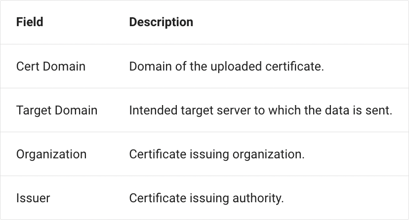
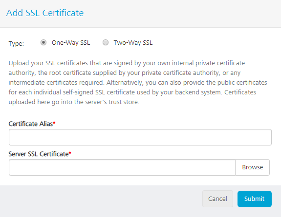
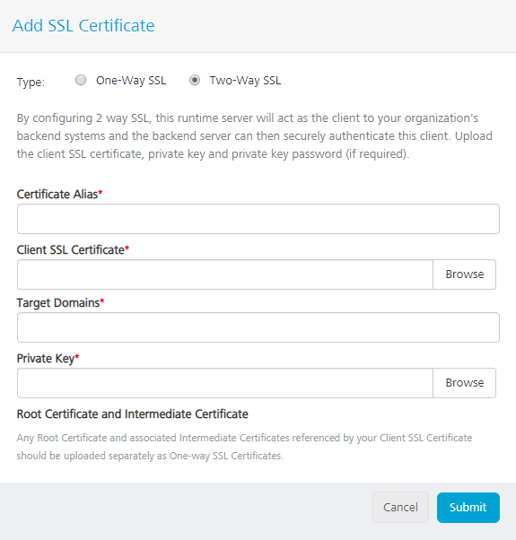

# SSL Certificates (Community Edition)

To configure secured communication between the server and the client, App Services provides an interface to upload the client certificates and the root certificates of the back end to the middleware. The uploaded SSL certificates aids in encrypting the information sent between the client and the server.

There are two ways of uploading the certificates to the middleware:

*   One-way SSL
*   Two-way SSL

**One-way SSL**: A root certificate of the back end server is uploaded . When the client sends a request to the server, the middleware server(client) validates the certificate uploaded with the certificate in the trust store. If the certificate is found in the trust store, the client accepts the communication from the server.

**Two-way SSL**: A client SSL certificate is uploaded in the key store. When a request is received , both the parties (client and the server) validates the certificates uploaded and the response is sent to the client.

**To access SSL certificates in the App Services, follow these steps:**

1.  Log on to **App Services**. For more information on logging, refer [Launching the App Services](Launching Admin Console.htm).
2.  Click **Settings** from the left pane of the App Services. The **SSL Certificates** page appears to upload the SSL certificates.

    

The following fields are displayed in this screen:

<!DOCTYPE html>
<html>
<head>

</head>
<body>
<table>
  <tr>
    <th>Field</th>
    <th>Description</th>
  </tr>
  <tr>
    <td>Certificate Alias</td>
    <td>Name of the certificate provided while uploading <b>Note:</b> The field is case-insensitive and must be unique.</td>
  </tr>
  <tr>
    <td>Type</td>
    <td>Type of the certificate uploaded. SSL certificates are of two types: One-way SSL Two-way SSL</td>
  </tr>
  <tr>
    <td>Expires On</td>
    <td>The expiry date of the uploaded certificate.</td>
  </tr>
  <tr>
    <td>Uploaded On</td>
    <td>The uploaded date of the certificate.</td>
  </tr>
  <tr>
    <td>Uploaded By</td>
    <td>Name of the certificate uploaded user.</td>
  </tr>
  <tr>
    <td>Certificate Details</td>
    <td>Details of the uploaded certificate. </td>
    <tr>
    <td>Add certificate</td>
    <td>Click Add Certificate to upload the certificate.</td>
  </tr>
  <tr>
    <td>Delete</td>
    <td>Delete the uploaded certificates. </td>
  </tr>
  </tr>
</table>
</body>
</html>

You can perform the following actions in this screen:

*   [Add Certificate](#add-certificate)
*   [Delete a Certificate](#delete-a-certificate)

Add Certificate
---------------

You can add a One-way or Two-way SSL certificates by clicking on **Add Certificate** button. To add a certificate, click **Add Certificate**. An **Add SSL Certificate** pop-up appears with two options:

*   [One-way SSL](#one-way-ssl)
*   [Two-way SSL](#two-way-ssl)

### One-way SSL

You can upload One-way SSL certificates the root certificate signed by your own internal private certificate authority or any intermediate certificates. Enter the required details in the fields provided to upload a one-way SSL certificate:

  
| Field | Description |
| --- | --- |
| Certificate Alias | Enter an alias name to upload the certificate.   **_Note:_** The field is case-insensitive and must be unique. |
| Server SSL Certificate | Select the certificate to be uploaded by clicking the **Browse** button. |
| Submit | Click Submit to upload the certificate. |
| Cancel | Cancel the operation. |

To upload one-way SSL, perform the following actions:

1.  Click **one-way SSL** from **Add SSL Certificate** pop-up.
2.  Enter an alias name for the certificate to be uploaded.
3.  Select the certificate by clicking the **Browse** button.
4.  Click **Submit**.

### Two-way SSL

The two-way SSL certificate is the client certificate uploaded in the trust store. In **Add Certificate** pop-up, select **Two-way SSL** and enter the required details in the fields provided:

  
| Field | Description |
| --- | --- |
| Certificate Alias | An alias name for the certificate to be uploaded.   **_Note:_** The field is case-insensitive and must be unique. |
| Client SSL certificate | Browse to select the client SSL certificate. |
| Target Domains | Target server to send the data. For more than one domain, provide comma separated values. |
| Private Key | Private key of the certificate to be uploaded. |
| Submit | Submit to upload the details entered. |
| Cancel | Cancel to abort the operation. |

Perform the following actions to upload a two-way SSL:

*   Click **Two-way SSL** from **Add SSL Certificate** pop-up.
*   Enter the required details and click **Browse** to select the Two-way SSL certificate.
*   Click **Submit** to upload the certificate to the middleware.

### Delete a Certificate

You can delete an uploaded certificate by performing the following actions:

*   Log on to **App Services** and click **Settings** from the left pane of the screen.
*   Click **SSL Certificates** tab from the top pane of the settings screen. The list of uploaded certificates appears.

    You can find a delete icon displayed on the right corner across each row.

*   Click **Delete** to delete the certificate.
