                            

Volt MX  Foundry console User Guide: [Logs](Logs.md) > Trace Logs

Trace Logs
----------

Trace Log feature enables you to view the request and response data between the clients and enterprise datasource server for a particular Application, User, Device, Request and a session.

**To access Trace Logs in Admin Console, follow these steps:**

1.  Log on to **VoltMX Foundry Console** and click **Environments**.
    
    Under **Environments**, you can find all the consoles available for the cloud account.
    
2.  Click **Server** to access the Admin Console.
    
    The **Admin Console** UI appears.
    
3.  Click **Logs** from the left pane of the screen.
    
    The new window appears with the list of logs created.
    
    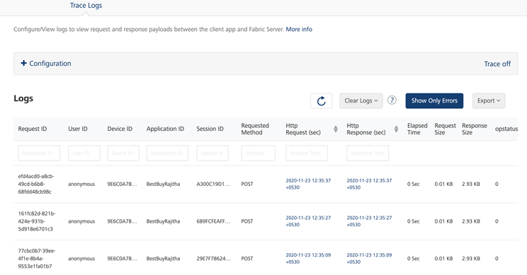
    

You can perform following actions in this screen:

*   [Log Configuration](#log-configuration)
*   [Copy the payload](#copy-the-payload)
*   [Customize Http Request (or) Response](#customize-http-request-or-response)
*   [Export Logs](#export-logs)
*   [Clear Logs](#clear-logs)

The logs screen displays the following UI elements:

  
| UI Element | Description |
| --- | --- |
| Request ID | ID of the selected request |
| User ID | ID of the logged in user |
| Application ID | ID of the application on which the log is created. |
| Session ID | ID of the particular session on which the log is created |
| Request Method | Method on which the request is sent. |
| Http Request (sec) | Displays the time taken (in seconds) to send the request. Click **Http Request** against a log to display the device payload information. > **_Note:_** You can sort the displayed logs based on the request or the response time. You can customize the Http Request by selecting the date and time. For more information, refer [Customize Http Request (or) Response](#customize-http-request-or-response). |
| Http Response (sec) | Displays the time taken (in seconds) to receive the response. Click **Http Response** against a log to display the device payload information. > **_Note:_** You can sort the displayed logs based on the request or the response time. You can customize the Http Response by selecting the date and time. For more information, refer [Customize Http Request (or) Response](#customize-http-request-or-response). |
| Elapsed Time | The amount of time taken between the request sent and the response received. |
| Request Size | Size (in bytes) of the request sent. |
| Response Size | Size (in bytes) of the response received. |
| opstatus | op status of the response. |
| Refresh | Refreshes the log list. |
| Clear Logs | Clears the logs. Trace logs older than seven days are automatically deleted. You can also manually delete the logs using Clear Logs. To manually delete the logs, you can perform the following actions: **All** - Clear all the logs. **Older than 2 days** - Delete logs older than 2 days. **Older than 1 day** - Delete logs older than 1 day. For more information, refer [Clear Logs](#clear-logs). |
| Show Only Errors | Displays only the error logs. |
| Export | Exports the trace logs list. You can export the logs in two ways: **Export Current**: Exports the current log list. **Export All**: Exports all the logs from the server. |

### Log Configuration

Log configuration can be set from the **Trace Logs** drop-down list. Trace logs can be enabled or disabled by selecting **ON** or **OFF** from the drop-down list.

Upon enabling the trace log, a drop-down list is displayed to select the duration of the trace on. The available options are 15, 30, and 60 mins with 30 mins is selected, by default.

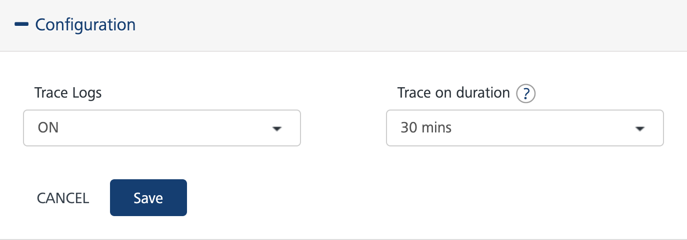

After selecting the **Trace on duration**, click **Save**.

> **_Note:_** Trace log can only be turned on for a limited duration as it impacts the server performance.

Once the trace log is enabled, a message **Trace on until $time** is displayed with **Extend by 15 minutes** and **Trace off** buttons.

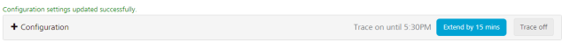

Once the duration of the trace log is complete, trace logging will be turned off.

#### Extending the Trace time

To extend the trace time, click **Extend by 15 minutes** button.

Trace log can be extended only by fifteen minutes from the current duration. If the current expiry time is greater than fifteen minutes from the current time, a message appears stating the current expiry time cannot be modified.

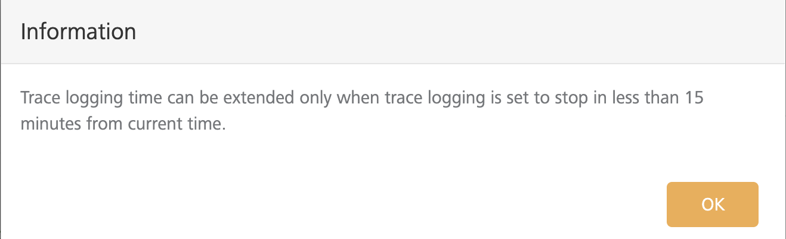

#### Trace off

You can cancel the trace on duration, by clicking **Trace Off**. A message appears asking for the confirmation.

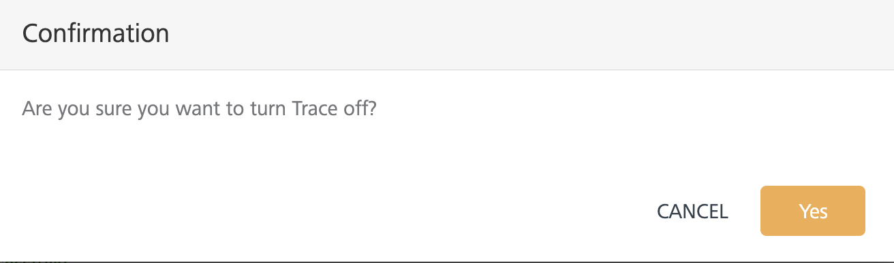

Click **Yes** to turn the trace off.

### Copy the Payload

To copy the request or response payload in the **Logs** screen, follow these steps:

1.  Select a log from the list of logs by clicking against the **Http Request** or **Http response**.
2.  Click **Copy** in the body parameter to copy the payload.

### Customize Http Request (or) Response

You can customize the Http request (or) response by selecting the date and time. To customize the Http Request (or) Response, follow these steps:

1.  Click the text box associated with the Http Request. The date and time pop-up appears.
    
    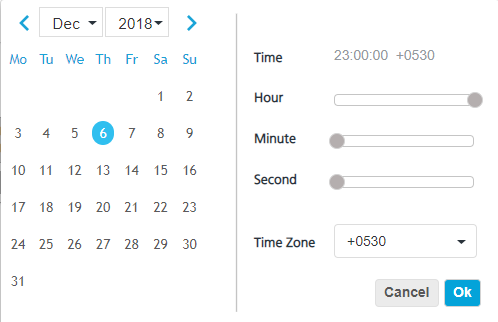
    
2.  Select the date and time to view the Http requests and click **Ok**. The selected date and time appears in the text box.
    
    The **Trace Logs** screen displays the Http requests sent after the selected date and time and the current date.
    
3.  Similarly, click the text box associated with Http Response.
4.  Select the date and time in the pop-up and click **Ok**.
    
    The **Trace Logs** screen displays the Http responses received before the selected date and time.
    

### Export Logs

You can export the trace logs created in the system to an Excel sheet. Perform the following actions to export the logs to your system:

1.  Log on to **Admin Console** and select **Logs** from the left pane of the screen.
    
    You can view the generated logs displayed on the screen.
    
2.  Click **Export** from the right pane of the screen. Two options **Export All** and **Export Current** are displayed.
    
    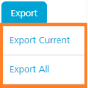
    
3.  Select either of the options to export logs to an Excel sheet. A pop-up displays asking for a confirmation.
    
    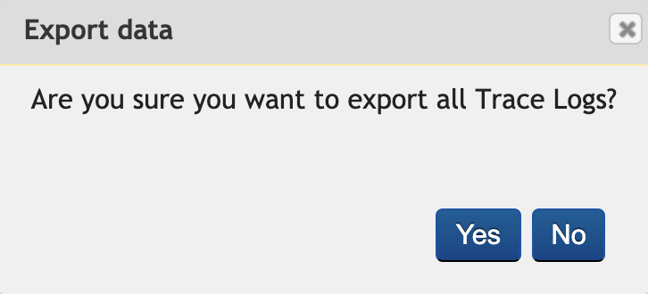
    
4.  Click **Yes**. An Excel file is downloaded to the system with the list of logs and the details.
    
    The following is a sample Excel sheet with the list of logs and its details.
    
    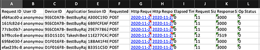
    

### Clear Logs

Trace logs are deleted automatically after seven days. You can also manually delete the logs using the options provided in clear logs.

*   **AutoDelete** - All the trace logs older than seven days are automatically deleted.

> **_Note:_** Admin does not have the option to turn off AutoDelete.

> **_Note:_** From release version V8 SP4 and above, Admin Console supports auto-delete and clear logs for logs older than two days.

*   **Manual Delete** - To manually delete the logs, perform the following actions:

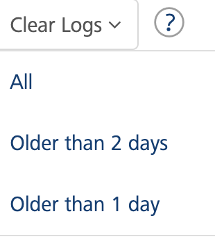

1.  Click **Clear Logs**, the system displays the following options.
    *   **All** - Click **All** to delete all the trace logs displaying on the screen.
    *   **Older than 2 days** - Click **Older than 2 days**, to delete the logs older than two days.
    *   **Older than 1 day** - Click **Older than 1 day**, to delete the logs older than one day.
2.  Select any of the options to manually clear the logs. A pop-up displays that asks you for the confirmation.
    
    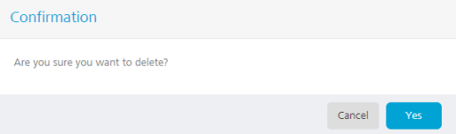
    
3.  Click **Yes** to clear the logs. The logs are deleted based on the selection.
