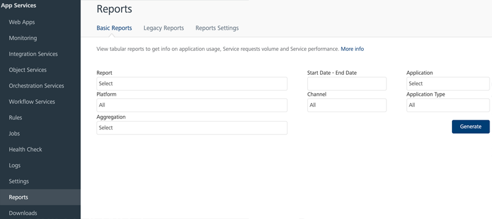

                             

Volt MX  Foundry console User Guide: [Reports](reports.md) > Using Basic Reports

Basic Reports
-------------

A basic report is generated after the application is deployed.

You can view the following statistics of an app from the Report drop-down:

  
| Statistics | Description |
| --- | --- |
| App Usage | Displays the usage of an app in used sessions and users. Users are based on the developers using the voltmx.setUserID() method. If the method is not used, the report counts the unique Device IDs and considers each device as a unique user. |
| Requests per Service | A total number of requests to each serviceID associated with the application. |
| Requests per Form | Total requests to form in the application. |
| Sessions per Device | Total sessions categorized by platform, channel and app type. |
| Service Duration | A total number of calls per application service including the min, average and max time taken. |
| Service Duration Detail | View average service call duration as a stacked bar showing the time taken for each phase of the service call. |

To generate a basic report, perform the following actions: 

1.  Select a report type from the **Report** drop-down list.
2.  Set the date range (Start Date and End Date) for which the report is to be generated.
3.  Select the application name from **Application** drop-down list.
    
    The list of applications deployed is displayed.
    
4.  Select the platform from the **Platform** drop-down list.
5.  Select a channel from the **Channel** drop-down list.
6.  Select an application type from the **Application Type** drop-down list.
    
    The available values include Hybrid, Mixed Mode, Mobile Web, Native, and SPA.
    
7.  Select the aggregation of the report from the **Aggregation** list.
    
    The available aggregation values are Day, Month, and Week.
    
8.  Click **Generate**.
    
    A basic report is generated with the selected parameters.
