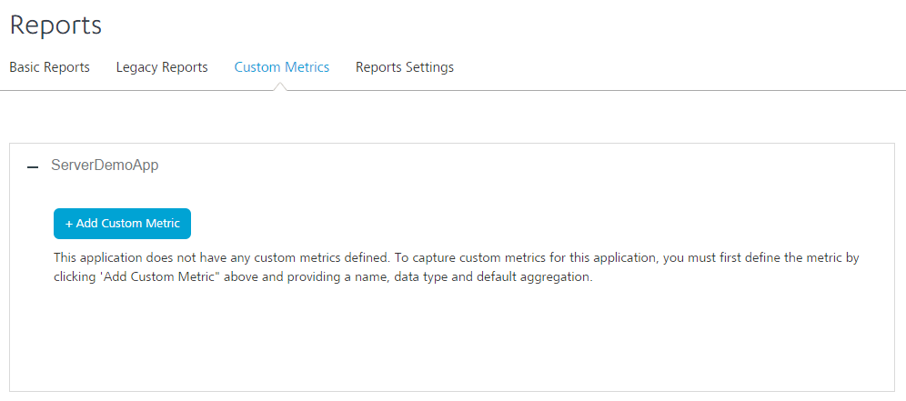
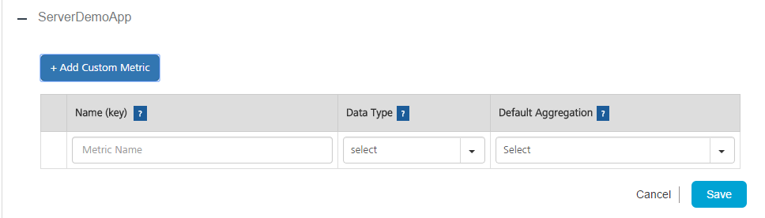
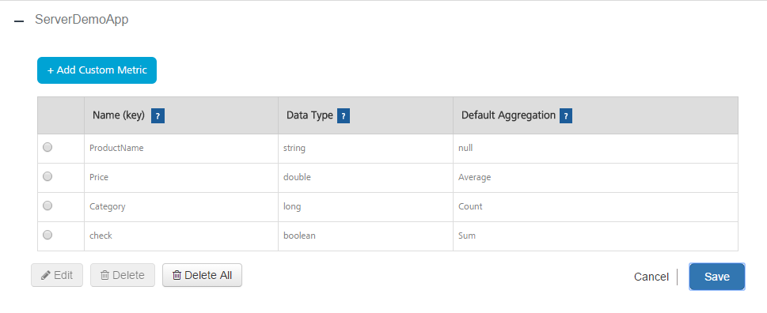

## Using Custom Metrics

Custom metrics is a feature of Volt MX Foundry Integration Service App Services that enables a developer to capture custom data from an application and build reports using that data. In addition to reports, the application developer also receives access to a set of standard metrics that are gathered from the application like the platform channel to use in building custom reports. This feature is available to any application deployed to Volt MX Foundry Integration Service.

The Volt MX Foundry Integration Service App Services enables a user to define custom metrics. Administrator can view Custom Metrics under Reports tab:

*   **Custom Metrics** - enables users to add or delete metrics that they intend to send from the application. The Custom Metrics page shows a list of applications deployed to Volt MX Foundry Integration Service. If a user deploys an application to Volt MX Foundry Integration Service, it appears in the **Custom Metrics** page.

    
    
## Prerequisites

Following are the prerequisites for creating custom metrics: 

1.  An application deployed to Volt MX Foundry Integration Service.

2.  Defining Custom Metrics in Volt MX Foundry Integration Service App Services

The Custom Metrics page allows an application developer to define the metrics for an application. Each metric is identified by a key that has to be unique within the application. There are six types of data: String, Boolean, Long (Integer), Double, Date, and Timestamp. The page shows all applications deployed to Volt MX Foundry Integration Service. To add custom metric parameters for an application, under Custom Metrics tab in the Reports section of the application, click on **+ Add Custom Metric** button.

For applications that already have custom metrics defined, clicking on **Add +** will show the list of Parameter Names, Data Type, and Default Aggregation function.

The application can send multiple key-value pairs that will be stored as custom metrics for reporting purposes. The user must register each key sent by the application and provide the Data Type and Default Aggregation values.

To create a custom metric, follow these steps: 

1.  Click **Add Custom Metric**. The following pane appears.

    

3.  Enter a name in the **Name (key)** area. Each metric is identified by a key that must to be unique within the application. The application code must use the same Name for sending data in the key-value pairs in [JSON string](#MetricsClientAPI) . The key is case insensitive.
4.  Select a **Data Type** from the list. The available values are Long (integer values), Double (values with decimal points like 12.5), String, and Date.The data type mentioned here must match the data type sent from the application for the metric name.

6.  Select a **Default Aggregation** from the list. The Default Aggregation is the cumulative function you apply to the data while building the application. The available values are Sum, Average, Highest, Lowest, Count, and Distinct Count. Default Aggregation functions are only applicable for Long and Double.
7.  Click **Save**. The parameters will be defined and saved under the application name. The custom metrics defined will be sent to the application to collect data.

    

9.  Click **Cancel** to cancel adding custom metrics to the application.

To delete a custom metric, follow these steps: 

1.  Select the custom metric in the application.
2.  Click **Delete**. A warning message appears.

    

4.  Click **Soft Delete** or **Hard Delete** to delete the custom metric.

    > **_Note:_** from an application with a key corresponding to a deleted parameter name will not be saved. Existing reports and ad hoc views already created from the domain that use the deleted parameter will work. However, creating new ad hoc views from the same domain will have the underscore _ deleted suffix for the parameter name to denote to the developer building reports that this is currently a deleted parameter.

## Rules for Custom Metrics Data Types

*   Long - Integer values
*   Double - Values with decimal point like 450.99
*   Boolean - true/false
*   String - Any string value, maximum length 500 characters.
*   Date - String value denoting date in the format yyyy-mm-dd. Example: "2014-05-01"
*   Timestamp - String value denoting timestamp. Valid formats for timestamp are shown below
    *   yyyy-mm-dd hh:mm:ss --- preferred format
    *   yyyy-mm-dd hh:mm:ssz
    *   yyyy-mm-dd hh:mm:ss+hh:mm
    *   yyyy-mm-dd hh:mm:ss-hh:mm
    *   z stands for zulu (UTC)
    *   +hh:mm is positive offset of time from UTC
    *   -hh:mm is negative offset from UTC.
    *   Example:
        <pre><code>  
        "2014-04-15 13:02:55z"
        "2014-04-15 13:02:55+05:30"
        "2014-04-15 13:02:55-05:30"
        </code></pre>

For more information on adding custom metrics to an application, refer [Custom Metrics Documentation](../../custom_metrics_and_reports/Content/Custom_Metrics_and_Reports_Guide.md).