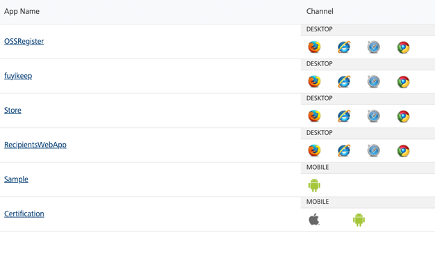

                            

Volt MX  Foundry console User Guide: Web Apps

Web Apps
========

The **Web Apps** page displays the apps deployed to the server and the services associated with the application.

The following details are displayed for the web apps deployed:

  
| Column | Description |
| --- | --- |
| App Name | Name of the web app deployed. Click the app name, a new tab opens loading the selected web app. The URL of the selected web app is in the following format: ip:port/apps/Iris.appid. For WAR based deployment applications, the URL is in the following format: ip:port/apps/Iris.appname. > **_Note:_** For multi-tenant servers, WAR based deployment is not supported. |
| Channel | Different channels on which the application is built. **Mobile**: All the mobile channels on which the application is built are displayed. **Desktop**: All the desktop channels on which the application is built are displayed. **Tablet**: All the tablet channels on which the application is built are displayed. |
| Version | The version number of the web app displayed. |

You can perform the following actions in this screen:

*   [Test a Web App](#test-a-web-app)
*   [Delete a Web App](#delete-an-application)

Test a Web App
--------------

From the list of web applications displayed, you can test an application by following these steps:

1.  Log on to **App Services** and click **Web Apps** from the left pane of the screen.
2.  From the list of web applications displayed in the **Web Apps** page, click an application in the **App Name** column to test the application.

Delete an Application
---------------------

From the list of web applications displayed in the **Web Apps** page, you can delete an application from the environment.

To delete a web application from the environment, follow these steps: 

1.  Log on to **App Services** and click **Web Apps** from the left pane of the screen.
2.  From the list of web application displayed in the **Web Apps** page, click **Delete** displayed across the web application.
    
    A confirmation message appears asking **Are you sure you want to permanently delete the <<App name>> application from this environment? The application cannot be recovered once you delete it.**.
    
3.  Click **OK**.The application is deleted.
