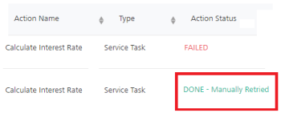

                            

Volt MX  Foundry console User Guide: Workflow Instances List Page

Workflow Services
=================

It lists all the Workflow Services that were published to the current environment from Volt MX Foundry Console. You can view all the instances of the Workflow that were triggered from here and the run-time status of each triggered instance from here. To know more about Workflow service, refer [Workflow Service](../../../Foundry/voltmx_foundry_workflow/Content/Workflow.md).

Click the **Workflow Services** from the left pane of the App Services to view the list of Workflow services.

The following information is displayed about each Workflow service:

  
| Column | Description |
| --- | --- |
| Name | Name of the service deployed. |
| Trigger | Displays the type of the workflow For example, the type can be an object triggered workflow, an Event triggered workflow or an Integration Service triggered workflow. |
| Response Type | Displays the Response type returned from the Workfow. This is supported only for Integration Service type workflows. For example, the response types supported for Integration Service type workflows are Sync and Async. For Object triggered workflows and Event triggered workflows, this field is shown as N/A. |
| Associated Entity | Displays the Linked Integration Service for the Integration Triggered Workflows. Displays the Linked object for the Object Triggered Workflows, in the format of objservicename.objname. For Event triggered workflows, this field is shown as N/A. |
| Version | Version number selected while creating the service. Click the drop-down list to view the different versions of the selected service. |

**Workflow Instances** List Page
--------------------------------

To view all the instances of a Workflow, click on the required Workflow. The **Workflow Instance** list screen appears.

You can filter the table using **Status** and **Time Range** lists. The **Status** list contains four options - All, Running, Completed, Failed. By default, All is selected. The **Time Range** list contains the following options - All, 5 minutes, 15 minutes, 1 hour, 4 hours, 1 Day, and 1 Week. By default, All is selected. Click **Refresh** to get the latest data.

The following information is displayed about each instance:

  
| Column | Description |
| --- | --- |
| Primary Key of Linked Object | Displays the value of the primary key field(s) of the associated object for each instance of the workflow. This is for Object Triggered workflow. For example: In the following screen-shot, multiple primary key (FirstName, PK1, and SSN) fields are displayed based on the linked object.  |
| Correlation ID Cust\_ID and Name | Displays the value of the Correlation ID field(s) for each instance of the workflow. This is for Event Triggered Workflow. |
| Instance ID | Displays the name of the respective instance. It is auto-generated. |
| Status | Displays the current status of the workflow instance such as Completed, Running, Failed, or Terminated.  Status: **Completed** - when a workflow instance is executed successfully and all the tasks/actions have been completed.  Status: **Running** - when a workflow instance is in the process of execution and all the tasks/actions have not been completed; and user tasks are in pending state.  Status: **Failed** - when any of the workflow tasks not executed successfully, for example, a task failed to communicate with a back-end service.  Status: **Terminated** - When the **Delete verb** is invoked on an object record which has a workflow linked to it, in this case, irrespective of the current status of the workflow instance, the status is marked to Terminated. In this case, the workflow instance will not be executed.   **Note**  If a Database Admin deletes a record of a linked object for a workflow instance, the current state of the workflow instance will not be changed to Terminated. |
| Duration | Displays the duration(sec) explains the time between start and end of a workflow instance. |
| Date Initiated | Displays the information about when the instance was triggered. |
| Date Completed | Displays the information about when the instance was ended. |

**Workflow Instances Details Page**
-----------------------------------

There are different kind of nodes/tasks in Workflow and each node/task represents a specific task or an event.

To view the nodes/tasks that are executed in that instance of the Workflow, click on the required instance. The **Nodes/Tasks** screen appears. You can also find the run-time progress of the Workflow from here as the **Nodes/Tasks** screen also displays the status of each node/task in the Workflow. If any instance fails, you can easily find out the node/task where the Workflow has failed.

*   **Workflow Namespace Data**: Click **View Details** to view the **Namespace data available** in **FOUNDRY\_WORKFLOW\_CONTEXT** in a JSON format. This displays the latest details of the workflow context data scope as per the workflow execution status. If a user modifies the workflow\_context data via the **Retry Details** dialog box, the same is also reflected here. This modal is read-only.
*   **Linked Object**: Displays the Linked object to that workflow in the format of objservicename.objname This is for Object Triggered workflows.
*   **Correlation ID**: Displays the value of the Correlation ID field(s) for each instance of the workflow service. This is for Event Triggered Workflows.
    
*   You can filter the table using **Status**. The **Status** list contains four options - All, Done, Paused, Scheduled, and Failed. By default, All is selected. Click **Refresh** to get the latest data.

The following information is displayed about each node/task of a workflow instance in this page:
 
| Column | Description |
| --- | --- |
| Action Name | Displays the name of the node\task. |
| Type | Displays the type of the node/task. |
| Action Status | Displays the current status of the node/task, such as Done, Scheduled, Paused, or Failed. Status: **Done** - when a task/node is completed successfully:  Status: **Scheduled** is applicable only for the **Timer** node. The status is initially **Scheduled** until the delay time lapses and then the Timer will again get audited as **Done** when the Timer node is completed successfully:  Status: **Paused** - when a task/node is waiting for a user action, for example, User Task. Status: **Failed** - when a task/node did not execute successfully. Clicking on the **Failed** link displays the error information in a pop-up window.  When any task fails, an exception is logged in the middleware.log includes the `wfName` and `wfInstID` parameters. These parameters help you to debug the issues that caused for the task failure. For example, when service task is failed, this is one exception being logged in logs. Sample middleware log of a Failed workflow service task: `[app.services][ERROR][2020-05-26T21:01:50.360+05:30]:[9eee071d-15f4-4e1a-9aa1-d7de8cb0507d]:[]:[TENANTENVID=4efd7c61-6c83-4ede-b8f7-85db87d6a2a3,svc=AccountOpenService,op=Account,wfName=loopWf,wfInstID=f3478ab0b150a2f5fa60c037328c8f15]:[VOLTMX-SERVER-EVENTS-CONSUMER-THREAD-POOL-1]:[com.voltmx.rules.exception.RulesException:<init>:32]:MW30002: ScriptException - Property access failed in MVEL script causing exception [Error: could not access property: response; parent is null: FOUNDRY_WORKFLOW_CONTEXT..] [Near : {... FOUNDRY_WORKFLOW_CONTEXT.. ....}] ^ [Line: 1, Column: 1]. org.mvel2.PropertyAccessException: [Error: could not access property: response; parent is null: FOUNDRY_WORKFLOW_CONTEXT..] [Near : {... FOUNDRY_WORKFLOW_CONTEXT.. ....}] ^ [Line: 1, Column: 1] at org.mvel2.optimizers.impl.refl.ReflectiveAccessorOptimizer.optimizeSetAccessor(ReflectiveAccessorOptimizer.java:200) ~[mvel2-2.4.3.Final.jar:?] at org.mvel2.optimizers.dynamic.DynamicOptimizer.optimizeSetAccessor(DynamicOptimizer.java:95) ~[mvel2-2.4.3.Final.jar:?] at org.mvel2.compiler.CompiledAccExpression.setValue(CompiledAccExpression.java:54) ~[mvel2-2.4.3.Final.jar:?] at org.mvel2.ast.DeepAssignmentNode.getReducedValueAccelerated(DeepAssignmentNode.java:90) ~[mvel2-2.4.3.Final.jar:?] at org.mvel2.MVELRuntime.execute(MVELRuntime.java:85) ~[mvel2-2.4.3.Final.jar:?] at org.mvel2.compiler.CompiledExpression.getDirectValue(CompiledExpression.java:123) ~[mvel2-2.4.3.Final.jar:?] at org.mvel2.compiler.CompiledExpression.getValue(CompiledExpression.java:119) ~[mvel2-2.4.3.Final.jar:?] at org.mvel2.compiler.CompiledExpression.getValue(CompiledExpression.java:113) ~[mvel2-2.4.3.Final.jar:?] at org.mvel2.MVEL.executeExpression(MVEL.java:941) ~[mvel2-2.4.3.Final.jar:?] at com.voltmx.rules.mvel.handlers.MVELExecutor.execute(MVELExecutor.java:26) ~[middleware-rules-1.0.0.0.jar:?] at com.voltmx.component.service.ServiceInvocationComponent.executeScript(ServiceInvocationComponent.java:150)` For more information to download middleware logs, refer to [Standard Logs > Cloud Logs > Archived Logs](Standard_Logs.md#archived-logs) |
| Action Status - **Retry** | Status **Retry** icon is displayed next to the task failed status. Helps you to trigger a failed task again manually.RetryTaskFailedButton 1**_Note:_** To view the actual error that has caused to failed the task, click the **Retry** icon next to the **FAILED** status of a service node/task. . If you retry to trigger the failed service node/task, the new record is appended with the status for succeeded or failed based on the necessary actions taken for an Error Message type. For a failed case, the status as `FAILED - Manually Retried` (including the **Retry** icon). For a success case, the status as `DONE - Manually Retried`. For more information on how to fix a failed task and execute the workflow again, refer to [How to Retry a Failed Task of a Workflow](#how-to-retry-a-failed-task-of-a-workflow). |
| Duration | Displays the duration(ms) explains the time taken by a task to complete in milliseconds, |
| Date Initiated | Displays the information about when the instance was triggered. |
| Date Completed | Displays the information about when the instance was ended. |

### How to Retry a Failed Task of a Workflow

> **_Note:_** For Event triggered workflows, the Retry functionality works the same as in the case of object triggered workflows.

When a task/node is failed, the workflow execution status goes to failed status. To view the actual error that has caused to failed the task, click the **Retry** icon next to the **FAILED** status of a service node/task.

Error details of each failed tasks are displayed in the **Admin Console > Retry Details** dialog box. These error details help you to troubleshoot the issue and then retry the task again. The **Retry Details** dialog box displays the workflow namespaces error data in six tabs, as follows:

The following table describes all the error details of a failed task with workflow namespaces tabs:

 

### How to Retry a Failed Task of a Workflow

> **_Note:_** For Event triggered workflows, the Retry functionality works the same as in the case of object triggered workflows. When a task/node is failed, the workflow execution status goes to failed status. To view the actual error that has caused to failed the task, click the **Retry** icon next to the **FAILED** status of a service node/task. Error details of each failed tasks are displayed in the **Admin Console > Retry Details** dialog box. These error details help you to troubleshoot the issue and then retry the task again. The **Retry Details** dialog box displays the workflow namespaces error data in six tabs, as follows:

[Retry Details dialog box](javascript:void(0);)****

The following table describes all the error details of a failed task with workflow namespaces tabs:

### How to Retry a Failed Task of a Workflow

> **_Note:_** For Event triggered workflows, the Retry functionality works the same as in the case of object triggered workflows.

When a task/node is failed, the workflow execution status goes to failed status. To view the actual error that has caused to failed the task, click the **Retry** icon next to the **FAILED** status of a service node/task.

Error details of each failed tasks are displayed in the **Admin Console > Retry Details** dialog box. These error details help you to troubleshoot the issue and then retry the task again. The **Retry Details** dialog box displays the workflow namespaces error data in six tabs, as follows:

[Retry Details dialog box](javascript:void(0);)****

The following table describes all the error details of a failed task with workflow namespaces tabs:

  
| Tab Name | Description ||
| --- | --- | --- |
| **Failed Task** | Action Name: Displays the name of the failed task. Type: Displays the type of the failed task. Action Status: Displays the status of the failed task. Task Details: Displays the service and operation name only if the failed task type is a **Service task**. Error Code: Displays the error code of the failed task. Error Type: Displays the error type of the failed task. Error Description: Displays the description of the failed task. Request Input: The Request Input tab is always displayed, but the JSON payload is shown only in case of a failed task type as **Service Task**. For other types of failed tasks, this section is empty. **Retry Task** button helps you to retry the task. ||
| **IDENTITY** | Displays the content inside the IDENTITY namespace, for example, user profile and security attributes of the identity provider. This is read-only. ||
| **DEVICE\_REQUEST** | Displays the content available at the DEVICE\_REQUEST namespace. | For **DEVICE\_REQUEST**, **FOUNDRY\_WORKFLOW\_CONTEXT**, and **BACKEND\_RESPONSE** namespaces, the following is supported:You can modify data.You can validate the data by using the **Validate** button.After you modify the data, you need to save the updated data. To retry the failed task with the modified data, click the **Retry Task** button in the **Failed Task** tab. |
| FOUNDRY\_WORKFLOW\_CONTEXT | Displays the content of the FOUNDRY\_WORKFLOW\_CONTEXT namespace. |
| BACKEND\_RESPONSE | Displays the content available at the BACKEND\_RESPONSE namespace. |
| SESSION | Displays the content of the SESSION namespace. This is read-only. ||

You can fix a failed task in one of the following ways:

How to Manual Retry with Edit Payload via Namespaces and Retry a Failed task (Fixing the data issue in Runtime and Retry a Failed Task)

While executing a workflow service, if there are any data errors, it will cause a task failure. So the related workflow instance goes into a failed state at the same time. You can address any data error issues by modifying the underlying workflow namespace data payloads in the **Retry Details** dialog box, and then retry the failed task again.

Use Case: An invalid email ID of a user is populated into the FOUNDRY\_WORKFLOW\_CONTEXT from a backend or a client request, and the same email ID is used in the **Email Task** to send email notifications to the user. Due to the invalid email ID, the **Email Task** node fails to send the mail to the user, and this causes the Workflow instance goes into failed state.  

The following steps help you to fix this data error issue in the runtime and execute the workflow again:

1.  In the Admin Console > Workflow Services tab, navigate to the failed task of the your workflow instance.
2.  Click the **Retry** button.
    
    
    
3.  Under **Retry Details** dialog box that appears, do the following:
    1.  Click the **FOUNDRY\_WORKFLOW\_CONTEXT** tab. The error data of the **FOUNDRY\_WORKFLOW\_CONTEXT** namespace is displayed in a JSON format.  
        For example, here the emailID without a **@** symbol is came from the backend.  
        
        1.  Enter the correct email ID of the user in the JSON payload.  
            You can validate the JSON payload by clicking the **Validate** button available in the JSON payload window. If the JSON payload is invalid, the errors message is displayed with the link to download the error payload.  
            
        2.  Click **SAVE**.
    2.  Navigate to the **Failed Task** tab in the **Retry Details** dialog box.
        1.   Click the **Retry Task** button.
4.  Click **Refresh** in the workflow instances list page to get the latest data.
    
    After the service task is executed successfully, the status changes to `DONE - Manually Retried`.  
    

How to Retry a failed task manually (Fixing the issue in Design-time app and Retry a Failed Task)

In this case, the issue must be fixed in the Foundry app and republish the app to the runtime server. And then you must Retry the task to be executed again using the **Retry Details** dialog box in Admin Console.

Use Case: In this example, in the [**Loan\_Approval** sample application](../../../Foundry/voltmx_foundry_workflow/Content/Workflow_Implementation.md), due to a wrong back-end URL, the **Calculate Interest Rate** service task is failed. Here, the back-end server is unable to process the request. In the following sample screen shot, the back-end URL has missing of one `slash (/)`.

  

The following steps help you to fix this issue in Foundry app and execute the failed task again:

1.  Log into your Foundry Console, fix the back-end URL issue in the required app, and then publish the app.
2.  In the Admin Console > Workflow Services tab, navigate to the failed task of the your workflow instance.
3.  Click the **Retry** icon.
    
    The **Retry Details** dialog box is displayed.
    

1.  Under **Failed Task** tab, click the **Retry Task** button.
    
    
    
2.  Click **Refresh** to get the latest data.
    
    After the service task is executed successfully, the status changes to `DONE - Manually Retried`.
    
    

