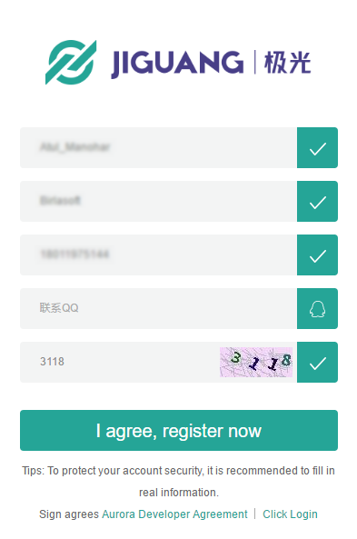
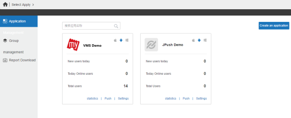
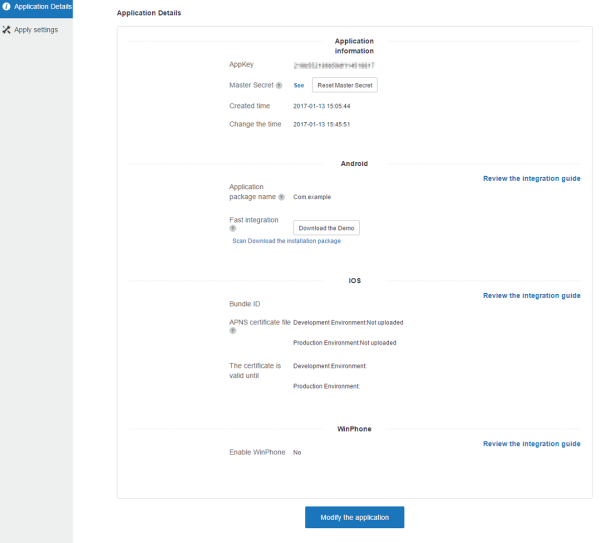
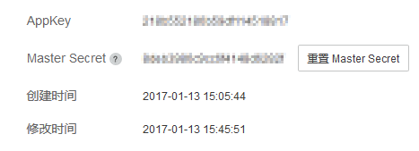
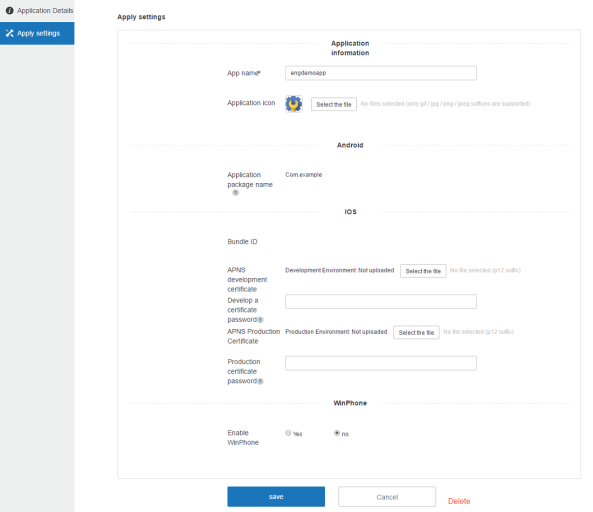

                             

Engagement Services JPush QuickStart Guide: Creating a JPush Account and an Android Application in the JPush Console

Creating a JPush Account and an Android Application in JPush Console
====================================================================

**JPush** is a push notification service that sends push notifications for apps on Android, iOS, and Windows platforms in countries where Google services are not allowed. Currently, the Engagement server supports push notifications through JPush for Android devices only. The section explains how to create an account with JPush and create an Android application in JPush console.

To create a JPush key, follow these steps:

1.  In a browser, enter the URL of the **JPush** website: `https://jpush.cn.`
    
    The **JIGUANG** home page appears.
    
    
    
    > **_Note:_** For readability, use the **Google Translate** option that is available in the menu bar.
    
    
    
2.  Click the **registered** button next to the **log in** button at the upper-right corner of the home page.
    
    The first **Register** page appears.
    
3.  To register with **JPush**, provide information for the following fields:
    
    *   **User Name**: Enter the user name to register with **JPush**. The user name should include between five to 20 characters.  
        Do not include special characters in a user name. You can use a combination of letters, numbers, and underscores.
    *   **Email**: Enter your personal email address.
    *   **Password**: Enter a password to create your account.
    *   **Confirm Password**: Re-enter the password to confirm it.
    
    
    
4.  Click **Next** to continue.
    
    The second **Register** page appears.
    
5.  Enter details for the following fields:
    
    *   **User Name**: Enter the user name that you entered in the **Register** window.
    *   **Organization**: Enter name of the organization where you work.
    *   **Email**: Enter your personal email address.
    *   **Phone Number**: Enter your contact number.
    *   **QQ Verification Code:** Enter the supplied QQ verification code to authenticate your phone number.
    *   **Security Code**: Enter the displayed security code to confirm your authenticity.
    
    
    
6.  Click the **I agree, register now** button to continue.
    
    The **JPush** page appears with a confirmation message that the authentication message is sent to the registered email address.
    
7.  Access your email account, and open the email sent through **JPush** to activate your user account.
8.  Log in to your JPush account.
    
    The **Applications** page appears.
    
    
    
9.  At the upper-right corner of the page, click the **Create an application** button to create your own application.
    
    The **Create an application** page appears.
    
10.  Enter details for the following fields:
       **Application Information**:
        *   **Application Name**: Enter a name of the application.
        *   **Application Icon**: To provide an icon for the application, click the **Select the File** button to browse the icon from its location. The selected icon name appears next to the **Select the File** button.
      **Android**:
        
        *   **Application Name**: Enter the application package name such as `com.example.BankingApp.`
        
        
        
        > **_Note:_** The current procedure explains how to register on the Android platform and the details about registration on the iOS and WinPhone platforms are not stated here.
        
11.  Click the **Create my app** button to continue.
    
      The **Application Details** page appears. The **Application Details** page displays the **Appkey** and the **Master Secret**.
    
     
    
12.  Record the **Appkey** and the **Master Secret** for your reference.
13.  To view the **Master Secret**, click the **Master Secret** button.
    
     
    
14.  If you need to modify the app, click the **Modify the application** button to continue.
15.  The **Apply settings** page appears.
    1.  Click **Cancel** if you do not want to update any details.
    2.  Click **Delete** to delete the application.
16.  Update the application, if required. You can change the app name and the application icon.
17.  Click **Save** to update the application details.
    
     
    
18.  Click the drop-down list at the upper-left corner of the page to view all the applications.
    
     
