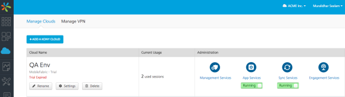
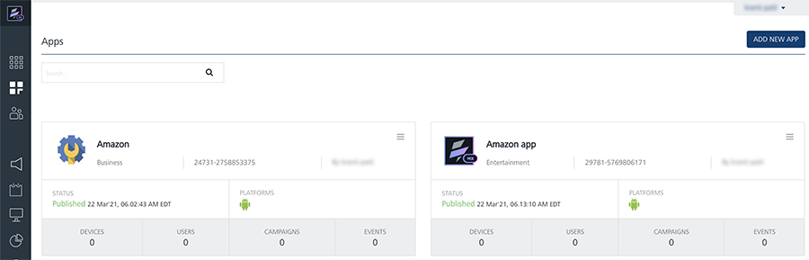
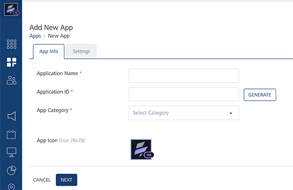
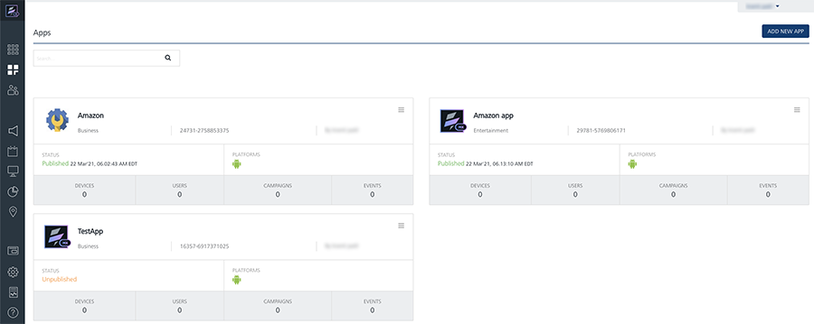
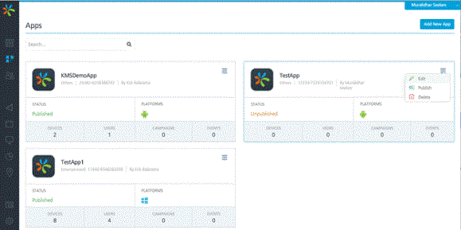
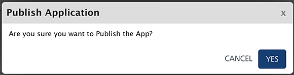
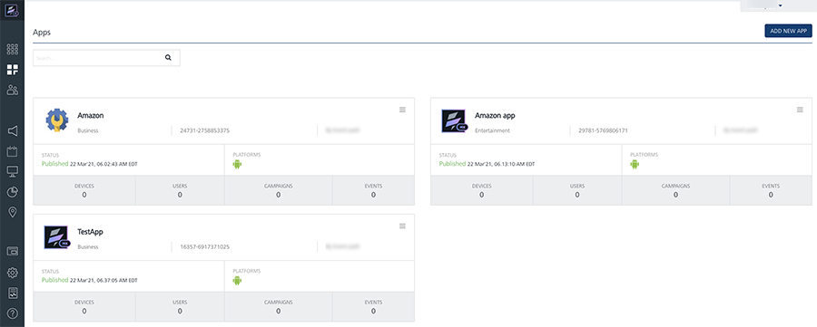

                            

Configuring the Engagement Demo Application Using Engagement Services Console
=============================================================================

The section explains how to provision the Engagement demo application using the Engagement services console.

To configure the Engagement demo application follow these steps:

1.  Open an Internet browser.
2.  Enter the URI: _manage.hclvoltmx.com_ in the address field and press the **Enter** key
    
    The **Sign in to your Volt MX Account** page appears.
    
    
    
3.  Enter your email ID and password as user-credentials.
4.  Click the **Sign in** button to continue.
    
    The system displays the **VoltMX Foundry** homepage.
    
    
    
5.  **VoltMX Foundry** home page: Click **Environments** in the left panel.
    
    The Clouds page appears.
    
6.  Click the **Engagement Services** tab next to the **Sync Services** tab.
    
    The **Engagement Services** home page (Dashboard) appears.
    
7.  **Engagement services**: In the left panel, click **Apps** under the **Overview** section. You can view all the configured applications and configure new applications.
    
    
    
8.  Click the **Add New App** button to configure a new app.
    
    The **Add New App** page appears with the **App Info** tab set to active.
    
9.  **App Info**: Enter the following details.
    
    *   **Application Name**: Enter the application name.
    *   **Application ID**: Click the **Generate** button to populate the system- generated application ID. You can enter the application ID manually in the text field.
    *   **App Category**: Select the app category from the drop-down list.
    *   **App Icon (Size: 78x78)**: Click the **Browse** button to navigate to the image file location and select it.
    
    
    
10.  Click the **Settings** tab and choose **Android** to display the **Android** screen.
    *   **GCM/FCM Authorization Key**: Enter the **GCM/FCM** authorization key. The **GCM/FCM** key is required to send push notifications to apps.
11.  Click **Test Connectivity with Cloud** to verify the entered key.
    
     
    
12.  If the entered GCM/FCM key is correct, the system displays the confirmation message that the cloud connection is successful. Click **Ok** to continue.
13.  Click **Save** to save the application.
    
     The application appears on the Apps home page. In the example below, the newly added app is **TestApp**. The current status of the application is unpublished. You need to publish the app to receive push notifications.
    
     
    
14.  On TestApp, in the upper-right corner, click the drop-down list and choose the **Publish** option to publish the application.
    
     
    
15.  The system displays the **Publish Application** dialog box asking, if you want to publish the application. Click **Yes** to continue.
    
     
    
     The current status of the app changes to published.
    
     
    

  
| Rev. | Author | Edits |
| --- | --- | --- |
| 7.2.5 | AU | AU |
