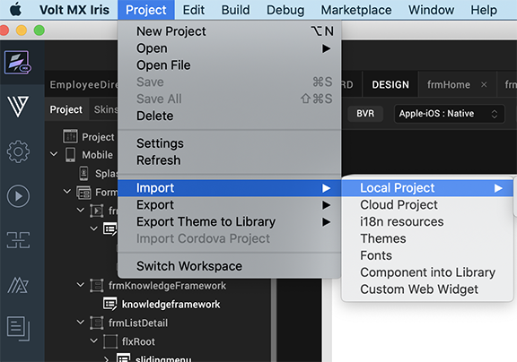
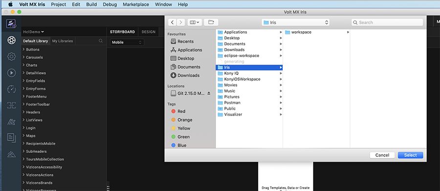
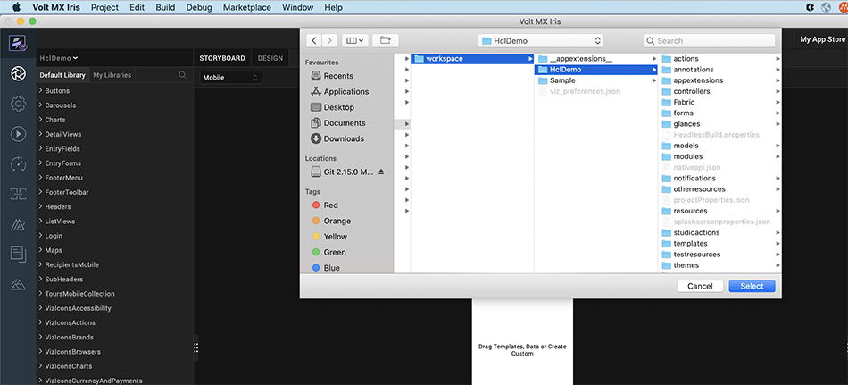
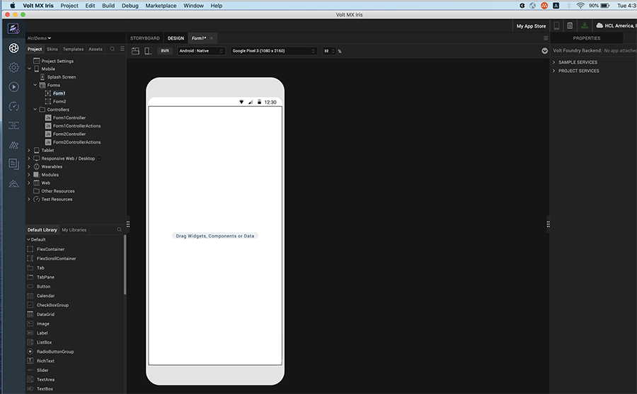
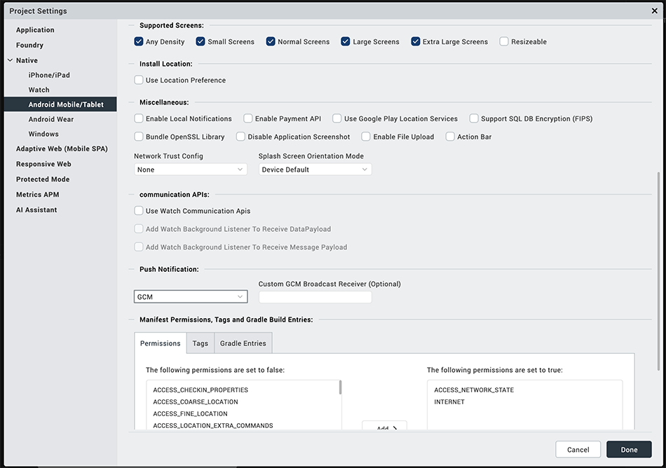
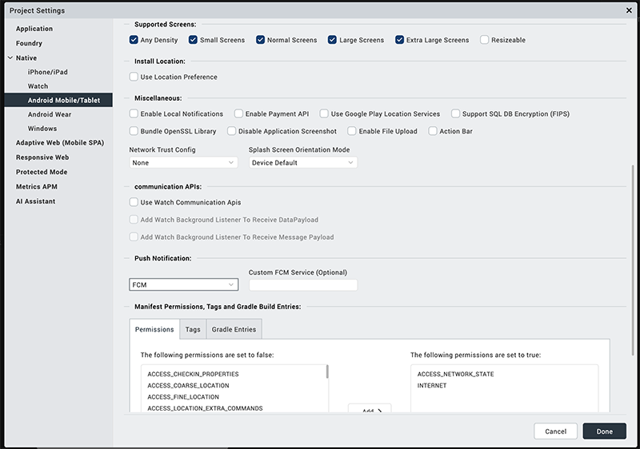

# Downloading and Configuring the Engagement Services Demo Client Application

The section explains how to download the Engagement demo application from GitHub and configure the app using Iris for Android devices. We assume that Android SDK and Iris IDE are installed.

To download and configure the Engagement demo client application, follow these steps:

1.  Connect to the URL [https://marketplace.demo-hclvoltmx.com/items/volt-mx-engagement-demo](https://marketplace.demo-hclvoltmx.com/items/volt-mx-engagement-demo) where the application is located. 

    The **VoltMX-Engagement-Service-Demo** page appears.

2.  On the upper-right corner of the page, click **Download** and save the zip file on your system.

    The list-view displays following files:

    - **Binaries**: Contains the binaries (Android) of the VoltMXMessagingDemo app.
    - **VoltMXMsgDemo app**: Client side **VoltMXMessagingDemo** application code.
    - **License.txt**: GitHub provides an option to include a software license in your project when you create a new repository.
    - **README.md**: README.md generates the.html summary you see at the bottom of projects.

3.  Close the **VoltMX-Engagement-Service-Demo-Iris** page.
4.  Open **Iris**. The **Iris** dashboard screen appears.
5.  Under the **File** menu, click **Import** > **Local Project**.

    

    The **Import Volt MX Project** window appears.

    

6.  Click the **Browse** button and navigate to the project folder that has the files you want to import.

    

7.  Select the **VoltMX Engagement Services Demo App** and click **Finish** to complete the importing of project in to **Iris**.

    The **Engagement Services Demo App** project opens into **Iris**.

    

    The application is installed on an Android device.

8.  Click **Project Settings** under the **Project** tab from the left panel to open the **Project Settings** window.

    The **Project Settings** window appears.

9.  In the **Project Settings** window, Choose **Native** tab > **Android** tab.

    The **Android** tab window appears.

10. **SDK Versions**: Choose **Target** and **Maximum** from the drop-down list for which the binary needs to be generated.

    

    
