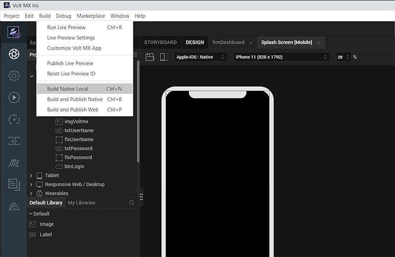
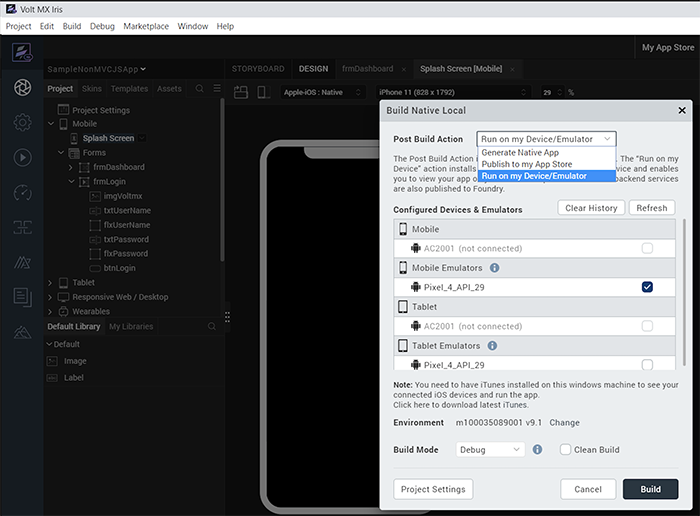
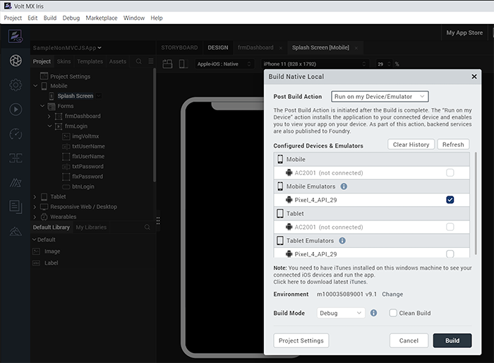

                           

Installing the Engagement Demo Client Application on an Android Device
======================================================================

The section explains how to install a configured Engagement application on Android devices. Follow these steps:

1.  Connect the Android device using a USB cable to the system where the application to be installed is located.
2.  **Iris**: From the menu bar, select the option as **Product** > **Emulators and Device Configuration**.
    
    
    
    The **Preference** window appears.
    
3.  In the **Preference** window, select the option as **Emulators and Device Configuration** > **VoltMX Iris** > **Emulators** > **Mobile** > **Android**.
    
    The **Configure Android Emulators** section appears.
    
4.  **Configure Android Emulators**: Enter the details for the following fields:
    1.  **Name**: Enter a name for the **Android** emulator.
    2.  **Location**: Click **Browse** to choose **Android** emulator.exe from its location on your system.
    3.  **AVD Name**: Enter the AVD name.
5.  Click **Save** to save the configuration. Click **OK** to continue.
    
    
    
    The Android device is connected and the device ID is displayed.
    
6.  From the menu bar, click the **Product** > **Launch Emulator** > **Android** > **Native or SPA** option to deploy and launch the application on a device.
    
    
