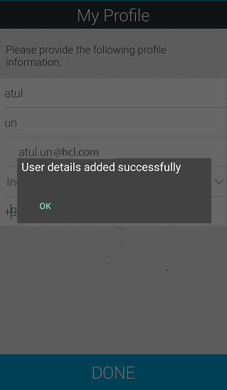
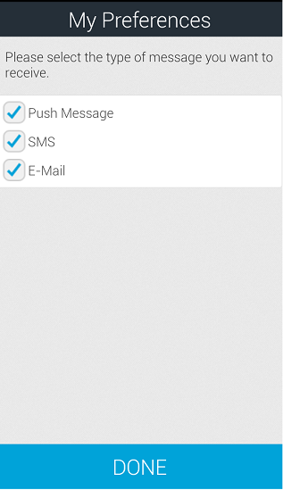
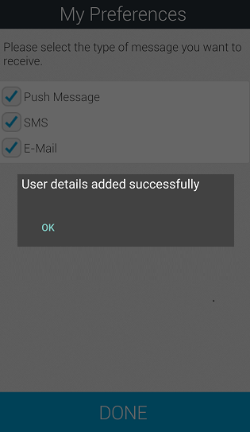
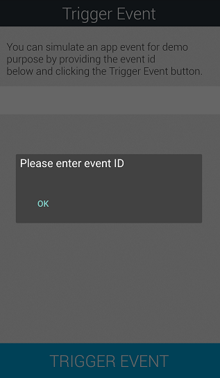

                           

Subscribing to Push Notifications Using Engagement Demo Application
===================================================================

The section explains subscription details for the Ad hoc push, email and SMS notifications using the application installed on the Android device.

To subscribe for the push notifications, follow these steps:

1.  Launch the Engagement demo application installed earlier on the Android device.
    
    The **Welcome to Volt MX Engagement Services Demo App** screen appears. The first screen of the application prompts the user to accept push notifications.
    
2.  Click **Ok** to receive the push notifications.
    
    
    
    The **VoltMX Engagement Services Would Like to Send You**... alert message appears.
    
3.  Click **Do not Allow**, if you do not want to receive the push notifications.
4.  Click **OK** to receive the push notifications.
    
    
    
    The **Demo App Settings** screen appears.
    
5.  **Demo App Settings** screen: Enter the following details:
    *   **URI**: Enter the Engagement server cloud URI the user is registered.
    *   **Application ID**: Enter the Engagement Demo App ID.
    *   **Sender ID**: Enter the Sender ID.
6.  Click **Done** to continue.
    
    
    
    The **My Profile** screen appears.
    
7.  **My Profile**: Enter the following details for your profile:
    
    *   **First Name**: Enter your first name.
    *   **Last Name**: Enter your last name.
    *   **E-mail Address**: Enter your personal email address.
    *   **Select Country**: Select the country from the drop-down list.
    *   **Select State**: Select the state if the county chosen is US.
    *   **Mobile Number**: Enter your personal mobile number.
    
    
    
8.  Click **Done** to continue.
    
    The system displays the confirmation message that details added successfully. The information is used to create a user and user's subscription in Volt MX Engagement server.
    
    
    
9.  Click **OK** to continue.
    
    The **My Preferences** screen appears. The **My Preferences** screen allows you to subscribe for push, email and SMS notifications.
    
10. Select the type of notifications. Click **Done** to create a subscription on the Engagement server for all the selected types of notifications.
    
    
    
    The system displays the confirmation message that the user details added successfully.
    
    
    
11. Click **OK** to continue.
    
    The **VoltMX Engagement Service Demo** app is installed on your mobile device. The app home screen displays the **My Profile** icon, **My Preference** icon, and the **Trigger Event** icon.
    
    
    
12. Click **My Profile** to view your profile. Edit any information as needed and click **Done** to update the profile information.
    
    
    
13. Click **My Preferences** to view the type of messages, you receive on your mobile device.
    
    
    
14. Click the **Trigger Event** icon to view the **Trigger Event** screen.
    
    
    
15. Click **Trigger Event** to invoke the event triggering API.
16. The system asks to enter the event ID. Click **OK** to continue.
    
    
    
    The system displays the keypad to enter the event ID.
    
    
    
17. Enter the event ID and click **Trigger Event** to continue.
    
    The **Trigger Event** screen displays the confirmation message that the event is triggered successfully. Click the Back icon on the upper-left corner to launch the home screen.
    
18. Click the **Gear** icon on the home screen to reset the settings for the demo app.
    
    
    
    The system displays the **Demo App Settings** screen.
    
19. Click **Reset Demo App** to delete the existing user information.
    
    
    
20. The system displays an alert asking if you want to reset the demo application. Click **Ok** continue.
    
    The alert displays the confirmation notification that the user is deleted successfully.
